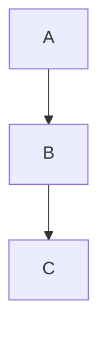

# Zenn 記法リファレンス

Zenn がサポートする Markdown 記法を網羅する。出典は Zenn 公式ガイド
（<https://zenn.dev/zenn/articles/markdown-guide>）。

## 見出し

```
# 見出し 1
## 見出し 2
### 見出し 3
#### 見出し 4
```

アクセシビリティの観点から、本文の見出しは 2 以降を推奨する。

## 文字装飾

```
*イタリック*
**太字**
~~取り消し線~~
`インラインコード`
```

## リスト

順序なし:

```
- 項目
- 項目
  - 入れ子
```

順序つき:

```
1. 一番目
2. 二番目
```

タスクリスト:

```
- [ ] 未完了
- [x] 完了
```

## リンクと画像

テキストリンク:

```
[アンカーテキスト](https://example.com)
```

画像:

```

```

幅指定（`=NNNx`）:

```

```

キャプション（画像直下のイタリック）:

```

*キャプション*
```

リンクつき画像:

```
[](https://example.com)
```

リンクカード（URL を単独行に置く）:

```
https://example.com
```

リンクカード（明示）:

```
@[card](https://example.com)
```

## コードブロック

基本:

````
```js
console.log("hello");
```
````

ファイル名つき（`言語:ファイル名`）:

````
```js:src/index.js
console.log("hello");
```
````

diff（言語名の前に `diff`）:

````
```diff js
- const a = 1;
+ const a = 2;
```
````

diff とファイル名:

````
```diff js:src/index.js
- const a = 1;
+ const a = 2;
```
````

## 表

```
| 見出し | 見出し |
| ------ | ------ |
| セル   | セル   |
```

## 引用

```
> 引用文
> 続きの引用文
```

## 区切り線

```
-----
```

## 脚注

```
本文中の参照[^1]。
[^1]: 脚注の内容。
```

インライン脚注:

```
本文^[インラインの脚注内容]。
```

## 数式（KaTeX）

ブロック:

```
$$
e^{i\theta} = \cos\theta + i\sin\theta
$$
```

インライン:

```
$a \ne 0$
```

## メッセージ / 警告ボックス

```
:::message
補足の本文。
:::
```

```
:::message alert
警告の本文。
:::
```

## アコーディオン（details）

```
:::details タイトル
折りたたむ本文。
:::
```

## 入れ子のコンテナ

外側のコロン数を内側より多くする。

```
::::details タイトル
:::message
入れ子の本文。
:::
::::
```

## Mermaid 図

````

````

制約: 1 ブロック最大 2000 文字、チェーン演算子（`&`）は最大 10 個。

## 埋め込み

X（旧 Twitter）:

```
https://twitter.com/<user>/status/<id>
@[tweet](https://twitter.com/<user>/status/<id>)
```

返信元を隠す場合は末尾に `?conversation=none` を付ける。

YouTube:

```
https://www.youtube.com/watch?v=<id>
@[youtube](<id>)
```

GitHub（ファイル・パーマリンク。行範囲は `#L1-L10`、単一行は `#L5`）:

```
https://github.com/<user>/<repo>/blob/<branch>/<file>#L1-L10
```

GitHub Gist:

```
@[gist](https://gist.github.com/<user>/<id>)
@[gist](https://gist.github.com/<user>/<id>?file=name.json)
```

CodePen:

```
@[codepen](<ページ URL>)
```

CodeSandbox:

```
@[codesandbox](<埋め込み URL>)
```

JSFiddle:

```
@[jsfiddle](<ページ URL>)
```

SlideShare:

```
@[slideshare](<埋め込みキー>)
```

SpeakerDeck:

```
@[speakerdeck](<スライド ID>)
@[speakerdeck](<スライド ID>?slide=24)
```

Docswell:

```
@[docswell](https://www.docswell.com/s/<user>/<id>-title)
```

Figma:

```
@[figma](<ファイル / プロトタイプ URL>)
```

blueprintUE:

```
@[blueprintue](https://blueprintue.com/render/<id>/)
```

## HTML コメント（出力されない）

```
<!-- コメント -->
```

1 行のみサポートする。複数行は不可。

## 絵文字補完

`:` に続けて 1 文字以上を入力すると、絵文字の候補を補完する。
