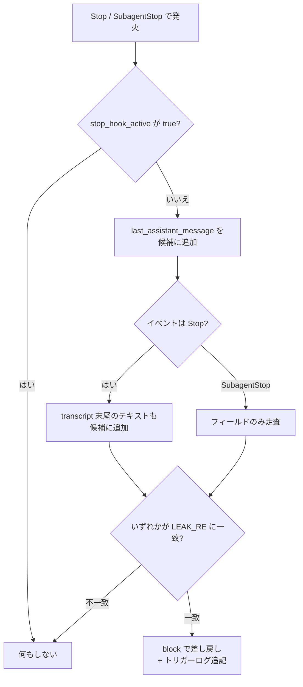

:::message
本記事は、内容の生成に AI を利用しています。
:::

## 結論

Claude Code には、モデルがまれにツール呼び出しを構造化された呼び出しとして発行せず、本文テキストとして「漏らす」リグレッションがあります[^version]。漏れたツール呼び出しはハーネスに実行されず、エラーも出ないまま本文に流れ、ターンが無言で終了します。残骸が会話履歴に残ると、後続の呼び出しが同じ壊れた形式を真似て連鎖的に破綻します。

本記事は、Claude Code のフック機構で二層防御を組み、漏れを予防しつつ、漏れたときは自動でリカバリする方法を解説します。構成は次の二層です。

- 予防層: `UserPromptSubmit` フックで、長いセッションに限り正しいツール呼び出し形式をモデルに再周知します。
- 検知・回復層: `Stop` / `SubagentStop` フックで、ターン最後のアシスタントメッセージに漏れたマークアップがあれば停止を差し戻し、モデルに正しい呼び出しの再発行を促します。

完成版のフックは 2 つです。`detect-leaked-toolcall.mjs`（検知・回復層）と `remind-toolcall-format.mjs`（予防層）を `~/.claude/hooks/` に置き、`settings.json` へ登録すれば常時稼働します[^path]。両フックは Node.js の標準モジュールのみを使い、追加の依存を持ちません。すべてフェイルオープン（内部エラー時は何もせず終了コード 0 で抜ける）で書き、フック自身の不具合がセッションを止めないようにします。

完成版スクリプトの全文を次のアコーディオンに畳んで掲載します。コピーすればそのまま動きます。各部分の設計理由は、本記事後半の段階的解説で述べます。

:::details detect-leaked-toolcall.mjs（検知・回復層・完成版全文）

```js:~/.claude/hooks/detect-leaked-toolcall.mjs
#!/usr/bin/env node
// Stop/SubagentStop hook: bounce leaked tool-call markup back to the model.

import fs from 'node:fs'

// ログをモジュールと同じディレクトリに解決する。import.meta.dirname は
// Node.js 20.11.0 / 21.2.0 より前で undefined になり、path.join(undefined, ...) が
// モジュール読み込み時に例外を投げてガードを黙って無効化する
// （フェイルオープンの try/catch は main() のみを包み、トップレベル評価は救済しない）。
// URL 形式は ESM 対応の全 Node.js で動き、node:path 依存も要らない。
const LOG_PATH = new URL('leaked-toolcall-triggers.log', import.meta.url)
const TAIL_BYTES = 1 << 20 // 1 MiB

// レガシーマークアップの開始形。名前空間プレフィックスの有無を問わず、
// 行頭にアンカーして散文中の言及による誤検知を抑える。
const LEAK_RE =
  /^[ \t]*<(?:[A-Za-z][\w.-]*:)?(?:invoke\s+name=|function_calls\s*>|parameter\s+name=)/m

// 閉じたフェンス付きコードブロックを除去してから照合する。本物の漏れは
// フェンス外の素のテキスト（ハーネスがそのまま描画した失敗呼び出し）であり、
// フェンス内には現れない。引用・例示のマークアップ（漏れ自体を解説する
// 記事など）は ``` / ~~~ フェンス内にある。除去しないと、マークアップを
// 提示するターンが自分で誤検知し、執筆セッションを差し戻しループへ追い込む。
// 未クローズのフェンスはそのまま残し、フェンス後の本物の漏れを隠さない。
const stripClosedFences = (text) => {
  const { out, held, fence } = text.split('\n').reduce(
    (acc, line) => {
      if (acc.fence === null) {
        const open = line.match(/^[ \t]*(`{3,}|~{3,})/)
        return open
          ? { out: acc.out, held: [line], fence: { char: open[1][0], len: open[1].length } }
          : { out: [...acc.out, line], held: [], fence: null }
      }
      const close = line.match(/^[ \t]*(`{3,}|~{3,})[ \t]*$/)
      return close && close[1][0] === acc.fence.char && close[1].length >= acc.fence.len
        ? { out: acc.out, held: [], fence: null }
        : { out: acc.out, held: [...acc.held, line], fence: acc.fence }
    },
    { out: [], held: [], fence: null },
  )
  // 未クローズのフェンスは残し、フェンス後の本物の漏れを隠さない。
  return (fence === null ? out : [...out, ...held]).join('\n')
}

const tryParse = (line) => {
  try {
    return JSON.parse(line)
  } catch {
    return null
  }
}

const assistantTextOf = (entry) => {
  const content = entry?.message?.content ?? []
  return typeof content === 'string'
    ? content
    : content
        .filter((block) => block && block.type === 'text')
        .map((block) => block.text ?? '')
        .join('\n')
}

// JSONL 行を畳み込み、最後の assistant エントリのテキストへ縮約する。
const scanAssistantLines = (lines) =>
  lines.reduce(
    (acc, raw) => {
      const line = raw.trim()
      if (!line) return acc
      const entry = tryParse(line)
      return entry && entry.type === 'assistant'
        ? { text: assistantTextOf(entry), found: true }
        : acc
    },
    { text: '', found: false },
  )

const readTail = (file) => {
  const fd = fs.openSync(file, 'r')
  try {
    const size = fs.fstatSync(fd).size
    const start = Math.max(0, size - TAIL_BYTES)
    const buf = Buffer.allocUnsafe(size - start)
    fs.readSync(fd, buf, 0, buf.length, start)
    return { chunk: buf.toString('utf8'), partial: start > 0 }
  } finally {
    fs.closeSync(fd)
  }
}

// 最後のアシスタントテキスト。末尾読みの高速経路（Stop は毎回走り、
// トランスクリプトは数十 MB になりうる）。窓内にアシスタントエントリが
// 無いときだけ全体読みにフォールバックする。
const lastAssistantText = (file) => {
  const { chunk, partial } = readTail(file)
  const rawLines = chunk.split('\n')
  const lines = partial ? rawLines.slice(1) : rawLines
  const tail = scanAssistantLines(lines)
  return tail.found || !partial
    ? tail.text
    : scanAssistantLines(fs.readFileSync(file, 'utf8').split('\n')).text
}

const transcriptCandidate = (file) => {
  try {
    return [{ source: 'transcript', text: lastAssistantText(file) }]
  } catch {
    return []
  }
}

const BLOCK_OUTPUT = {
  decision: 'block',
  reason:
    'Your last message contains raw tool-call markup emitted as plain text ' +
    '(it was NOT executed). Re-issue it as a proper structured tool call. If ' +
    'the markup was an intentional quotation rather than an attempted call, ' +
    'simply state that and finish your turn.',
  systemMessage:
    'leaked-toolcall guard: 生のツール呼び出しマークアップを検知し、モデルに再発行を要求しました',
}

const utcSeconds = () => `${new Date().toISOString().slice(0, 19)}+00:00`

const main = () => {
  const payload = JSON.parse(fs.readFileSync(0, 'utf8'))
  // ループガード: 停止フックからの継続中は決して差し戻さない。
  if (payload.stop_hook_active) return
  const event = payload.hook_event_name || 'Stop'

  const fieldText = payload.last_assistant_message
  const fieldCandidate =
    typeof fieldText === 'string'
      ? [{ source: 'message', text: fieldText }]
      : []
  // メインの Stop イベントに限りトランスクリプトを相互照合する
  // （SubagentStop の transcript_path は親セッションを指すため）。
  const tcCandidate =
    event !== 'SubagentStop' && payload.transcript_path
      ? transcriptCandidate(payload.transcript_path)
      : []

  const hit = [...fieldCandidate, ...tcCandidate]
    .map(({ source, text }) => ({
      source,
      match: stripClosedFences(text).match(LEAK_RE),
    }))
    .find(({ match }) => match !== null)
  if (!hit) return

  const session = payload.session_id ?? '?'
  fs.appendFileSync(
    LOG_PATH,
    `${utcSeconds()} session=${session} event=${event} source=${hit.source} match=${JSON.stringify(hit.match[0].trim())}\n`,
  )
  process.stdout.write(`${JSON.stringify(BLOCK_OUTPUT)}\n`)
}

try {
  main()
} catch {
  // フェイルオープン: 壊れたガードがセッションの停止を妨げたり、
  // モデルの出力を覆い隠したりしてはならない。
  process.exit(0)
}
```

:::

:::details remind-toolcall-format.mjs（予防層・完成版全文）

```js:~/.claude/hooks/remind-toolcall-format.mjs
#!/usr/bin/env node
// UserPromptSubmit hook: proactively remind the model of the correct tool-call
// format, but ONLY once a session has grown large.

import fs from 'node:fs'

const REMIND_ABOVE_BYTES = 2 * 1024 * 1024 // start reminding once the transcript is large

const REMINDER = [
  'Format reminder (long session, where a known model regression can surface):',
  'always issue tool calls as real structured tool calls, never as plain-text markup.',
  'Writing invoke / parameter / function_calls tags as message text does NOT execute them',
  'and silently ends the turn. If you are about to type tool-call markup as text, stop and',
  'make the structured tool call instead.',
].join(' ')

const transcriptBytes = (file) => {
  try {
    return fs.statSync(file).size
  } catch {
    return 0
  }
}

const main = () => {
  const payload = JSON.parse(fs.readFileSync(0, 'utf8'))
  const file = payload.transcript_path
  if (!file || transcriptBytes(file) < REMIND_ABOVE_BYTES) return
  process.stdout.write(
    `${JSON.stringify({
      hookSpecificOutput: {
        hookEventName: 'UserPromptSubmit',
        additionalContext: REMINDER,
      },
    })}\n`,
  )
}

try {
  main()
} catch {
  process.exit(0)
}
```

:::

両フックを `~/.claude/settings.json` へ登録します。`command` には `node` でフックを直接呼ぶコマンドを書きます。

```json:~/.claude/settings.json
{
  "hooks": {
    "UserPromptSubmit": [
      {
        "hooks": [
          {
            "type": "command",
            "command": "node ~/.claude/hooks/remind-toolcall-format.mjs"
          }
        ]
      }
    ],
    "Stop": [
      {
        "hooks": [
          {
            "type": "command",
            "command": "node ~/.claude/hooks/detect-leaked-toolcall.mjs"
          }
        ]
      }
    ],
    "SubagentStop": [
      {
        "hooks": [
          {
            "type": "command",
            "command": "node ~/.claude/hooks/detect-leaked-toolcall.mjs"
          }
        ]
      }
    ]
  }
}
```

検知フックは `Stop` と `SubagentStop` の両方に登録します。同一スクリプトが `hook_event_name` でイベントを判別し、`SubagentStop` ではトランスクリプト相互照合をしません。

以降では、バグの機序、二層に分ける理由、検知フックを段階的に堅牢化する過程を解説します。完成版の正典は上記のアコーディオンです。後半では各段階の差分だけを示します。

## バグの正体

### 現象

モデルがまれに、レガシーな本文埋め込み XML 形式のツール呼び出しをプレーンテキストとして出力します。具体的には、呼び出しを囲む `function_calls` ブロック、関数名を持つ `invoke` 要素、引数を表す `parameter` 要素といったタグを、実行可能なツール呼び出しではなく、ただのメッセージ本文として書き出します。

正しいツール呼び出しは、ハーネスが解釈する構造化フォーマットで発行されます。Claude Code の現行モデルでは、各タグに名前空間プレフィックス `antml:` が付きます[^prefix]。漏れが起きるときは、プレフィックスの欠落した素のタグ（例: `invoke`）や、ブロックを囲む `function_calls` ラッパーの欠落が観測されます。パーサはプレフィックスやラッパーの欠けた出力をツール呼び出しと認識せず、本文テキストとして描画します。

### 影響

漏れには次の二段の害があります。連鎖の機序を図に示します。

```mermaid
flowchart TD
  A[モデルが漏れマークアップを<br/>本文テキストとして出力] --> B[ハーネスが<br/>ツール呼び出しと認識しない]
  B --> C[エラーを出さず<br/>本文として描画]
  C --> D[ターンが無言で終了]
  C --> E[orphan ブロックが<br/>会話履歴に残留]
  E --> F[後続の呼び出しの<br/>few-shot 見本として作用]
  F --> G[後続も同じ壊れた形式を再生産]
  G --> E
```



1. ターンの無言終了。ハーネスは漏れをツール呼び出しと認識しないため、エラーを出さずにテキストとして流し、ターンを終えます。利用者が席を外している間に起きると、作業は途中で止まったまま気付かれません。
2. 履歴汚染による連鎖破綻。実行されずに会話履歴へ残った orphan ブロック（実行されず削除もされない孤立した呼び出し）が、後続のツール呼び出しに対する few-shot の見本として働きます。いったん壊れた形式が履歴に入ると、以降の呼び出しが同じ壊れた形式を再生産し、回復しない事例が報告されています[^clear]。

### 再現しやすい条件

漏れは、長いセッション・大きなコンテキスト・コンパクション（文脈圧縮）後に出やすくなります。コンテキスト長が伸びるほど発生確率は上がる傾向にあります。

破損は言語に関係なく発生しますが、非 ASCII・CJK の引数が悪化要因として観測報告されています。具体的には、長い multibyte 文字列や全角記号[^fullwidth]を含むツール引数で発生率が上がる、という利用者報告があります。ただし、相関は本記事の執筆時点で Anthropic 未確認です。報告は主に後述の亜種②（parse error・リトライ）に対するもので、本記事の焦点である亜種①（本文漏れ・無言終了）にも同じ機序で効くかは、直接の証拠が弱い点に注意します。

https://github.com/anthropics/claude-code/issues/64506

長い中国語の Edit 引数と全角記号で発生率が上がると報告する Issue（CLOSED・`duplicate` で #49747 へ集約・Opus 4.8）です。短い呼び出しは失敗しにくく、長い CJK 引数は頻繁に失敗する、と述べます。症状は亜種②です。

https://github.com/anthropics/claude-code/issues/64955

日本語（非 ASCII）引数や並列ツール呼び出しとの相関を疑う Issue（CLOSED・`duplicate` で #64774 へ集約・Opus 4.8）です。報告者自身が相関は未確定と注記しており、確度は #64506 より低めです。症状は亜種②です。

なお本記事のフックは、自然言語に依存しません。検知正規表現は ASCII のマークアップ開始形を行頭で照合するため、引数や本文が CJK でも動作は変わりません。むしろ漏れの悪化要因を抱えやすい CJK 利用者にこそ、自衛策として役立ちます。

### 一次情報

本現象は単発のバグではありません。`anthropics/claude-code` リポジトリで数十件規模が報告されたクラスタです。Opus 4.6 / 4.7 / 4.8 の複数モデルにまたがり、2026 年 4〜6 月に集中して立てられました。多くは相互に `duplicate` ラベルで集約されています。本記事の執筆時点（2026 年 6 月）でも、Anthropic のメンテナによる修正完了の表明や changelog 記載は無く、コミュニティからのバグ報告のまま残っています。

クラスタを貫く共通シグネチャは、名前空間プレフィックス `antml:` の欠落です。加えて、`invoke` 開始タグの直前に `court` や `count` という由来不明のトークンを伴う破損も、複数の Issue で繰り返し報告されています[^stray]。

報告は 2 つの亜種に分かれます。本記事が扱うのは前者です。

1. 本文漏れ・無言終了（本記事の焦点）。漏れたマークアップが本文テキストとして描画され、ツールが実行されず、エラーも返らないままターンが終わります。
2. parse error・リトライ。同じ破損が API レベルで `tool call could not be parsed (retry also failed)` として現れ、リトライされます。

代表的な Issue を挙げます。状態とコメント数は本記事の執筆時点（2026 年 6 月）の値で、変動します。

https://github.com/anthropics/claude-code/issues/49747

クラスタ最古のアンカー Issue（OPEN・27 コメント・`regression` / `has repro` ラベル付き・起票 2026 年 4 月 17 日・Opus 4.7）です。タイトルは JSON 引数内へレガシー XML が混入する変種を指します。コメントスレッドでは「ツール呼び出しが可視メッセージへ漏れ、ツールが実行されずエラーも返らないまま終わる」変種が報告されています。起票者は単一のバグ報告として立てており、Anthropic 公式の tracking issue ではありません[^hub]。

https://github.com/anthropics/claude-code/issues/63870

本記事の症状そのものを示す報告（OPEN・17 コメント・`has repro` ラベル付き）です。Bash の呼び出しが実行されず、素の `invoke` タグのテキストとして本文に出る、と述べます。

https://github.com/anthropics/claude-code/issues/69211

無言終了に一致する報告（OPEN）です。コンパクション後に、漏れたマークアップが実行と通知を無言で飲み込む、と述べます。

https://github.com/anthropics/claude-code/issues/62344

履歴汚染による連鎖破綻（few-shot self-poisoning）の機序を最も具体的に記述する Issue（CLOSED・`duplicate` ラベル付き）です[^dup]。壊れた呼び出しが 1 つ履歴に入ると、以降の呼び出しは同形式を再生産し、`/clear` で回復する旨を述べます。

https://github.com/anthropics/claude-code/issues/66400

名前空間プレフィックスの欠落を明示する報告（OPEN・`duplicate` ラベル付き）です。現行 Opus 4.8 上で、プレフィックスの欠落により素の `invoke` / `parameter` がツール呼び出しと認識されず本文として描画される、と述べます。

https://github.com/anthropics/claude-code/issues/63875

亜種②（parse error・リトライ）の最大スレッド（OPEN・62 コメント）です。`tool call could not be parsed (retry also failed)` がセッションを中断する報告が集まり、クラスタの規模を示します。

個別の `duplicate` 群は番号を列挙しません。同種報告の全体像は、次の検索結果から把握できます。

https://github.com/anthropics/claude-code/issues?q=is%3Aissue+malformed+tool+call

:::message
上記の Issue 群は、重複として相互に集約されつつあるコミュニティ報告です。本記事は公式に修正済みであることを主張しません。フックは、修正が入るまでの自衛策として用います。
:::

## 対策の全体像

フックは、二層で防御します。

| 層 | フックイベント | 役割 |
| --- | --- | --- |
| 予防層 | `UserPromptSubmit` | 長いセッションに限り、正しいツール呼び出し形式をモデルへ再周知する |
| 検知・回復層 | `Stop` / `SubagentStop` | ターン最後のアシスタントメッセージに漏れがあれば停止を差し戻し、再発行を促す |

二層に分ける理由は、単層では取りこぼすからです。予防層だけでは、リマインダーを無視して漏れが起きた場合に検知できません。検知・回復層だけでは、漏れが起きるたびに 1 ターン分の差し戻しコストを払います。予防層で発生確率を下げ、検知・回復層で取りこぼしを救います。両層は独立して動き、片方が無くても他方は機能します。

`UserPromptSubmit` は利用者がプロンプトを送信した時点で発火します。`Stop` はモデルが応答を終えた時点、`SubagentStop` はサブエージェントが実行を終えた時点で発火します。本記事の検知ロジックは、漏れが必ずターンを終わらせる性質を使い、最後のアシスタントメッセージだけを走査します。

本記事は二層防御に絞ります。フック機構の網羅的な仕様は公式の Hooks リファレンスを参照します。フィールド名・出力スキーマ・終了コードの意味は公式ドキュメントで裏取りしました。

https://code.claude.com/docs/en/hooks

一方、トランスクリプト（JSONL）のメッセージ単位のスキーマは公式に詳細化されていないため、本記事は観測された構造に依存する実装として扱います。

## 検知・回復フックを段階的に作る

検知・回復フックを、最小版から堅牢化を 1 つずつ積み上げて作ります。各段階で「なぜ必要か」を述べ、追加する差分を `diff` で示します。最終形は `Stop` と `SubagentStop` の両方に対応し、完成版全文は結論のアコーディオンに掲載済みです。

フックは stdin から JSON ペイロードを受け取り、差し戻すときだけ stdout に JSON を返します。Node.js の標準モジュールのみを使い、追加依存を持ちません。

### 検知の核: 行頭アンカーの正規表現

検知の核は、漏れたマークアップの開始タグを行頭で照合する正規表現です。

```js:検知の核
// レガシーマークアップの開始形。名前空間プレフィックスの有無を問わず、
// 行頭にアンカーして散文中の言及による誤検知を抑える。
const LEAK_RE =
  /^[ \t]*<(?:[A-Za-z][\w.-]*:)?(?:invoke\s+name=|function_calls\s*>|parameter\s+name=)/m
```

行頭（先頭の空白を許容）にアンカーする理由は、誤検知を抑えるためです。タグ名を本文の途中で言及するだけの文（例: 解説文中で関数呼び出しの形式に触れる場合）は照合しません。照合するのは、行頭に開始タグが現れる、実際に漏れた呼び出しだけです。名前空間プレフィックスは省略可能にし、プレフィックス付き・欠落の双方を捉えます。

行頭アンカーだけでは取りこぼす誤検知が 1 種類残ります。漏れたマークアップをコードブロックで例示・引用する本文は、行頭に開始タグが並ぶため正規表現に照合します。漏れ自体を主題に解説する本文が典型例です。後述⑥で、照合前に閉じたフェンスを除去してこの誤検知を解消します。

### ⓪ 最小版

まず、最後のアシスタントメッセージに行頭のマークアップがあれば差し戻すだけの最小版を作ります。`Stop` / `SubagentStop` のペイロードには、ターン最後のアシスタント応答テキストが `last_assistant_message` として渡ります[^lastmsg]。

```js:最小版
import fs from 'node:fs'

const LEAK_RE =
  /^[ \t]*<(?:[A-Za-z][\w.-]*:)?(?:invoke\s+name=|function_calls\s*>|parameter\s+name=)/m

const payload = JSON.parse(fs.readFileSync(0, 'utf8'))
const text = payload.last_assistant_message ?? ''

if (LEAK_RE.test(text)) {
  process.stdout.write(
    `${JSON.stringify({
      decision: 'block',
      reason:
        'Your last message contains raw tool-call markup emitted as plain ' +
        'text (it was NOT executed). Re-issue it as a proper structured tool call.',
    })}\n`,
  )
}
```

`decision: "block"` を返すと、ハーネスはモデルの停止を差し戻し、会話を継続させます。`reason` はモデルへ伝わり、「直前のメッセージは実行されていないので、正しい構造化ツール呼び出しとして再発行せよ」という指示として機能します。これでターンが回復し、無言で終わっていた呼び出しが正しく再発行されます。さらに、漏れた呼び出しは履歴上で「差し戻された負の例」としてラベル付けされ、放置すれば後続を汚染する見本が、避けるべき見本へ変わります。

:::message alert
漏れたマークアップを **解析して実行してはなりません**。フックは検知と差し戻しのみを行います。寛容にパースして実行する設計は、プロンプトインジェクションの権限昇格経路になりえます。差し戻しは、モデル自身に正しい形式で再発行させる安全な方法です。
:::

### ① フェイルオープン

最小版には穴があります。フック自体がエラーを投げると、セッションの停止を妨げかねません。フックの不具合がセッションを固める事態は避けます。`main` を `try` で囲み、内部エラー時は何も出力せず終了コード 0 で抜けます。

```diff js:フェイルオープンを足す
-const payload = JSON.parse(fs.readFileSync(0, 'utf8'))
-const text = payload.last_assistant_message ?? ''
-
-if (LEAK_RE.test(text)) {
-  process.stdout.write(/* ... block 出力 ... */)
+const main = () => {
+  const payload = JSON.parse(fs.readFileSync(0, 'utf8'))
+  const text = payload.last_assistant_message ?? ''
+  if (!LEAK_RE.test(text)) return
+  process.stdout.write(/* ... block 出力 ... */)
+}
+
+try {
+  main()
+} catch {
+  // フェイルオープン: 壊れたガードがセッションの停止を妨げたり、
+  // モデルの出力を覆い隠したりしてはならない。
+  process.exit(0)
 }
```

終了コード 0 かつ無出力は「何もしない（許可）」を意味します。検知に確信が持てない異常時は、ガードを黙らせてセッションを通常どおり進ませます。検知の取りこぼしより、セッションを固めないことを優先します。

### ② ループガード

差し戻すと、モデルは継続して再応答します。再応答が再び停止すると、再び `Stop` フックが走ります。誤検知（例: マークアップを意図的に引用した正当な本文）が続くと、差し戻しが無限に繰り返されかねません。`stop_hook_active` で 1 ターン 1 回に制限します。

```diff js:ループガードを足す
 const main = () => {
   const payload = JSON.parse(fs.readFileSync(0, 'utf8'))
+  // ループガード: 停止フックからの継続中は決して差し戻さない。
+  if (payload.stop_hook_active) return
   const text = payload.last_assistant_message ?? ''
   if (!LEAK_RE.test(text)) return
   process.stdout.write(/* ... block 出力 ... */)
 }
```

`stop_hook_active` は、停止フックによる差し戻しから継続している最中だけ `true` になります。継続中はガードを黙らせるため、誤検知のコストは 1 回の再試行に収まります。差し戻しが連鎖して暴走することはありません。

### ③ 末尾読み

ここまでは `last_assistant_message` フィールドのみを見ます。後述④でトランスクリプトも照合しますが、トランスクリプト（JSONL 形式の会話ログ）は数十 MB に達しえます。`Stop` は毎ターン走るため、毎回ファイル全体を読むのは無駄が大きくなります。末尾の一定バイトだけを読む高速経路を用意し、その窓にアシスタントエントリが無いときだけ全体読みにフォールバックします。

```diff js:末尾読みのヘルパーを足す
 import fs from 'node:fs'
+
+const TAIL_BYTES = 1 << 20 // 1 MiB
+
+const readTail = (file) => {
+  const fd = fs.openSync(file, 'r')
+  try {
+    const size = fs.fstatSync(fd).size
+    const start = Math.max(0, size - TAIL_BYTES)
+    const buf = Buffer.allocUnsafe(size - start)
+    fs.readSync(fd, buf, 0, buf.length, start)
+    return { chunk: buf.toString('utf8'), partial: start > 0 }
+  } finally {
+    fs.closeSync(fd)
+  }
+}
```

末尾 1 MiB を読み、ファイルの途中から読んだ場合（`partial`）は先頭行が途切れている可能性があるため捨てます。最後のアシスタントメッセージは末尾近くにあるため、ほとんどの場合は末尾窓だけで見つかります。窓内にアシスタントエントリが無いときに限り、全体を読み直します。

トランスクリプトの各行は 1 件の JSON エントリです。アシスタントのターンは `type` が `assistant` で、`message.content` にブロックの配列を持ちます。テキストブロックは `type` が `text` で `text` を持ちます。末尾から最後のアシスタントエントリのテキストを畳み込んで取り出します。

```js:最後のアシスタントテキストを取り出す
const tryParse = (line) => {
  try {
    return JSON.parse(line)
  } catch {
    return null
  }
}

const assistantTextOf = (entry) => {
  const content = entry?.message?.content ?? []
  return typeof content === 'string'
    ? content
    : content
        .filter((block) => block && block.type === 'text')
        .map((block) => block.text ?? '')
        .join('\n')
}

// JSONL 行を畳み込み、最後の assistant エントリのテキストへ縮約する。
const scanAssistantLines = (lines) =>
  lines.reduce(
    (acc, raw) => {
      const line = raw.trim()
      if (!line) return acc
      const entry = tryParse(line)
      return entry && entry.type === 'assistant'
        ? { text: assistantTextOf(entry), found: true }
        : acc
    },
    { text: '', found: false },
  )

const lastAssistantText = (file) => {
  const { chunk, partial } = readTail(file)
  const rawLines = chunk.split('\n')
  const lines = partial ? rawLines.slice(1) : rawLines
  const tail = scanAssistantLines(lines)
  return tail.found || !partial
    ? tail.text
    : scanAssistantLines(fs.readFileSync(file, 'utf8').split('\n')).text
}
```

### ④ トランスクリプト相互照合

`last_assistant_message` フィールドだけを見ると、取りこぼしが起きます。利用者が席を外している停止経路では、ハーネスが漏れたブロックを含まないフィールドをフックへ渡す場合があります。フィールドのみを走査すると、実際の漏れを無言で見逃します。一方、`transcript_path` は `Stop` イベントではそのセッション自身を指すため、信頼できる正の情報源です。そこで `Stop` では、フィールドとトランスクリプト末尾のアシスタントテキストの **両方** を走査し、どちらかが照合すれば差し戻します。

`SubagentStop` では扱いが異なります。`SubagentStop` の `last_assistant_message` はサブエージェント自身の最終メッセージですが、`transcript_path` は親セッションを指すため、トランスクリプトを読むと対象を取り違えます。`SubagentStop` ではフィールドのみを信頼します。

検知のソースを決める判定フローを図に示します。



判定本体を `main` に組み込みます。フィールド候補とトランスクリプト候補を結合し、最初に照合した候補を採用します。

```js:相互照合
const transcriptCandidate = (file) => {
  try {
    return [{ source: 'transcript', text: lastAssistantText(file) }]
  } catch {
    return []
  }
}

const main = () => {
  const payload = JSON.parse(fs.readFileSync(0, 'utf8'))
  if (payload.stop_hook_active) return
  const event = payload.hook_event_name || 'Stop'

  const fieldText = payload.last_assistant_message
  const fieldCandidate =
    typeof fieldText === 'string'
      ? [{ source: 'message', text: fieldText }]
      : []
  // メインの Stop イベントに限りトランスクリプトを相互照合する
  // （SubagentStop の transcript_path は親セッションを指すため）。
  const tcCandidate =
    event !== 'SubagentStop' && payload.transcript_path
      ? transcriptCandidate(payload.transcript_path)
      : []

  const hit = [...fieldCandidate, ...tcCandidate]
    .map(({ source, text }) => ({ source, match: text.match(LEAK_RE) }))
    .find(({ match }) => match !== null)
  if (!hit) return
  // ... トリガーログ追記と差し戻し出力 ...
}
```

### ⑤ トリガーログ

最後に、発火のたびにログへ 1 行追記します。発火頻度を計測し、将来フックを引退させる判断材料にします。バグが修正されて長期間ゼロが続けば、ガードを外す根拠になります。ゼロは引退の「証拠（signal）」であって「証明」ではない点に注意します。

```diff js:ログ追記と差し戻し出力を足す
-  const hit = [...fieldCandidate, ...tcCandidate]
-    .map(({ source, text }) => ({ source, match: text.match(LEAK_RE) }))
-    .find(({ match }) => match !== null)
-  if (!hit) return
-  // ... トリガーログ追記と差し戻し出力 ...
+  const hit = [...fieldCandidate, ...tcCandidate]
+    .map(({ source, text }) => ({ source, match: text.match(LEAK_RE) }))
+    .find(({ match }) => match !== null)
+  if (!hit) return
+
+  const session = payload.session_id ?? '?'
+  fs.appendFileSync(
+    LOG_PATH,
+    `${utcSeconds()} session=${session} event=${event} source=${hit.source} match=${JSON.stringify(hit.match[0].trim())}\n`,
+  )
+  process.stdout.write(`${JSON.stringify(BLOCK_OUTPUT)}\n`)
 }
```

差し戻し出力 `BLOCK_OUTPUT` と、`LOG_PATH`・`utcSeconds` はモジュール先頭で定義します。`LOG_PATH` は `import.meta.url` から `new URL()` で組み立てます。`import.meta.dirname` は Node.js 20.11.0 と 21.2.0 で追加されたため、それ以前では undefined になります[^dirname]。undefined のとき、トップレベルの `path.join(undefined, ...)` がモジュール読み込み時に例外を投げ、フックを黙って無効化します。フェイルオープンの `try`/`catch` は `main` のみを包み、トップレベル評価の例外は救済しません。`import.meta.url` 方式は ESM 対応の全 Node.js で動き、`node:path` 依存も不要です。

```js:差し戻し出力の定義
const LOG_PATH = new URL('leaked-toolcall-triggers.log', import.meta.url)

const BLOCK_OUTPUT = {
  decision: 'block',
  reason:
    'Your last message contains raw tool-call markup emitted as plain text ' +
    '(it was NOT executed). Re-issue it as a proper structured tool call. If ' +
    'the markup was an intentional quotation rather than an attempted call, ' +
    'simply state that and finish your turn.',
  systemMessage:
    'leaked-toolcall guard: 生のツール呼び出しマークアップを検知し、モデルに再発行を要求しました',
}

const utcSeconds = () => `${new Date().toISOString().slice(0, 19)}+00:00`
```

`decision` と `reason` はモデルへ向けた差し戻しと指示です。`reason` には、マークアップが意図的な引用であった場合の逃げ道（「呼び出しではなく引用だと述べてターンを終えてよい」）も含め、正当な引用が 1 回の再試行で済むようにします。`systemMessage` は利用者に表示される警告で、モデルのコンテキストには入りません。ログ行には発火時刻・セッション ID・イベント名・照合元（`message` と `transcript` のどちら由来か）・照合断片を記録します。

### ⑥ フェンス除去

検知器は、本物の漏れと、引用・例示されたマークアップを区別しなければなりません。本物の漏れはフェンス外の素のテキストに現れます。ハーネスがツール呼び出しと認識せず、そのまま本文へ描画した失敗呼び出しだからです。一方、漏れを解説・引用する本文は、マークアップをコードフェンス（ `` ``` `` / `~~~`）の内側へ置きます。⑤までの検知器は両者を区別せず、フェンス内のマークアップも行頭にあれば照合します。

区別がないと、漏れ自体を主題に書くセッションが自分の例示で誤検知します。差し戻しが繰り返され、執筆セッションが停止できないループへ陥ります。本記事の執筆セッションでも、同じループが実際に起きました。

照合の前に閉じたフェンスを除去して、誤検知を解消します。未クローズのフェンスは残します。フェンス開始後に閉じフェンスが現れないまま本物の漏れが続く場合に、漏れを隠さないためです。`stripClosedFences` を追加し、各候補の照合を `stripClosedFences(text).match(LEAK_RE)` に変えます。

```js:フェンス除去のヘルパー
// 閉じたフェンス付きコードブロックを照合前に除去する。本物の漏れは
// フェンス外の素のテキストであり、フェンス内には現れない。引用・例示の
// マークアップ（漏れ自体を解説する記事など）はフェンス内にある。
// 未クローズのフェンスはそのまま残し、フェンス後の本物の漏れを隠さない。
const stripClosedFences = (text) => {
  const { out, held, fence } = text.split('\n').reduce(
    (acc, line) => {
      if (acc.fence === null) {
        const open = line.match(/^[ \t]*(`{3,}|~{3,})/)
        return open
          ? { out: acc.out, held: [line], fence: { char: open[1][0], len: open[1].length } }
          : { out: [...acc.out, line], held: [], fence: null }
      }
      const close = line.match(/^[ \t]*(`{3,}|~{3,})[ \t]*$/)
      return close && close[1][0] === acc.fence.char && close[1].length >= acc.fence.len
        ? { out: acc.out, held: [], fence: null }
        : { out: acc.out, held: [...acc.held, line], fence: acc.fence }
    },
    { out: [], held: [], fence: null },
  )
  // 未クローズは残し、フェンス後の本物の漏れを隠さない。
  return (fence === null ? out : [...out, ...held]).join('\n')
}
```

```diff js:照合前にフェンスを除去する
   const hit = [...fieldCandidate, ...tcCandidate]
-    .map(({ source, text }) => ({ source, match: text.match(LEAK_RE) }))
+    .map(({ source, text }) => ({
+      source,
+      match: stripClosedFences(text).match(LEAK_RE),
+    }))
     .find(({ match }) => match !== null)
   if (!hit) return
```

フェンス除去は、マークアップを主題に書く場合の支配的な誤検知を消します。フェンス外・行頭の散文でタグ名に触れる稀なケースは残り、1 回の差し戻しを生じえますが、`stop_hook_active` のループガードがコストを 1 回に抑えます。検知はヒューリスティックのため、誤検知をゼロにはできません。

⓪から⑥を統合した完成版は、結論のアコーディオン「detect-leaked-toolcall.mjs（検知・回復層・完成版全文）」に掲載済みです。コピーして利用してください。

## 予防フック

予防フックは、`UserPromptSubmit` で正しいツール呼び出し形式をモデルへ再周知します。ただし毎ターンではなく、トランスクリプトのサイズが閾値に達したときだけ出します。

毎ターン出さない理由は 2 つあります。第一に、漏れは長いセッション・大きなコンテキストと強く相関するため、短いターンでリマインダーを出してもトークンを浪費するだけで効果が薄くなります。トランスクリプトのサイズは、コンテキスト長の安価な代理指標として使えます。第二に、リマインダーは漏れるマークアップの実物を再現してはなりません。実物を書けば、避けるべきパターンの新たな few-shot 見本をモデルへ渡すことになります。リマインダーは散文で形式を注意するにとどめます。

閾値は 2 MiB とします[^threshold]。トランスクリプトが 2 MiB 以上のセッションでのみ、リマインダーをコンテキストへ注入します。予防フックの全文は、結論のアコーディオン「remind-toolcall-format.mjs（予防層・完成版全文）」に掲載済みです。

```js:remind-toolcall-format.mjs（要点）
const REMIND_ABOVE_BYTES = 2 * 1024 * 1024 // start reminding once the transcript is large

const main = () => {
  const payload = JSON.parse(fs.readFileSync(0, 'utf8'))
  const file = payload.transcript_path
  if (!file || transcriptBytes(file) < REMIND_ABOVE_BYTES) return
  process.stdout.write(
    `${JSON.stringify({
      hookSpecificOutput: {
        hookEventName: 'UserPromptSubmit',
        additionalContext: REMINDER,
      },
    })}\n`,
  )
}
```

`UserPromptSubmit` の出力で `hookSpecificOutput.additionalContext` に文字列を渡すと、そのターンのモデルのコンテキストへ追加されます。予防フックも検知フックと同じくフェイルオープンで、エラー時は終了コード 0 で抜けます。

## フックが効くことを検証する

両フックは stdin から JSON を受け取り stdout に JSON を返します。`settings.json` へ登録する前に、JSON ペイロードを流して手元で起動し、想定どおり動くことを確認します。検知フックは、発火するとトリガーログへ 1 行追記するため、ログでも確認できます。

以降のコマンドは、フックを `~/.claude/hooks/` に配置した前提で記します。配置先は任意です。

### 陽性: 行頭マークアップを検知する

`last_assistant_message` に行頭マークアップを含むペイロードを流します。マークアップの実物を直接シェルに書くと扱いづらいため、Node.js でペイロードを組み立てて検知フックへパイプします。

```bash:陽性の確認
node -e '
  const leak = "<" + "invoke name=\"Edit\">\n<" + "parameter name=\"x\">1</" + "parameter>\n</" + "invoke>";
  process.stdout.write(JSON.stringify({
    hook_event_name: "Stop",
    session_id: "test-positive",
    last_assistant_message: "ok, editing the file.\n" + leak,
  }));
' | node ~/.claude/hooks/detect-leaked-toolcall.mjs
```

`decision` が `block` の JSON が stdout に出れば成功です。あわせてトリガーログへ 1 行追記されます。

```bash:トリガーログの確認
cat ~/.claude/hooks/leaked-toolcall-triggers.log
```

`event=Stop source=message` を含む行が記録されます。

### 陰性: クリーンな本文は無視する

漏れを含まない本文では、無出力で終わります。

```bash:陰性の確認
echo '{"hook_event_name":"Stop","session_id":"test-negative","last_assistant_message":"File updated. All tests pass."}' \
  | node ~/.claude/hooks/detect-leaked-toolcall.mjs
```

stdout に何も出なければ成功です。

### ループガード: 継続中は差し戻さない

`stop_hook_active` が `true` のときは、漏れを含んでも無出力で終わります。

```bash:ループガードの確認
node -e '
  const leak = "<" + "invoke name=\"Edit\">\n</" + "invoke>";
  process.stdout.write(JSON.stringify({
    hook_event_name: "Stop",
    stop_hook_active: true,
    session_id: "test-loopguard",
    last_assistant_message: leak,
  }));
' | node ~/.claude/hooks/detect-leaked-toolcall.mjs
```

無出力で終われば、差し戻しが 1 ターン 1 回に制限されていると確認できます。

### 誤検知防止: 行の途中のマークアップは無視する

タグ名を行の途中で言及するだけの本文は、検知しません。

```bash:誤検知防止の確認
echo '{"hook_event_name":"Stop","session_id":"test-inline","last_assistant_message":"The parser looks for a <invoke> tag at the line start."}' \
  | node ~/.claude/hooks/detect-leaked-toolcall.mjs
```

行頭ではなく文中にタグ名が現れる本文では、無出力で終わります。行頭アンカーが誤検知を抑えていると確認できます。

## 設定と運用上の注意

### settings.json への登録

両フックを `settings.json` に登録します。登録内容は結論に掲載済みです。`UserPromptSubmit` と `Stop` は `matcher` を取りません。`SubagentStop` はサブエージェントの種別による `matcher` を取れますが、全サブエージェントで発火させるため `matcher` を付けません。いずれもイベント配下へ `command` フックを並べ、`command` には `node` でフックを直接呼ぶコマンドを書きます。

:::message
`command` は実行環境の `PATH` で解決されます。`node` を直接呼べない環境では、絶対パスで `node` を指定するか、利用しているバージョン管理ツールに合わせてコマンドを調整します。フックのスクリプト自体は Node.js の標準モジュールのみを使い、追加の依存を持ちません。
:::

### 運用方針

- フェイルオープンを貫きます。フックの内部エラーは終了コード 0 で握りつぶし、セッションを止めません。検知の取りこぼしより、セッションを固めないことを優先します。
- 解析・実行はしません。フックは検知と差し戻しのみを行います。漏れたマークアップを寛容にパースして実行する設計は採りません。
- ログで引退を判断します。トリガーログの発火頻度を継続的に観測します。バグが修正されて長期間ゼロが続けば、フックを外す根拠になります。ゼロは引退の証拠であって証明ではないため、外す判断は慎重に行います。

### 限界

フックの効果には次の限界があります。導入時に把握しておきます。

- リカバリであって浄化ではありません。フックは新たな漏れを差し戻して再発行させますが、すでに履歴へ残った漏れマークアップは消せません。残った漏れは few-shot の見本として後続を汚染し続けます。セッションが激しく汚染されたら、`/clear` で履歴をリセットして再開します。
- 誤検知をゼロにはできません。検知はヒューリスティックだからです。フェンス除去はマークアップを主題に書く支配的なケースを解消しますが、フェンス外・行頭の散文での言及は 1 回の差し戻しを生じえます。`stop_hook_active` のループガードがコストを 1 回に抑えます。
- 相互照合は意図的に維持します。利用者の離席時に、ハーネス供給フィールドが漏れを取りこぼす穴を埋めるためです。相互照合は誤検知の原因ではありません。誤検知の原因は、⑥で解消した「フェンス内かどうかの未区別」です。

## まとめ

Claude Code には、モデルがツール呼び出しを本文テキストとして漏らすリグレッションがあります。漏れはターンを無言で終わらせ、履歴に残ると後続の呼び出しを連鎖的に汚染します。

本記事は、フック機構で二層防御を組みました。予防層は `UserPromptSubmit` で、長いセッションに限り正しい形式を再周知します。検知・回復層は `Stop` / `SubagentStop` で、ターン最後のアシスタントメッセージに漏れがあれば停止を差し戻し、正しい呼び出しの再発行を促します。検知ロジックは行頭アンカーとフェンス除去で誤検知を抑え、フェイルオープン・ループガード・末尾読み・トランスクリプト相互照合・トリガーログを段階的に積み上げました。両フックを `settings.json` に登録すれば、修正が入るまでの自衛策として常時稼働します。完成版スクリプトは結論のアコーディオンに掲載済みです。

[^version]: 本記事の記述は 2026 年 6 月時点の観測に基づきます。リグレッションはモデルとハーネスの組み合わせに依存するため、将来のバージョンでは挙動が変わりえます。

[^fullwidth]: 全角記号とは、全角スラッシュ・全角縦線・全角プラス・全角イコール（／｜＋＝）のような、ASCII 記号に対応する全角幅の文字です。#64506 は、長い中国語引数のなかでもこれらの全角記号と強く相関すると報告しています。

[^path]: フックの配置先は任意です。本記事は `~/.claude/hooks/` を例に用います。`settings.json` の `command` のパスを配置先に合わせて調整してください。

[^dirname]: `import.meta.dirname` は Node.js 公式ドキュメントによると v20.11.0 と v21.2.0 で追加されました。20.11.0 系へバックポートされたため、v20.11.0 / v21.2.0 より前（v21.0.x・v21.1.x を含む）では undefined になります。加えて `file:` プロトコルのモジュールでのみ定義されます。`import.meta.url` は ESM 導入時から利用でき、上記の制約を受けません。出典: <https://nodejs.org/api/esm.html>

[^prefix]: 例として、正しい開始タグは `antml:` を冠した `invoke` 要素になります。プレフィックスは Claude Code のツール呼び出し用名前空間で、ハーネスはプレフィックス付きのタグだけを構造化ツール呼び出しとして解釈します。本記事はプレフィックスの実物を行頭に書かないよう、散文で説明します。

[^clear]: #62344 は `/clear` で会話履歴をリセットすると回復する旨を報告しています。本記事のフックは、`/clear` を待たずに漏れを差し戻し、履歴上の orphan ブロックを「差し戻された負の例」へ変えます。

[^stray]: 例えば #63998 は、漏れたタグの直前の行に `court` という素のトークンが付与されると報告します。#64112 は、`invoke` 開始タグの直前に `count` が付く破損をタイトルと本文で報告します。トークンの由来は明らかにされていません。本記事のフックは、トークンの有無に依らず、漏れたタグの開始形を行頭で照合します。

[^hub]: #49747 の本文は「単一のバグ報告」として起票されています。実態としては多数のコメントが寄せられ、ほかの Issue から重複先として参照される事実上のハブになっています。Anthropic が公式に指定した tracking issue ではありません。

[^dup]: #62344 は GitHub Actions のボットにより、#61367 の重複として自動クローズされました。#61367 は #49747 の系列へ連なります。直接の重複先は #49747 ではなく #61367 です。

[^lastmsg]: `last_assistant_message` は `Stop` / `SubagentStop` の入力に含まれる、ターン最後のアシスタント応答テキストです。公式の Hooks リファレンスにも、両イベントの入力フィールドとして明記されています。一方、トランスクリプトのメッセージ単位スキーマは公式に詳細化されていません。④で `Stop` 時にトランスクリプトと相互照合する理由は、フィールドのみでは取りこぼす経路が観測されたためです。

[^threshold]: 2 MiB は経験的な初期値です。漏れはコンテキスト長と相関し、トランスクリプトのバイト数をその安価な代理指標として使います。短いセッションでの無駄なリマインダーを避けつつ、長いセッションを確実に捕捉する値として選びました。環境に応じて `REMIND_ABOVE_BYTES` を調整してください。
