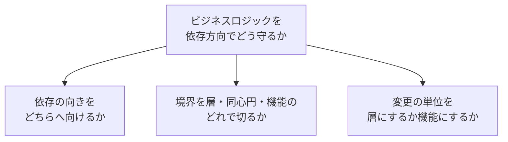
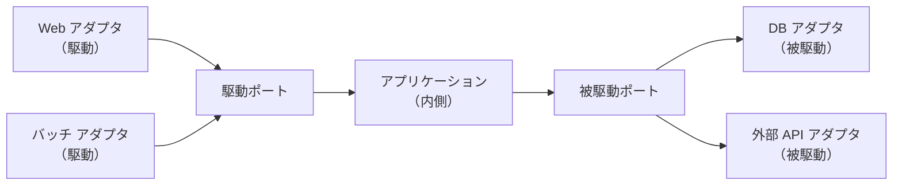
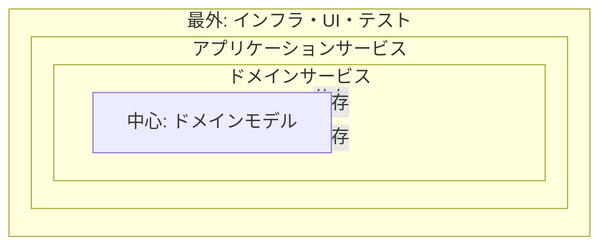
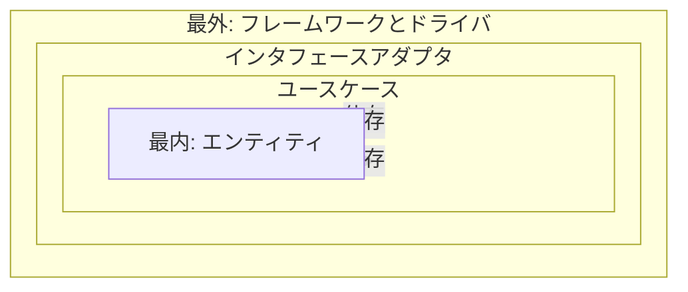
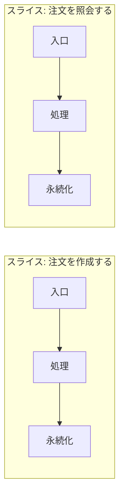
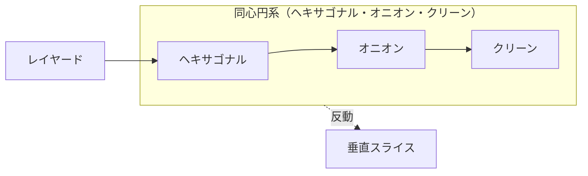
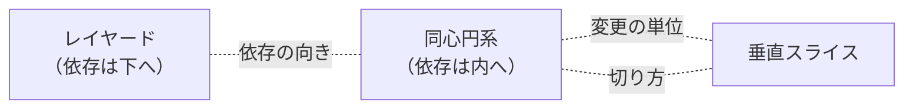
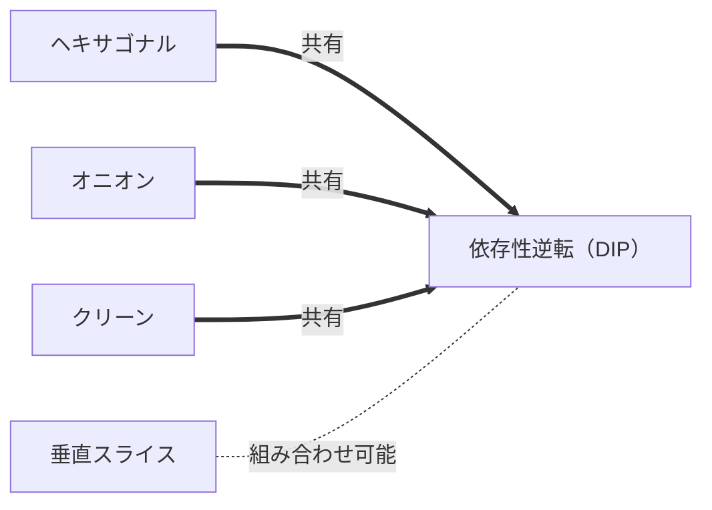

## 導入: ビジネスロジックを依存方向でどう守るか

アプリケーションの中核には、ビジネスのルールを表現するコードが存在する。注文の金額を計算し、与信枠を検査し、状態の遷移を許可または拒否する。一方で、ビジネスルールの周囲には、データベース・Web フレームワーク・外部 API といった技術的な詳細が取り巻く。技術的な詳細は、ビジネスルールより速く・頻繁に変わる。データベースは載せ替わり、フレームワークは更新され、外部 API は仕様を変える。ビジネスルールが技術的な詳細へ依存すると、詳細の変更がルールへ波及する。

アーキテクチャの各様式は、共通の問題への異なる回答である。問題とは「ビジネスロジックを技術的な詳細から守り、依存の向きをどう制御するか」である。回答は、次の軸で分岐する。

- 依存の向き: ビジネスルールが詳細へ依存するか、詳細がルールへ依存するか
- 境界の置き方: 層で水平に切るか、同心円で内外に切るか、機能で縦に切るか
- 変更の単位: 技術的な層を単位に変えるか、ビジネスの機能を単位に変えるか

本記事は 5 つのアーキテクチャ様式を、構造を決める起点で 3 つの族に分けて比較する。特定の様式を中心に据えず、各様式を族の 1 メンバーとして対等に扱う。クリーンアーキテクチャも数ある様式の 1 つとして同じ重みで扱い、中心に据えない。各様式を次の 4 段で展開し、末尾で全様式を横断するトレードオフ表にまとめる。

- 問題起点: 何の痛みを解こうとしたか
- 論理: 構造の理屈
- 批判: 限界・誤用・いつ使わないか
- 担い手と論争: 提唱者・支持者・批判者と一次情報

共通核は依存性逆転の原則（Dependency Inversion Principle、以下 DIP）である。DIP は「上位のモジュールは下位のモジュールに依存してはならない。両者は抽象に依存すべきである」と説く[^dip-martin]。ビジネスルールがインタフェースを定義し、技術的な詳細がインタフェースを実装する。制御の流れは外側から内側へ向かうが、ソースコードの依存の向きは内側を指す。同心円系の 3 様式は、DIP を構造の中心に据える。本記事は DIP を各様式の論理で繰り返し参照する。

コード例は Kotlin 2.4.0 を前提とする[^kotlin-version]。各例は様式の差分が見える最小限に絞り、長大なクラス群は避ける。

アーキテクチャを構造化する軸を、はじめに俯瞰しておく。



各様式は 3 つの軸の上で異なる位置を占める。本記事は、構造を何で切るかという起点で各様式を 3 つの族に束ねる。層で分ける族・内側を境界で守る族・機能で縦に切る族の 3 つを順に見ていく。

## 層で分ける

層で分ける族は、構造の出発点を技術的な役割の水平な層に置く。プレゼンテーション・ビジネスロジック・データアクセスといった役割ごとに層を重ね、上の層が下の層を呼ぶ。依存の向きは上から下へ素直に流れる。

### レイヤードアーキテクチャ

#### 問題起点

技術的な役割ごとにコードを分け、責務の所在を明確にしたい。画面の表示・業務の処理・データの永続化を 1 つの関数に混ぜると、変更の影響範囲が読めない。役割で層を分ければ、各層は隣接する層とだけやり取りし、関心事が局所化する。

#### 論理

レイヤードアーキテクチャは、アプリケーションを水平な層に積む。典型は 3 層から 4 層である。

- プレゼンテーション層: 入力の受付と出力の整形
- アプリケーション層: ユースケースの調整（4 層構成で分離する）
- ドメイン層: ビジネスルール
- インフラストラクチャ層: 永続化と外部連携

各層は直下の層だけに依存する。上の層は下の層のインタフェースを呼び、下の層は上の層を知らない。依存の向きは上から下への一方向である。

```kotlin
// 上の層が下の層を直接呼ぶ。依存の向きは上から下へ流れる。
class OrderController(private val service: OrderService) {
    fun place(request: OrderRequest): OrderResponse =
        service.placeOrder(request.customerId, request.items).let(::OrderResponse)
}

class OrderService(private val repository: OrderRepository) {
    fun placeOrder(customerId: Long, items: List<OrderItem>): Long {
        require(items.isNotEmpty()) { "items must not be empty" }
        return repository.save(customerId, items)
    }
}

// ドメイン層がインフラ層（JdbcOrderRepository）を直接参照する。
class JdbcOrderRepository : OrderRepository {
    override fun save(customerId: Long, items: List<OrderItem>): Long = 0
}
```

層の役割が明快で、各層の責務が分かれる。新しい機能は、各層に対応するクラスを足して縦に貫けば実装できる。

#### 批判

依存の向きがビジネスルールを守らない。素朴なレイヤードでは、ドメイン層がインフラストラクチャ層へ依存する。具体的には次の問題が起きる。

- ドメイン層がリポジトリの実装やデータベースの都合を参照する。
- データベースの変更がドメイン層へ波及する。
- ドメイン層の単体テストにデータベースが必要になる。

依存の向きを下に流す素朴な構成は、技術的な詳細が最下層にあるため、最も変わりやすい層へ最も重要な層が依存する逆転を招く。対処は DIP である。ドメイン層がリポジトリのインタフェースを定義し、インフラストラクチャ層が実装する。依存の向きをインフラからドメインへ反転させると、構造は次の族（内側を境界で守る族）へ近づく。

採否の目安は次のとおり。

- レイヤードアーキテクチャは、層の数が少なく、ドメインが薄い CRUD（Create / Read / Update / Delete）中心のシステムで機能する。
- ドメインルールが厚く、技術的な詳細の変更からルールを守る必要がある領域では、DIP を導入した同心円系の様式へ移る判断が要る。
- 層を増やすほど、層をまたぐ単純なデータの転記（マッピング）が増える。層の数は要求に見合う最小限に保つ。

#### 担い手と論争

- 整理・普及: 単一の発明者はいない。古典的な n 層アーキテクチャとして広く使われる。Frank Buschmann ほかが『Pattern-Oriented Software Architecture, Volume 1』（1996）で Layers をアーキテクチャパターンとして文書化した[^layered-posa]。Eric Evans が『Domain-Driven Design』（2003）でレイヤード化を整理した[^layered-evans]。Martin Fowler は『Patterns of Enterprise Application Architecture』（2002）で多層構成のパターンを整理した[^layered-fowler]。
- 批判・慎重論: Mark Richards は、各層が論理をほとんど持たず要求を素通しする状態を Architecture Sinkhole Anti-Pattern と名づけ、約 8 割の要求が素通しなら様式が不適合だと論じる[^layered-sinkhole]。Mark Richards と Neal Ford は『Fundamentals of Software Architecture』（2020）で、レイヤードは技術分割でありドメインが全層に分散して全体的なアジリティを欠くと指摘する[^layered-fundamentals]。

## 内側を境界で守る（同心円・依存性逆転）

内側を境界で守る族は、構造の出発点を同心円の境界に置く。ビジネスルールを最も内側に置き、技術的な詳細を外側に置く。依存の向きを DIP で反転させ、外側から内側へ向ける。内側はインタフェース（ポート）を定義し、外側が実装（アダプタ）を提供する。本族の 3 様式は、同じ DIP の核を共有しつつ、境界の数え方と層の呼称で差を持つ。

### ヘキサゴナルアーキテクチャ（ポート&アダプタ）

#### 問題起点

アプリケーションを、外部とのやり取りの種類から独立させたい。同じビジネスロジックを、Web からも・バッチからも・テストからも同じ形で駆動したい。データベースを本番用とインメモリ用で差し替えたい。入出力の経路（UI・API・DB・メッセージング）がビジネスロジックへ食い込むと、経路ごとにロジックが分岐し、テストが外部環境に縛られる。

#### 論理

ヘキサゴナルアーキテクチャ（別名: ポート&アダプタ）は、アプリケーションを内側の六角形として描く。六角形の内側にビジネスロジックを置き、外界との接点をポートとアダプタで表す。

- ポート: アプリケーションが定義するインタフェース。アプリケーションが必要とする操作を抽象として宣言する。
- アダプタ: ポートを外界の技術へ結ぶ実装。1 つのポートに複数のアダプタを差し替えられる。

ポートには 2 種類がある。

- 駆動ポート（プライマリ・内向き）: アプリケーションを呼び出す側のインタフェース。Web コントローラやバッチが駆動アダプタとして呼ぶ。
- 被駆動ポート（セカンダリ・外向き）: アプリケーションが外部へ要求する操作のインタフェース。データベースや外部 API のアダプタが実装する。



```kotlin
// 駆動ポート: アプリケーションを呼び出す入口のインタフェース。
interface PlaceOrderUseCase {
    fun place(customerId: Long, items: List<OrderItem>): Long
}

// 被駆動ポート: アプリケーションが外部へ要求する操作。アプリケーションが定義する。
interface OrderRepository {
    fun save(customerId: Long, items: List<OrderItem>): Long
}

// 内側のアプリケーション。被駆動ポートにだけ依存し、実装を知らない。
class OrderApplication(private val repository: OrderRepository) : PlaceOrderUseCase {
    override fun place(customerId: Long, items: List<OrderItem>): Long {
        require(items.isNotEmpty()) { "items must not be empty" }
        return repository.save(customerId, items)
    }
}
```

ポートはアプリケーションが定義する。被駆動ポートの `OrderRepository` をアプリケーション側に置くことで、依存の向きが反転する。アプリケーションはデータベースの実装を知らず、インタフェースだけに依存する。DIP がアプリケーションを技術的な詳細から切り離す。アダプタの差し替えで、同じアプリケーションを本番用データベースともインメモリのテスト用実装とも結べる。

#### 批判

境界の導入はコードの量を増やす。次の負担が生じる。

- ポートのインタフェースと、ポートをまたぐデータの変換が増える。
- アダプタごとにマッピングのコードが要る。
- ドメインが薄い領域では、ポートとアダプタの構造が読解の手間を上回る。

「すべての外部接点をポートで抽象化する」教条化も問題になる。差し替えの要求がない接点までインタフェースで包むと、抽象だけが残る。

適用範囲は次のとおり。

- ヘキサゴナルアーキテクチャは、外部接点が複数あり、接点を差し替える要求がある領域で効果を発揮する。テストで外部依存をインメモリ実装に置換したい場合に向く。
- 外部接点が単一で差し替えの要求がない領域では、ポートの抽象は過剰投資になる。

#### 担い手と論争

- 提唱・命名: Alistair Cockburn が 1994 年の図を起点に、2005 年に Ports and Adapters へ改称した[^hex-cockburn]。語呂のよさから Hexagonal Architecture の呼称が定着した。
- 支持・普及: Vaughn Vernon は『Implementing Domain-Driven Design』（2013）でヘキサゴナルを DDD の基盤的アーキテクチャに据えた[^hex-vernon]。Netflix Technology Blog はデータソース変更への適応事例を報告した[^hex-netflix]。
- 批判・慎重論: Mark Seemann は、レイヤードに依存性逆転を適用するとポート&アダプタになると論じ、層型・オニオン・ポート&アダプタを本質的に等価とみなす[^seemann-same]。Herberto Graça は 3 様式を依存が中心へ向かう同一原理の共有として整理する[^graca-explicit]。Victor Rentea は、厳格な層化が抽象なき間接化（indirection without abstraction）を生み、委譲だけのコントローラがボイラープレートを増やすと批判する[^hex-rentea]。

### オニオンアーキテクチャ

#### 問題起点

ビジネスルールを、データアクセスとインフラストラクチャから明確に切り離したい。素朴なレイヤードでデータアクセス層を最下層に置くと、上位の層がデータアクセスへ依存する。依存の向きを内側へ集約し、中心のドメインモデルを最も安定させたい。

#### 論理

オニオンアーキテクチャは、アプリケーションを同心円の層として描く。中心にドメインモデルを置き、外へ向かって層を重ねる。Palermo の原典が明示するのは、次の構造と依存方向ルールである[^onion-palermo]。

- 中心: ドメインモデル（エンティティ・値オブジェクト）
- 中心の外側: リポジトリ等のインタフェース
- 最外: インフラストラクチャ・UI・テスト

依存の向きは、すべて外側から内側を指す。Palermo はルールを「all coupling is toward the center（結合はすべて中心へ向かう）」と定式化する[^onion-palermo]。内側の層は外側の層を知らない。インタフェースは内側の層が定義し、外側の層が実装する。DIP が同心円の全周で働く。

実務では、ドメインモデルとインフラの間にドメインサービス・アプリケーションサービスを置く層分けが流布する。Palermo の原典が名づける層ではなく、原典の構造から派生した層分けである。次の図は、流布する派生的な層分けを示す。



```kotlin
// 中心: ドメインモデル。外側を一切参照しない。
data class Order(val id: Long, val items: List<OrderItem>) {
    val total: Long = items.sumOf { it.price * it.quantity }
}

// 内側が定義するインタフェース。実装は最外のインフラ層が提供する。
interface OrderRepository {
    fun save(order: Order): Long
}

// アプリケーションサービス。ドメインモデルとインタフェースにだけ依存する。
class OrderService(private val repository: OrderRepository) {
    fun place(order: Order): Long {
        require(order.items.isNotEmpty()) { "items must not be empty" }
        return repository.save(order)
    }
}
```

オニオンアーキテクチャは、ヘキサゴナルアーキテクチャと同じ DIP を共有する。差は描き方にある。ヘキサゴナルが内外の 2 領域とポートで表すのに対し、オニオンは中心から外への複数の同心層を明示し、ドメインモデルを最内に固定する。中心のドメインモデルは外側の何も参照しないため、最も安定する。

#### 批判

同心層の数が増えると、層をまたぐマッピングが増える。次の負担が生じる。

- ドメインモデル・アプリケーションサービス・インフラの間で、データ表現の変換が要る。
- 層の責務の線引き（ドメインサービスとアプリケーションサービスの区別）に判断が要る。
- ドメインが薄い領域では、同心層の構造が過剰になる。

「ドメインモデルを純粋に保つ」原則の教条化も起きる。フレームワークの注釈をドメインモデルから完全に排除する規律は、単純なアプリケーションには見合わない手間を生む。

適用範囲は次のとおり。

- オニオンアーキテクチャは、ドメインルールが厚く、ドメインモデルをインフラから独立させる価値がある領域で効果を発揮する。
- ドメインが薄く CRUD に近い領域では、同心層の構造は過剰投資になる。

#### 担い手と論争

- 提唱・命名: Jeffrey Palermo が 2008 年のブログ連載で Onion Architecture として提唱した[^onion-palermo]。
- 支持・普及: .NET コミュニティを中心に参照される。Microsoft の .NET ガイドは、オニオンをヘキサゴナル・ポート&アダプタ・クリーンと同系の名称として並べる[^onion-msdotnet]。
- 批判・慎重論: Mark Seemann は、オニオンを層型・ポート&アダプタと並ぶ同一パターンの別表現とみなす[^seemann-same]。Herberto Graça は、オニオンをポート&アダプタに DDD の内部層を加えたものと位置づける[^graca-explicit]。Victor Rentea は、単一実装しか持たないインタフェースを疑い、抽象なき間接化が増える点を批判する[^hex-rentea]。

### クリーンアーキテクチャ

#### 問題起点

依存の向きを内側へ向ける規則を明示的に名づけ、層の役割を具体的に定義したい。依存の向きを規定する原則を「依存性のルール」として 1 つの文に固定したい。フレームワーク・UI・データベースを詳細として外側へ追い出し、ビジネスルールを最も内側に置く規則を明示したい。

#### 論理

クリーンアーキテクチャは、依存性のルール（The Dependency Rule）を中心に据える。ルールは「ソースコードの依存は、内側へのみ向かう」と定める[^clean-martin]。同心円を 4 層で示す。

- エンティティ（最内）: 企業全体のビジネスルール
- ユースケース: アプリケーション固有のビジネスルール
- インタフェースアダプタ: コントローラ・プレゼンタ・ゲートウェイ
- フレームワークとドライバ（最外）: Web・データベース・外部ツール

依存は内側だけを指す。内側は外側を知らない。制御の流れが外側から内側へ進み、内側から外側へ戻る場合は、内側が定義するインタフェースを通じて制御を反転させる（制御の流れと依存の向きを分離する）。



```kotlin
// 最内: エンティティ。アプリケーション横断のビジネスルール。
data class Order(val id: Long, val items: List<OrderItem>) {
    fun validate() = require(items.isNotEmpty()) { "items must not be empty" }
}

// ユースケース層が定義する出力境界（被駆動ポートに相当）。
interface OrderGateway {
    fun save(order: Order): Long
}

// ユースケース: アプリケーション固有のルール。内側だけに依存する。
class PlaceOrder(private val gateway: OrderGateway) {
    fun execute(order: Order): Long {
        order.validate()
        return gateway.save(order)
    }
}
```

クリーンアーキテクチャの依存性のルールは、ヘキサゴナルのポート&アダプタ・オニオンの同心層と同じ DIP の言い換えである[^clean-martin]。`OrderGateway` をユースケース層に置くことで、データベースのアダプタがユースケースへ依存する。最も変わりやすいフレームワークとデータベースが最外に追い出され、最も重要なビジネスルールが最内で守られる。

#### 批判

層の数と境界の数だけ、ボイラープレートが増える。次の負担が生じる。

- 層をまたぐたびにデータの変換（入力モデル・出力モデル・エンティティの間の詰め替え）が要る。
- ユースケースごとに入力境界・出力境界のインタフェースが要る。
- ドメインが薄い領域では、4 層の構造が読解と実装の手間を上回る。

「クリーン」の教条化が、独立した批判の対象になる。原典の図を字義どおりに全規模へ適用すると、単純な CRUD にまで 4 層と多数のインタフェースを課す。原則の理解より図の模倣が先行すると、抽象だけが残る。フレームワークの機能（依存性注入・O/R マッパー）を「詳細だから」と過度に遠ざける運用は、フレームワークの利点を捨てる。

適用範囲は次のとおり。

- クリーンアーキテクチャは、ビジネスルールが厚く、フレームワークやデータベースの寿命よりルールの寿命が長い領域で効果を発揮する。
- ドメインが薄く、ライフサイクルが短いアプリケーションでは、4 層の構造は過剰投資になる。境界の数を要求に見合う最小限へ削る判断が要る。

#### 担い手と論争

- 提唱・命名: Robert C. Martin（通称 Uncle Bob）が 2012 年のブログ記事 "The Clean Architecture" で提示し[^clean-martin]、2017 年の書籍『Clean Architecture』で体系化した[^clean-book]。Robert C. Martin はクリーンを先行様式（ヘキサゴナル・オニオン）の統合として位置づけた[^clean-martin]。
- 支持・普及: 同心円の図とともに広く引用され、各言語のサンプル実装が普及した。
- 批判・慎重論: David Heinemeier Hansson は、依存性注入を柔軟性の名目で広まった作法と評し[^clean-dhh-di]、テストのための抽象層が設計を損なう test-induced design damage を指摘する[^clean-dhh-damage]。James McKay は、単一実装に対する抽象は漏れやすく、同一モデルの多重マッピングが DRY を破ると批判する[^clean-mckay]。Blaine Osepchuk は、書籍に実例が乏しく適用方法を得にくいと評する[^clean-osepchuk]。James Hickey は、同一機能の断片が層をまたいで離れ、文脈の切り替えが増えると指摘する[^clean-hickey]。

## 機能で縦に切る

機能で縦に切る族は、構造の出発点をビジネスの機能（フィーチャー）に置く。技術的な層で水平に切る代わりに、1 つの機能を入口から永続化まで縦に貫く 1 つのスライスとして束ねる。変更の単位を層ではなく機能に合わせる。同心円系への反動として位置づく。

### 垂直スライスアーキテクチャ

#### 問題起点

1 つの機能の変更を、1 か所で完結させたい。レイヤードや同心円系では、1 つの機能を加える際にプレゼンテーション・ユースケース・ドメイン・インフラの各層へ少しずつコードを足す。変更が複数の層に分散し、機能の全体像が層をまたいで散らばる。機能を単位にコードを束ね、機能の追加と変更を局所化したい。

#### 論理

垂直スライスアーキテクチャは、アプリケーションを機能ごとの縦のスライスへ分ける。1 つのスライスは、1 つのユースケース（例: 注文を作成する）に必要な入口・処理・永続化をまとめて持つ。スライス間の結合を弱め、スライス内の凝集を高める。



```kotlin
// 1 スライス = 1 ユースケース。入口・処理・永続化を 1 ファイルに束ねる。
data class PlaceOrderCommand(val customerId: Long, val items: List<OrderItem>)

class PlaceOrderHandler(private val db: Database) {
    fun handle(command: PlaceOrderCommand): Long {
        require(command.items.isNotEmpty()) { "items must not be empty" }
        val total = command.items.sumOf { it.price * it.quantity }
        return db.insertOrder(command.customerId, command.items, total)
    }
}

// 照会スライスは書き込みと別の経路を持ち、読み取りに最適化できる。
class GetOrderHandler(private val db: Database) {
    fun handle(orderId: Long): OrderView = db.selectOrderView(orderId)
}
```

機能の変更は 1 つのスライスに閉じる。注文の作成ロジックを変えても、注文の照会スライスへ影響しない。スライスごとに実装の度合いを変えられる。単純な照会は手続きとして直接書き、複雑な機能はスライス内でドメインモデルを使う。層を横断する一律の抽象を、機能ごとに必要な分だけへ置き換える。

#### 批判

横断的関心事がスライスをまたいで重複する。次の問題が起きる。

- 認証・ログ・トランザクション管理・検証といった、機能をまたぐ関心事の置き場所が定まらない。
- 同じドメインルール（例: 与信検査）が複数のスライスに転記される。
- スライスの粒度の基準が曖昧だと、スライスが肥大化するか、過度に細分化する。

依存の向きを縦のスライスへ閉じる構造は、スライスをまたぐ共有コードの管理を別途要求する。横断的関心事はパイプライン（リクエストの前後で共通処理を挟む仕組み）へ、共有ドメインルールは共通のドメイン層へ切り出す設計が要る。同心円系が層で一律に解いた横断的関心事を、垂直スライスは個別に解く。

適用範囲は次のとおり。

- 垂直スライスアーキテクチャは、機能ごとに独立して変更が入る領域、機能間の結合が弱い領域で効果を発揮する。読み書きの要求が異なる場合に、スライスごとに最適化できる。
- 機能をまたぐ共有ルールが厚く、横断的関心事が多い領域では、スライス間の重複の管理が負担になる。

#### 担い手と論争

- 提唱・命名: Jimmy Bogard が 2018 年のブログ記事 "Vertical Slice Architecture" で提唱した[^vsa-bogard]。
- 支持・普及: Derek Comartin が .NET コミュニティで精力的に発信する[^vsa-comartin]。MediatR や CQRS（Command Query Responsibility Segregation、コマンドとクエリの責務分離）の文脈で広く参照される。
- 層型への批判: Jimmy Bogard は、層をまたぐ一律の規則が実務で役立つ場面は少なく、抽象すべきでない概念まで抽象化を招くと述べる[^vsa-bogard]。Derek Comartin は、名詞やエンティティで駆動する系は高結合で変更しにくくなると指摘する[^vsa-comartin]。
- 垂直スライス自体への懸念: 全面否定の実名批判は確認できない。Oskar Dudycz は支持の立場から、純粋なスライスは各機能が孤立して作られるフィーチャーファクトリ化を招き、モジュール間の同期呼び出しが分散トランザクションの問題を生むと注意を促す[^vsa-dudycz]。

## アーキテクチャ様式の相関

3 族に分けても、様式どうしは族をまたいで関係する。様式どうしには系譜・対立・合成の関係が重なる。族で束ねた地図の上に、派生の流れ・同じ軸での対立・組み合わせの線を引くと、各様式の位置が立体的に見える。関係を 3 種に分けて図示し、要点を整理する。

系譜の関係を示す。実線矢印は派生・源流の向き（源流から派生へ）を表す。



対立の関係を示す。破線は同じ軸の両端で対立する組を表す。



合成の関係を示す。太線矢印は共有する核を表し、点線は組み合わせ可能な関係を表す。



系譜の要点は次のとおり。

- レイヤードに DIP を導入し、依存の向きを内側へ反転させると、ヘキサゴナルへ至る。ヘキサゴナルは DIP にポート&アダプタの語彙を与える。
- ヘキサゴナルの内外 2 領域を、中心から外への同心層へ展開するとオニオンへ至る。オニオンは DIP にドメインモデルを最内へ固定する強調を加える。
- クリーンは、DIP を依存性のルールとして 1 つの文に明示し、4 層に役割を命名する。ヘキサゴナル（2005）・オニオン（2008）の後、2012 年に提示された。
- 垂直スライスは、同心円系が技術的な層で水平に切る構造への反動である。変更の単位を層から機能へ移す。

対立の要点は次のとおり。

- レイヤードと同心円系は、依存の向きで対立する。レイヤードは依存を下（インフラ）へ流し、同心円系は依存を内（ビジネスルール）へ向ける。DIP の有無が分かれ目である。
- 同心円系と垂直スライスは、変更の単位で対立する。同心円系は技術的な層を単位に切り、垂直スライスはビジネスの機能を単位に切る。
- 同心円系と垂直スライスは、境界の切り方でも対立する。同心円系は同心層で水平に切り、垂直スライスは機能で縦に切る。

合成の要点は次のとおり。

- ヘキサゴナル・オニオン・クリーンは、DIP を共有核とし、境界の数え方と語彙で差を持つ対等な表現である。3 様式は依存の向きを内側へ向ける核を共有する。
- 3 様式は同じ DIP を別の語彙で表す。ヘキサゴナルはポート&アダプタ、オニオンは同心層、クリーンは依存性のルールと 4 層の命名で核を描く。
- 垂直スライスは、スライス内部で同心円系を組み合わせられる。複雑なスライスはスライス内でユースケース層とエンティティを持ち、単純なスライスは手続きで済ませる。垂直スライスと同心円系は排他ではない。

### 三様式の関係をどう捉えるか

クリーン・ヘキサゴナル・オニオンの関係には 2 つの見方がある。「クリーンが他を包含する上位集合だ」と断言できる一次出典は無い。3 様式は次の核を共有する。

- 依存は常にコア（内側）へ向かう（依存性逆転、DIP）。
- ビジネスロジックを UI・データベース・フレームワークから独立させる。

見方①は、提唱者 Robert C. Martin の「統合」視点である。Martin はクリーンを、ヘキサゴナル・オニオン等の似た目的を持つ先行様式を 1 つの同心円図に統合（integrate）したものとして提示した[^clean-martin]。

- 原語は "integrating ... into a single actionable idea" であり、"contains"・"subsumes"・"generalizes"（包含・一般化）とは述べていない。
- Martin 自身が、先行様式を "very similar" であり "the same objective" を持つと認めている[^clean-martin]。

見方②は、第三者の「同じ核の別表現・近縁」視点である。

- Mark Seemann は "Layers, Onions, Ports, Adapters: it's all the same" で、レイヤードに依存性逆転を適用するとポート&アダプタになると論じる[^seemann-same]。
- Herberto Graça は、ヘキサゴナル・オニオン・クリーンを「依存はすべて内側へ向かう」という同じ根本ルールを共有する近縁として整理する[^graca-explicit]。

各様式は、クリーンに吸収しきれない固有の強調点を持つ。

- ヘキサゴナル（Cockburn）: 内と外の対称性。UI を上・データベースを下に積む 1 次元の階層図から脱却し、入力側と出力側を同型のポート&アダプタとして扱う。ただし対称は「内と外」であって「左右（driving と driven）」の完全な対等ではない。Cockburn 自身が左右の非対称を認める。原文は "not that between left and right sides ... but between inside and outside" である[^hex-cockburn]。
- オニオン（Palermo）: 依存方向ルールの明示的な定式化 "all coupling is toward the center（結合はすべて中心へ向かう）"[^onion-palermo]。
- クリーン（Martin）: 依存性のルールを明示的に名づけ、エンティティ・ユースケース・インタフェースアダプタ・フレームワークの 4 層を命名する[^clean-martin]。

以上より、本記事はクリーン・ヘキサゴナル・オニオンを、依存性逆転を共有する対等な兄弟として扱う。「クリーンが上位集合だ」とは書かない。Martin が統合として提示した事実は、担い手の記述のとおりである。

導入で示した 3 軸（依存の向き・境界の置き方・変更の単位）が、関係の背骨を成す。各様式は同じ軸の両端で対立し、軸の上で近い様式は系譜や合成でつながる。3 族で束ねた地図に系譜・対立・合成の線を引くと、様式の選択は孤立した 5 択ではなく、軸の上での位置取りと組み合わせの判断になる。

## 様式の担い手と歴史

5 つの様式を、提唱・支持・批判の担い手と起源で一覧する。人名・年・短語に絞り、一次情報のリンクは本文の脚注に委ねる。

| 様式 | 提唱・命名 | 支持・普及 | 批判・慎重論 | 起源（年） | 現在の活用 |
| --- | --- | --- | --- | --- | --- |
| レイヤード | 単一発明者なし（Buschmann・Evans・Fowler が整理） | n 層の定番 | Richards（Sinkhole）・Richards & Ford（アジリティ欠如） | 2002 前後 | 薄いドメイン・CRUD |
| ヘキサゴナル | Alistair Cockburn | Vernon・Netflix | Seemann（等価）・Rentea（過剰設計） | 2005 | 外部接点の差し替え |
| オニオン | Jeffrey Palermo | .NET コミュニティ | Seemann（等価）・Graça（統合）・Rentea（過剰設計） | 2008 | 厚いドメイン |
| クリーン | Robert C. Martin | 各言語のサンプル実装 | DHH（DI 批判）・McKay・Osepchuk・Hickey | 2012 | 厚いドメイン・長寿命 |
| 垂直スライス | Jimmy Bogard | Comartin・.NET・MediatR | Dudycz（フィーチャーファクトリ化の懸念） | 2018 | 機能独立・読み書き分離 |

## 結び: 唯一の正解はない

5 つのアーキテクチャ様式は、共通の問題への異なる回答である。優劣の序列はなく、ドメインの性質・規模・変更の質によって最適が変わる。判断の手がかりを 3 点で整理する。

- ドメインルールの厚さが境界の数を決める。ルールが薄ければレイヤードで足り、厚ければ DIP で守る同心円系が報われる。
- 変更の入り方が切る向きを決める。機能ごとに独立して変更が入るなら垂直スライス、技術的な層ごとに変更が局所化するなら同心円系が向く。
- アプリケーションの寿命がボイラープレートの許容量を決める。寿命が長くルールの寿命がフレームワークを上回るなら、同心円系の境界が報われる。短命なら過剰になる。

アーキテクチャ様式は排他ではない。ヘキサゴナル・オニオン・クリーンは DIP を共有核とする対等な表現であり、垂直スライスはスライス内部で同心円系を組み合わせられる。1 つのシステムでも、境界ごとに異なる様式を選べる。ルールの厚い中核には DIP で守る同心円系を、薄い周辺にはレイヤードを、機能が独立する領域には垂直スライスを割り当てる判断が、現実の設計である。共通核の DIP は、どの様式を選んでも「最も変わりやすい詳細に、最も重要なルールを依存させない」という一点へ収束する。

最後に、全様式を横断するトレードオフ表で締める。

| 様式 | 依存の向き | 境界の切り方 | 変更の単位 | 主な向き先 | 主な批判 |
| --- | --- | --- | --- | --- | --- |
| レイヤード | 上から下へ | 水平な層 | 技術的な層 | 薄いドメイン・CRUD | 依存が下へ流れルールを守らない |
| ヘキサゴナル | 外から内へ（DIP） | 内外 2 領域＋ポート | 技術的な層 | 外部接点の差し替え | 抽象過多・ポート化の教条化 |
| オニオン | 外から内へ（DIP） | 同心層 | 技術的な層 | 厚いドメイン | 同心層のマッピング増 |
| クリーン | 内へ（依存性のルール） | 4 層の同心円 | 技術的な層 | 厚いドメイン・長寿命 | 教条化・ボイラープレート |
| 垂直スライス | スライス内へ閉じる | 機能で縦に切る | ビジネスの機能 | 機能独立・読み書き分離 | 横断的関心事の重複 |

表は様式の差を圧縮した近似である。実際の設計では、1 つの様式を選ぶより、ドメインの境界ごとに様式を組み合わせる判断が問われる。設計の上達とは、各様式がどの痛みを解き、どこで破綻するかを把握し、共通核の DIP を軸に目の前のドメインへ照らして選ぶ力を養う過程である。

[^kotlin-version]: 本記事のコード例は Kotlin 2.4.0（2026-06-03 リリース）を前提とする。出典: [Kotlin 2.4.0 Released（JetBrains Blog）](https://blog.jetbrains.com/kotlin/2026/06/kotlin-2-4-0-released/)。
[^dip-martin]: Robert C. Martin, "The Dependency Inversion Principle"（1996）。<https://web.archive.org/web/20110714224327/http://www.objectmentor.com/resources/articles/dip.pdf>
[^layered-evans]: Eric Evans, 『Domain-Driven Design: Tackling Complexity in the Heart of Software』（Addison-Wesley、2003）。<https://www.domainlanguage.com/ddd/>
[^layered-fowler]: Martin Fowler, 『Patterns of Enterprise Application Architecture』（Addison-Wesley、2002）。<https://martinfowler.com/books/eaa.html>
[^hex-cockburn]: Alistair Cockburn, "Hexagonal architecture"。本人サイト（<https://alistair.cockburn.us/hexagonal-architecture/>）は TLS 証明書失効で参照できないため、1994 年の図を起点に 2005 年へ Ports and Adapters へ改称した経緯は本人インタビューと Wikipedia で確認した。"Interview with Alistair Cockburn"（jmgarridopaz.github.io、2020）<https://jmgarridopaz.github.io/content/interviewalistair.html>、"Hexagonal architecture (software)"（Wikipedia）<https://en.wikipedia.org/wiki/Hexagonal_architecture_(software)>。
[^onion-palermo]: Jeffrey Palermo, "The Onion Architecture: part 1"（2008）。<https://jeffreypalermo.com/2008/07/the-onion-architecture-part-1/>
[^clean-martin]: Robert C. Martin, "The Clean Architecture"（2012）。<https://blog.cleancoder.com/uncle-bob/2012/08/13/the-clean-architecture.html>
[^clean-book]: Robert C. Martin, 『Clean Architecture: A Craftsman's Guide to Software Structure and Design』（Prentice Hall、2017）。<https://www.pearson.com/en-us/subject-catalog/p/clean-architecture-a-craftsmans-guide-to-software-structure-and-design/P200000009528/>
[^vsa-bogard]: Jimmy Bogard, "Vertical Slice Architecture"（2018）。<https://www.jimmybogard.com/vertical-slice-architecture/>
[^seemann-same]: Mark Seemann（2013）"Layers, Onions, Ports, Adapters: it's all the same"。<https://blog.ploeh.dk/2013/12/03/layers-onions-ports-adapters-its-all-the-same/>
[^graca-explicit]: Herberto Graça（2017）連載 "Explicit Architecture" 第 1 回。記事タイトルは DDD・Hexagonal・Onion・Clean・CQRS を統合する旨を列挙する。<https://herbertograca.com/2017/11/16/explicit-architecture-01-ddd-hexagonal-onion-clean-cqrs-how-i-put-it-all-together/>
[^layered-posa]: Frank Buschmann ほか 5 名による『Pattern-Oriented Software Architecture, Volume 1: A System of Patterns』（Wiley、1996）。ISBN 9780471958697。著者は Buschmann・Meunier・Rohnert・Sommerlad・Stal の 5 名である。
[^layered-sinkhole]: Mark Richards, "Software Architecture Patterns"（O'Reilly、2015）。Architecture Sinkhole Anti-Pattern を解説する。<https://www.oreilly.com/content/software-architecture-patterns/>
[^layered-fundamentals]: Mark Richards, Neal Ford, 『Fundamentals of Software Architecture』（O'Reilly、2020）。レイヤードを技術分割として論じ、ドメインの分散とアジリティ欠如を指摘する。<https://www.oreilly.com/library/view/fundamentals-of-software/9781492043447/>
[^hex-vernon]: Vaughn Vernon, 『Implementing Domain-Driven Design』（Addison-Wesley、2013）。InfoQ がヘキサゴナルを層型の発展形と要約する。Jan Stenberg, "Vaughn Vernon on Advanced Architecture Styles with DDD"（InfoQ、2013）。<https://www.infoq.com/news/2013/04/DDD-Architecture-Styles/>
[^hex-netflix]: Netflix Technology Blog, "Ready for changes with Hexagonal Architecture"（2020）。<https://netflixtechblog.com/ready-for-changes-with-hexagonal-architecture-b315ec967749>
[^hex-rentea]: Victor Rentea, "Overengineering in Onion/Hexagonal Architectures"（更新 2023）。<https://victorrentea.ro/blog/overengineering-in-onion-hexagonal-architectures/>
[^onion-msdotnet]: Microsoft, "Common web application architectures"（.NET ドキュメント）。オニオン・ヘキサゴナル・ポート&アダプタ・クリーンを同系の名称として並べる。<https://learn.microsoft.com/en-us/dotnet/architecture/modern-web-apps-azure/common-web-application-architectures>
[^clean-dhh-di]: David Heinemeier Hansson, "Dependency injection is not a virtue"（2013）。URL パスは /2012/ だが本文の日付は 2013 年 1 月 6 日である。<https://dhh.dk/2012/dependency-injection-is-not-a-virtue.html>
[^clean-dhh-damage]: David Heinemeier Hansson, "Test-induced design damage"（2014）。<https://dhh.dk/2014/test-induced-design-damage.html>
[^clean-mckay]: James McKay, "Just how clean is Uncle Bob's Clean Architecture?"（2018）。<https://jamesmckay.net/2018/09/just-how-clean-is-uncle-bobs-clean-architecture>
[^clean-osepchuk]: Blaine Osepchuk, "Why I can't recommend Clean Architecture by Robert C Martin"（DEV Community、2018）。<https://dev.to/bosepchuk/why-i-cant-recommend-clean-architecture-by-robert-c-martin-ofd>
[^clean-hickey]: James Hickey, "Clean Architecture Disadvantages"（2020）。<https://www.jamesmichaelhickey.com/clean-architecture/>
[^vsa-comartin]: Derek Comartin, "Vertical Slice Architecture isn't technical"（CodeOpinion、2025）。<https://codeopinion.com/vertical-slice-architecture-isnt-technical/>
[^vsa-dudycz]: Oskar Dudycz, "My thoughts on Vertical Slices, CQRS ..."（Architecture Weekly、2025）。<https://www.architecture-weekly.com/p/my-thoughts-on-vertical-slices-cqrs>
