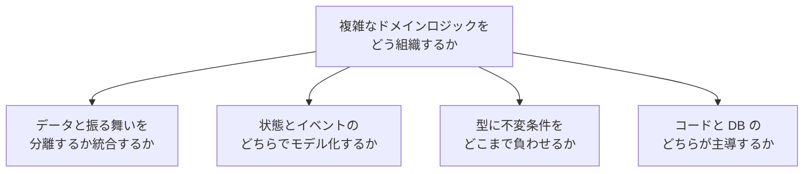
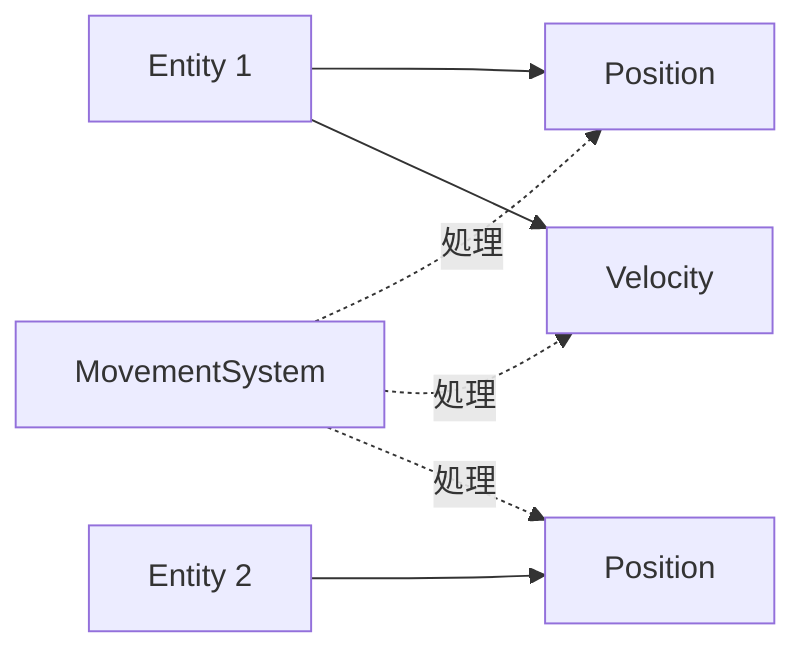
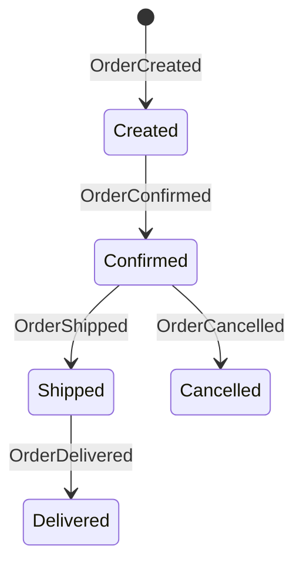
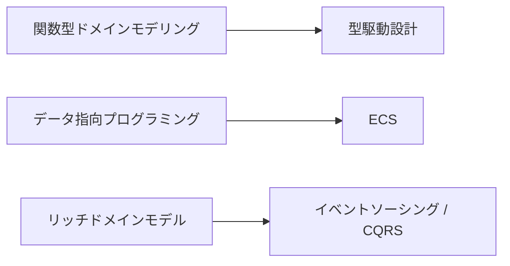
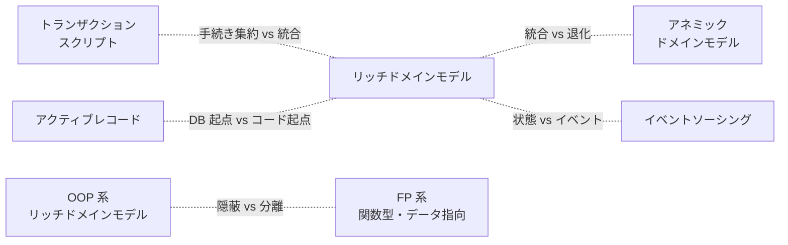
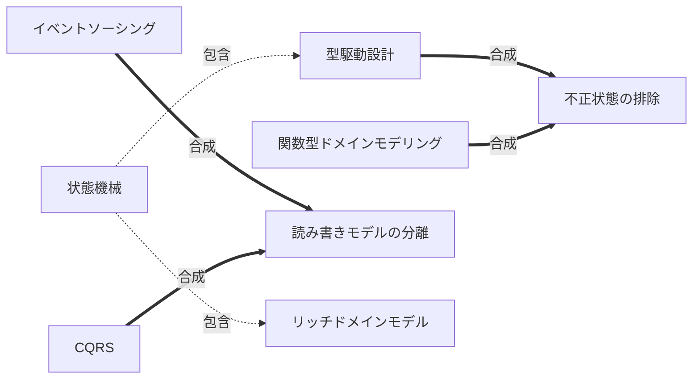

:::message
本記事は、内容の生成に AI を利用している。
:::

## 導入: 複雑なドメインロジックをどう組織するか

ソフトウェアの中核には、ドメインのルールを表現するコードが存在する。注文の金額を計算し、在庫を引き当て、与信枠を検査し、状態の遷移を許可または拒否する。ドメインロジックは規模が小さいうちは関数 1 つに収まる。しかしルールが増え、例外が積み重なり、複数のユースケースから同じルールを呼び出す段階に達すると、コードの組織方法そのものが設計上の問題になる。

ドメインモデリングの各思想は、共通の問題への異なる回答である。問題とは「複雑なドメインロジックをどう組織し、変更に強い構造へ落とし込むか」である。回答は、次の軸で分岐する。

- データと振る舞いの配置
- 状態とイベントの選択
- 型による制約の強度
- コードとデータベースの主従関係

本記事は 10 の設計思想を、設計の起点で 5 つの族に分けて比較する。特定の思想を中心に据えず、各思想を族の 1 メンバーとして対等に扱う。ドメイン駆動設計（Domain-Driven Design、以下 DDD）も数ある思想の 1 つとして同じ重みで扱い、中心に据えない。各思想を次の 3 段で展開し、末尾で全思想を横断するトレードオフ表にまとめる。

- 問題起点: 何の痛みを解こうとしたか
- 論理: 設計の理屈
- 批判: 限界・誤用・いつ使わないか

コード例は Kotlin 2.4.0 を前提とする[^kotlin-version]。各例は思想の差分が見える最小限に絞り、長大なクラス定義は避ける。

ドメインモデリングを構造化する軸を、はじめに俯瞰しておく。



各思想は 4 つの軸の上で異なる位置を占める。本記事は、設計を何から始めるかという起点で各思想を 5 つの族に束ねる。手続き・データ・振る舞い・型と関数・状態と時間の 5 つの起点を順に見ていく。

## 手続きを起点に組む

手続きを起点に組む族は、設計の出発点を業務手続きの流れに置く。1 つのユースケースを 1 つの手続きとして上から下へ記述し、抽象化の構造を最小限に保つ。

### トランザクションスクリプト

#### 問題起点

業務手続きを愚直に手続きとして書きたい。1 つのリクエストに対し、入力の受け取り・検証・データベースの読み書き・結果の返却を順に行う。ドメインが単純なら、抽象化のための構造はかえって読解を妨げる。

#### 論理

トランザクションスクリプトは、1 つのユースケースを 1 つの手続きとして実装する。ロジックはサービスやハンドラの関数に集約し、データは受動的なレコードとして扱う。

```kotlin
// 1 ユースケース = 1 手続き。ロジックは手続き本体に集約する。
class OrderService(private val db: Database) {
    fun placeOrder(customerId: Long, items: List<OrderItem>): Long {
        require(items.isNotEmpty()) { "items must not be empty" }
        val total = items.sumOf { it.price * it.quantity }
        val credit = db.findCreditLimit(customerId)
        require(total <= credit) { "credit limit exceeded" }
        return db.insertOrder(customerId, items, total)
    }
}
```

手続きの内部は上から下へ読める。間接層がなく、制御の流れがコードの並びと一致する。新しいユースケースは新しい手続きを足すだけで増やせる。

#### 批判

ロジックの重複が課題になる。複数のユースケースが同じルール（例: 与信検査）を必要とすると、次の問題が起きる。

- 手続きごとにルールが転記される。
- 変更時に修正漏れが起きる。

ドメインが成長すると、手続きは次のように破綻する。

- 手続きが長大化する。
- 分岐が増える。
- テストの組み合わせが爆発する。

採否の目安は次のとおり。

- トランザクションスクリプトを避ける目安は、同じドメインルールが 3 か所以上に現れた時点である。
- ルールの再利用が要求されるなら、ルールを置く場所をデータ側へ移す検討に入る。
- ドメインが薄く CRUD（Create / Read / Update / Delete）に近いなら、手続きのままで十分に機能する。

#### 担い手と論争

- 提唱・命名: Martin Fowler が『Patterns of Enterprise Application Architecture』（2002）でパターンとしてカタログ化した[^fowler-ts]。
- 支持: Fowler 自身が単純さを利点に挙げて擁護する。"The glory of Transaction Script is its simplicity." と述べ、単純な問題では採用を排除するなと記す[^ts-fowler-defense]。
- 批判・慎重論: Fowler 自身が限界を指摘する。業務ロジックが複雑化すると "it gets progressively harder to keep it in a well-designed state." とし、複雑なドメインはドメインモデルへ移るべきだと述べる[^ts-fowler-defense]。Eric Evans も、振る舞いをオブジェクトに収める努力を早々に諦め手続き型へ滑り落ちる退行を戒める[^ts-evans]。

## データを起点に組む

データを起点に組む族は、設計の出発点をデータ構造やスキーマに置く。振る舞いの配置はデータの形に従う。オブジェクトはデータの入れ物に徹し、ロジックは外側の関数やサービスが担う。

### アクティブレコード / データ中心設計

#### 問題起点

データベースのテーブルとオブジェクトを直結し、永続化の手間を減らしたい。テーブル 1 行をオブジェクト 1 つに対応させ、保存・更新・削除をオブジェクトのメソッドで完結させる。

#### 論理

アクティブレコードは、ドメインオブジェクトに永続化の責務を持たせる。`save` や `delete` がオブジェクト自身のメソッドになり、オブジェクトはテーブル構造を反映する。設計の出発点はデータベーススキーマであり、コードはスキーマに従う。「DB → コード」の向きである。

```kotlin
// オブジェクトが永続化の責務を持つ。スキーマがオブジェクト構造を規定する。
class User(
    var id: Long? = null,
    var name: String,
    var email: String,
) {
    fun save() { /* INSERT または UPDATE を発行する */ }
    fun delete() { /* DELETE を発行する */ }

    companion object {
        fun find(id: Long): User? { /* SELECT して User を組み立てる */ return null }
    }
}
```

リッチドメインモデルが「コード → DB」の向き（ドメインを先に設計し、永続化を後で対応づける）を取るのと対照的に、アクティブレコードはスキーマを設計の起点に置く。

#### 批判

ドメインロジックと永続化が同じオブジェクトに同居するため、責務が混ざる。具体的には次の問題が起きる。

- ルールが増えると、永続化メソッドとビジネスメソッドが 1 つのクラスに堆積する。
- テストにデータベースが必要になる。
- スキーマがオブジェクト構造を規定する制約は、ドメインの都合よりテーブルの都合を優先させ、ドメインの表現力を削る。

適用範囲は次のとおり。

- アクティブレコードは、データ中心で CRUD が主体のシステムで生産性が高い。管理画面・社内ツール・スキーマとドメインがほぼ一致する領域では、永続化の直結が開発を加速する。
- ドメインルールが厚く、スキーマとドメインが乖離する領域では、リッチドメインモデルとリポジトリによる分離へ移る判断が要る。

#### 担い手と論争

- 提唱・命名: Martin Fowler が『Patterns of Enterprise Application Architecture』でパターンとしてカタログ化した[^fowler-ar]。
- 支持・普及: David Heinemeier Hansson が Ruby on Rails の ActiveRecord で広く普及させた[^rails-doctrine]。Taylor Otwell の Laravel Eloquent も "ActiveRecord implementation" として実装した[^ar-eloquent]。
- 批判・慎重論: Mehdi Khalili は単一責任原則（Single Responsibility Principle、以下 SRP）違反を指摘する。"It (seriously) violates SRP." とし、ユニットテストの困難も挙げる[^ar-khalili]。Matthias Noback は、基底クラスと抽象メソッドの導入でコード量が大きく増える点を批判する[^ar-noback]。Hansson 自身も永続化とドメインの混在を認めつつ実用性を優先する[^rails-doctrine]。

### アネミックドメインモデル

#### 問題起点

データ構造とロジックを分離して配置したい。オブジェクトはデータの入れ物に徹し、ロジックはサービス層へ集める。レイヤー間の責務分担を明確にしたい組織やフレームワークが採用する。

#### 論理

アネミックドメインモデルは、データを持つオブジェクトから振る舞いを取り除く。オブジェクトはゲッターとセッターのみを持ち、ルールはサービスが外側から適用する。構造はリッチドメインモデルと逆である。

```kotlin
// データだけを持つ貧血オブジェクト。
data class Order(
    val id: Long,
    val customerId: Long,
    val items: List<OrderItem>,
    val status: OrderStatus,
)

// ルールは外側のサービスが適用する。
class OrderService(private val repository: OrderRepository) {
    fun confirm(order: Order, creditLimit: Long): Order {
        val total = order.items.sumOf { it.price * it.quantity }
        require(total <= creditLimit) { "credit limit exceeded" }
        return order.copy(status = OrderStatus.CONFIRMED)
    }
}
```

#### 批判

アネミックドメインモデルは「アンチパターン」として広く批判される。批判の要点は次のとおり。

- Martin Fowler は、データと振る舞いを分離する構造がオブジェクト指向の基本に反すると指摘する[^anemic]。
- 振る舞いを失ったオブジェクトは不変条件を自衛できない。
- サービスがルールを適用し忘れると不整合な状態が生まれる。

それでもアネミックドメインモデルは普及する。理由は次のとおり。

- レイヤー化したフレームワーク（典型的にはサービス層とリポジトリ層を持つ構成）に馴染む。
- データ転送オブジェクト（Data Transfer Object、以下 DTO）やシリアライズと相性が良く、API 境界をまたぐデータ表現に転用しやすい。
- 振る舞いの設計判断を省けるため、参入障壁が低い。

批判と普及の併存は、設計の正しさと組織的な採用しやすさが別の評価軸である事実を示す。

アネミックドメインモデルが妥当な場面もある。ドメインルールが薄く、オブジェクトが純粋なデータ表現として機能する境界（例: API のリクエスト/レスポンス、永続化の射影）では、振る舞いの欠如はむしろ単純さの利点になる。

#### 担い手と論争

- 批判・命名: Martin Fowler が 2003 年にアンチパターンとして命名し、最大の批判者でもある。"The fundamental horror of this anti-pattern is that it's so contrary to the basic idea of object-oriented design" と述べる[^anemic]。Fowler は記事内で Eric Evans に言及し、問題意識を共有する[^anemic]。
- 支持・擁護: Rüdiger zu Dohna は、オブジェクト指向の純粋さをドメインモデルの必須条件とする見方に反論する。"I disagree that OO purity is a hard requirement for qualifying as a Domain Model." と述べる[^anemic-dohna]。アンチパターンではなく SOLID な設計だとする反論もある[^anemic-solid]。CRUD 中心の領域では妥当とする中立論もある[^ms-ddd]。
- 注意: Eric Evans が命名したとする説は一次情報で裏付けられない。命名は Fowler とする。

### データ指向プログラミング

#### 問題起点

データとロジックを過度に結合させず、汎用のデータ構造で表現したい。オブジェクトにデータを隠蔽するのではなく、データを開示し、汎用の関数で操作したい。

#### 論理

データ指向プログラミング（Data-Oriented Programming、以下 DOP）は、データを不変かつ汎用の構造（レコード・マップ・リスト）で表し、ロジックをデータから分離した関数で記述する。Kotlin では `sealed interface` と `data class` でドメインのデータ形状を宣言し、`when` 式で網羅的に分岐する。

```kotlin
// データを汎用の不変構造で開示する。ロジックは外側の関数が担う。
sealed interface Shape {
    data class Circle(val radius: Double) : Shape
    data class Rectangle(val width: Double, val height: Double) : Shape
}

// 振る舞いはデータから分離した関数として書く。when が網羅性を保証する。
fun area(shape: Shape): Double = when (shape) {
    is Shape.Circle -> Math.PI * shape.radius * shape.radius
    is Shape.Rectangle -> shape.width * shape.height
}
```

データと振る舞いを分離する点はアネミックドメインモデルに似る。差は意図にある。アネミックドメインモデルは振る舞いをオブジェクトから「奪った」結果として批判されるが、DOP はデータの開示と関数の分離を積極的な設計指針として選ぶ。不変データは共有が安全で、`when` の網羅検査は新しいケースの追加漏れをコンパイル時に検出する。

#### 批判

データを開示する設計は、次の弱点を持つ。

- 不変条件をデータ自身で守れない。妥当性の保証は、データを構築する関数とデータを操作する関数の規律に依存する。
- カプセル化が失われるため、データ形状の変更がコードベース全体へ波及しやすい。

適用範囲は次のとおり。

- データ指向プログラミングは、データ変換やパイプライン処理が主体の領域、データ形状が安定している領域で効果を発揮する。
- 不変条件が複雑で、状態を厳密に守る必要があるドメインでは、リッチドメインモデルや型駆動設計の方が適する。

#### 担い手と論争

データ指向には 2 つの系譜がある。本記事の節は、複雑性の削減を狙う関数型寄りの系譜（DOP）を扱う。

- DOP の提唱: Yehonathan Sharvit が書籍『Data-Oriented Programming』（2022）で原則を体系化した[^dop-sharvit][^dop-principles]。
- DOD の提唱・普及: もう 1 つの系譜は、キャッシュ効率を狙うゲーム寄りのデータ指向設計（Data-Oriented Design、以下 DOD）である。Mike Acton が CppCon 2014 で普及させ[^dod-acton]、Richard Fabian が書籍にまとめた[^dod-fabian]。
- 批判・慎重論: Dawid Ciężarkiewicz は、静的型システムを持つ言語では全データを汎用マップで表す方針は意味をなさないとし、Sharvit が不変性や永続データ構造の難点を過小評価していると批判する[^dop-dpc]。DOD への純然たる否定論は、逐語引用つきの実名批判者を一次情報で特定できない。批判の中心は DOD を ECS と同一視する誤解への反論である。

### ECS（エンティティ・コンポーネント・システム）

#### 問題起点

振る舞いを継承の階層に縛らず、データの合成で組み立てたい。多数のエンティティに対し、振る舞いをまとめて適用し、データの局所性（メモリ上の連続配置）で処理性能を高めたい。

#### 論理

ECS（Entity-Component-System、エンティティ・コンポーネント・システム）は、ドメインを 3 要素に分ける。

- エンティティは単なる識別子
- コンポーネントはデータ
- システムはコンポーネントを処理するロジック

エンティティは継承ではなくコンポーネントの合成で性質を得る。



```kotlin
// コンポーネントは純粋なデータ。エンティティは ID とコンポーネントの合成。
data class Position(val x: Double, val y: Double)
data class Velocity(val dx: Double, val dy: Double)

// システムはコンポーネントの集合を一括処理する。振る舞いはシステムが担う。
class MovementSystem {
    fun update(
        positions: MutableMap<Int, Position>,
        velocities: Map<Int, Velocity>,
    ) {
        velocities.forEach { (id, v) ->
            positions[id]?.let { p ->
                positions[id] = Position(p.x + v.dx, p.y + v.dy)
            }
        }
    }
}
```

エンティティは「移動できる」「描画できる」といった性質を、`Velocity` や `Sprite` などのコンポーネントを足すことで得る。継承の階層を組まずに性質を合成し、システムが該当コンポーネントを持つエンティティをまとめて処理する。データ指向プログラミングと同じく、データと振る舞いを分離する。

#### 批判

ECS には次の弱点がある。

- 学習コストが高く、エンティティ間の関係や複雑な相互作用の表現が難しい。
- データの合成は柔軟だが、コンポーネント間の不変条件（例: `Velocity` を持つなら必ず `Position` を持つ）を型で守りにくい。
- 汎用のビジネスアプリケーションでは、ECS の利点（大量エンティティの一括処理、データ局所性）を活かせる場面が乏しい。

適用範囲は次のとおり。

- ECS は、ゲームやシミュレーションのように、多数のエンティティを毎フレーム一括更新する領域で効果を発揮する。
- エンティティ数が少なく、ルールが複雑なビジネスドメインでは、ECS の合成よりリッチドメインモデルの方が適する。

#### 担い手と論争

「Entity Component System」の三語表現は後年に定着した。初期の呼称は系譜ごとに異なる。

- 起源: Scott Bilas が GDC 2002 でデータ駆動のゲームオブジェクト機構を示した。語は "Component System" である[^ecs-bilas]。
- 体系化・普及: Adam Martin が t-machine.org（2007）で "Entity System(s)" として体系化した[^ecs-martin]。Unity DOTS[^ecs-unity] や Bevy が実装で普及させた。
- 批判・慎重論: flecs 作者の Sander Mertens は、普及側の立場から素朴な ECS の限界を批判する。階層を性能よく実装するのは "impossible to implement a performant hierarchy in vanilla ECS" だと述べる[^ecs-mertens]。Dennis Gustafsson は、複数のコンポーネント型を読むと連続配置の利点が消えるとし、ECS の性能優位を誤解だと論じる[^ecs-gustafsson]。Casey Muratori は、Dungeon Siege を起源とする通説に異議を唱え、用語より先行する実装が Looking Glass Studios にあったと論じる[^ecs-muratori]。

## 振る舞いを起点に組む

振る舞いを起点に組む族は、設計の出発点をドメインの振る舞いと責務に置く。データと振る舞いを同じオブジェクトに統合し、ルールが属するオブジェクトの内側に振る舞いを寄せる。

### リッチドメインモデル（DDD 戦術的設計）

#### 問題起点

ドメインルールを 1 か所に集約し、再利用と一貫性を確保したい。トランザクションスクリプトで生じるルールの分散を、ルールが属するデータの近くへ寄せて解消する。

#### 論理

リッチドメインモデルは、データと振る舞いを同じオブジェクトに統合する。ルールはオブジェクトのメソッドとして表現し、不変条件をオブジェクトの内部で保証する。DDD の戦術的設計はエンティティ・値オブジェクト・集約・ドメインサービスといった構成要素を提供し、リッチドメインモデルを体系化する。

```kotlin
// データと振る舞いを統合する。不変条件はオブジェクト内部で保証する。
class Order private constructor(
    val id: OrderId,
    private val items: List<OrderItem>,
) {
    val total: Money = items.fold(Money.ZERO) { acc, item -> acc + item.subtotal }

    fun confirm(creditLimit: Money): ConfirmedOrder {
        require(total <= creditLimit) { "credit limit exceeded" }
        return ConfirmedOrder(id, items, total)
    }

    companion object {
        fun create(id: OrderId, items: List<OrderItem>): Order {
            require(items.isNotEmpty()) { "items must not be empty" }
            return Order(id, items)
        }
    }
}
```

ルールは `Order` に属する。与信検査と合計計算はいずれも `Order` のメソッドに集約され、他のユースケースから同じメソッドを呼べる。集約は整合性の境界を定め、境界内の不変条件をまとめて守る。

「どのオブジェクトがどの振る舞いを担うか」を決める発想は、責務駆動設計（Responsibility-Driven Design、以下 RDD）に由来する責務・役割のレンズである。RDD は Rebecca Wirfs-Brock が 1990 年に考案した、オブジェクトを責務の担い手として捉える設計手法である[^rdd-wirfs]。RDD は単独の方法論として前面に立つ場面が減った一方、責務でオブジェクトを切る考え方は DDD の戦術的設計や GRASP、「Tell, Don't Ask」に受け継がれて生きている。

#### 批判

設計の難度が高い。次の判断は経験を要する。

- 集約の境界
- エンティティと値オブジェクトの区別
- ドメインサービスへの逃がし方

誤った境界は、次のいずれかを生む。

- 肥大化した集約
- 整合性を守れない断片化した集約

適用範囲は次のとおり。

- ドメインが薄い場合、リッチドメインモデルの構造は過剰投資になる。ルールがほとんどなく、データの出し入れが主体のシステムでは、オブジェクトに守るべき不変条件が乏しく、構造だけが残る。
- リッチドメインモデルは、ルールが厚く、ルール同士が絡み合うドメインで効果を発揮する。

#### 担い手と論争

- 提唱: Eric Evans が書籍『Domain-Driven Design』（2003）で体系化した。
- 支持・普及: Martin Fowler が用語を広め[^ddd-fowler]、Vaughn Vernon が実装手法を整理した。2024 年の実証研究（IEEE TSE）は、マイクロサービスの境界設計の主要手法として位置づける[^ddd-tse]。
- 批判・慎重論: Stefan Tilkov は戦術的パターンの教条的な適用を批判し、既存の DDD 用語に問題を無理やり押し込むだけの設計を戒める[^ddd-tilkov]。Greg Young は、単純な例への依存と immutable value object などへの盲従を教条主義として批判する[^ddd-young]。Khalil Stemmler は、習熟した後は DDD の儀式を捨てるべきだと述べる。"you can only say DDD is overrated once you've achieved mastery over it. At this point, you toss it aside." と記す[^ddd-stemmler]。Fowler も複雑なドメイン向きと限定する。

## 型と関数を起点に組む

型と関数を起点に組む族は、設計の出発点を型の定義と純粋関数に置く。不正な状態を型で表現できなくし、ドメインを不変データと関数の合成で記述する。検証を型の構築時へ寄せ、構築後の値の妥当性を保証する。

### 関数型ドメインモデリング

#### 問題起点

可変状態と副作用を排し、データ変換の連なりとしてドメインを表現したい。状態を書き換える代わりに、入力から出力への純粋な関数でルールを記述する。

#### 論理

関数型ドメインモデリングは、ドメインを不変データと純粋関数で構成する。ワークフローは関数の合成として表現し、状態の変化は新しい値の生成で表す。オブジェクト指向（Object-Oriented Programming、以下 OOP）は振る舞いをオブジェクトに閉じ込める。関数型（Functional Programming、以下 FP）はデータと関数を分離したまま合成で組み立てる。

```kotlin
// 不変データを純粋関数で変換する。状態は書き換えず、新しい値を返す。
data class Cart(val items: List<Item>)

fun addItem(cart: Cart, item: Item): Cart =
    cart.copy(items = cart.items + item)

fun applyDiscount(cart: Cart, rate: Double): Cart =
    cart.copy(items = cart.items.map { it.copy(price = it.price * (1 - rate)) })

// ワークフローは関数の合成として組み立てる。
fun checkout(cart: Cart, discount: Double): Cart =
    applyDiscount(addItem(cart, freeGift()), discount)
```

純粋関数と不変データは次の性質を持つ。

- 純粋関数は同じ入力に同じ出力を返し、副作用を持たない。
- テストは入出力の対応だけで済み、状態の準備が要らない。
- 不変データは共有しても安全で、並行処理での競合を避けられる。

#### 批判

FP の適用には次の限界がある。

- 可変状態が本質のドメイン（長寿命のセッション、対話的な編集、ハードウェア制御）では、不変データの再生成がかえって複雑さを増す。
- 永続化や入出力といった副作用は最終的に必要であり、副作用を境界へ押し出す設計（関数の純粋な核を不純な殻で包む構成）に習熟が要る。
- チームが OOP に最適化したコードベースを持つ場合、FP への移行コストは無視できない。

関数型ドメインモデリングは、データ変換が主体で、ルールを関数として表現しやすいドメインに向く。型システムと組み合わせると、同じ族の型駆動設計と接続し、不正な状態を型で排除できる。

#### 担い手と論争

- 提唱・体系化: Scott Wlaschin が書籍『Domain Modeling Made Functional』（2018）でまとめた[^fdm-wlaschin]。Debasish Ghosh も並行して Scala で『Functional and Reactive Domain Modeling』（2016）を著した[^fdm-ghosh]。
- 源流: Yaron Minsky が "make illegal states unrepresentable" の指針を示した（Jane Street、2011）[^fdm-minsky]。
- 支持・普及: Mark Seemann が実務へ広め、Scala 公式（Scala 3 Book）が手法を解説する[^fdm-scala]。
- 批判・慎重論: Sean Goedecke は "make invalid states unrepresentable" を有害だと論じる。業務ルールが流動的なとき "you will be forced to do something that violates your tidy constraints" と述べる[^fdm-goedecke]。Iain Schmitt は、大規模アプリで全依存を関数引数として渡す手法のスケール性に懐疑を示す[^fdm-schmitt]。可変状態が本質の領域では複雑化し、OOP に最適化したチームでは移行コストが生じる。

### 型駆動設計

#### 問題起点

不正な状態をそもそも表現できないようにしたい。実行時の検証で弾くのではなく、不正な値を型として構築できなくする。「正しさをコンパイル時に保証する」。

#### 論理

型駆動設計は、ドメインの制約を型で表現する。妥当な値だけを構築できる型を定義し、不正な状態を型システムで排除する。検証は型の構築時に 1 度だけ行い、構築後の値は常に妥当である（parse, don't validate の原則）[^parse]。

```kotlin
// 妥当な値だけを構築できる型。不正な状態は型として表現できない。
@JvmInline
value class Email private constructor(val value: String) {
    companion object {
        fun of(raw: String): Result<Email> =
            if (raw.contains("@")) Result.success(Email(raw))
            else Result.failure(IllegalArgumentException("invalid email"))
    }
}

// 状態を sealed 型で表し、各状態が持てるデータを型で固定する。
sealed interface Subscription {
    data class Active(val until: Long) : Subscription
    data object Expired : Subscription
}
```

`value class` は実行時のオーバーヘッドを抑えつつ、型レベルで値を区別する。`sealed interface` は状態の集合を閉じ、各状態が保持できるデータを型で固定する。`Active` だけが有効期限を持ち、`Expired` は何も持たない構造を型が強制する。型駆動設計は関数型ドメインモデリングと結びつき、純粋関数の入出力を妥当な型で縛る。

#### 批判

型による制約は、型システムの表現力に依存する。次の限界がある。

- 複雑な不変条件（複数フィールドにまたがる制約、実行時にしか決まらない条件）は型で表しきれず、実行時検証が残る。
- 過度な型分割は、型の爆発と変換コードの増殖を招く。

適用範囲は次のとおり。

- 型駆動設計は、不変条件が明確で型に落とし込める領域で効果を発揮する。実行時の検証ではなく構築時の型で正しさを保証したい領域に向く。
- 制約が動的で型に収まらない領域では、効果が限定される。

#### 担い手と論争

- 提唱（依存型系）: Edwin Brady が Idris と書籍『Type-Driven Development with Idris』（2017）で依存型による設計を示した[^tdd-brady][^tdd-idris]。理論基盤は Conor McBride による。
- 普及（軽量型系）: Alexis King が "Parse, don't validate"（2019）で軽量な型による設計を広めた[^parse]。Yaron Minsky も同じ指針を示す。
- 批判・慎重論: Brady 自身が依存型の本番投入に留保を示す。Idris を "It's really a research project. It's not something that I'd expect you to take and use in production." と述べる[^tdd-brady-research]。型レベルプログラムの性能限界も認める[^tdd-brady-perf]。軽量型系のスローガンを実務へ押し広げることへの正面批判は、逐語引用つきの実名批判者を一次情報で特定できない。軽量版の核は広く定着した。

## 状態と時間を起点に組む

状態と時間を起点に組む族は、設計の出発点を状態の遷移と時間の経過に置く。許可された遷移だけを起こすか、状態に至った経緯を事実として保持するかで、ドメインを組み立てる。

### 状態機械ベース

#### 問題起点

状態遷移のルールを明示し、許可された遷移だけを起こしたい。状態を表す文字列やフラグの組み合わせで管理すると、不正な遷移（例: 出荷済みから注文受付へ戻る）を防げない。

#### 論理

状態機械ベースの設計は、ドメインを状態（state）と遷移（transition）の集合としてモデル化する。状態を `sealed` 型で列挙し、遷移を状態から状態への関数として表す。許可されない遷移は、型または実行時の検査で拒否する。

```kotlin
// 状態を列挙し、遷移を状態から状態への関数で表す。不正な遷移は拒否する。
sealed interface Door {
    data object Open : Door
    data object Closed : Door
    data class Locked(val key: String) : Door
}

fun lock(door: Door, key: String): Door = when (door) {
    is Door.Closed -> Door.Locked(key)
    else -> error("can only lock a closed door")
}

fun unlock(door: Door, key: String): Door = when (door) {
    is Door.Locked -> if (door.key == key) Door.Closed else error("wrong key")
    else -> error("can only unlock a locked door")
}
```

イベントソーシングが「状態に至るイベント列」を保存するのに対し、状態機械は「現在の状態と許可された遷移」を中心に置く。両者は状態とイベントのどちらを主役にするかで分岐する。状態機械はイベントを遷移の引き金として扱い、保存対象は現在状態である。

#### 批判

状態が多次元（複数の独立した状態軸が直交する）になると、状態の組み合わせが爆発する。対処は次のとおり。

- 単一の状態機械で全軸を表すと、状態数が積で増える。
- 軸ごとに状態機械を分け、直交する状態を別々に管理する設計が要る。

適用範囲は次のとおり。

- 状態機械ベースは、状態遷移のルールが設計の中心になる領域（注文・予約・ワークフロー・デバイス制御）で効果を発揮する。
- 状態がほとんどなく、データ変換が主体の領域では、状態機械の構造は過剰である。

#### 担い手と論争

- 提唱: David Harel が Statecharts を 1987 年の論文で示した。論文名は "Statecharts: A Visual Formalism for Complex Systems" で、Science of Computer Programming 誌に掲載された[^sm-harel]。
- 支持・普及: 組み込みや制御系が UML 状態機械や Stateflow で定番として用いる。W3C は SCXML として標準化した[^sm-scxml]。近年はフロントエンドで David Khourshid の XState が復権させた[^sm-xstate]。
- 批判・慎重論: Khourshid 自身が、単純な状態機械にライブラリは不要だとし、"you don't need a library for state machines" と述べる（フル statechart には必要だと留保する）[^sm-khourshid]。Alan Skorkin は、状態機械の導入は時期尚早になりがちで "It's overkill and by the time it's not, it's too late." と論じる[^sm-skorkin]。Michael von der Beeck は、Harel 原論文が形式意味論を固定せず、非互換な statechart 変種が多数生まれた点を学術的に批判する[^sm-beeck]。素朴な状態機械は状態爆発の問題も抱える。

### イベントソーシング / CQRS

#### 問題起点

「いまの状態」だけでなく「状態に至った経緯」を保持したい。状態を直接上書きすると、過去の事実が失われ、監査・再現・分析ができない。状態の読み取りと書き込みの要求が乖離する規模では、両者を分けたい。

#### 論理

イベントソーシングは、状態ではなくイベントの列を真実の源（source of truth）として保存する。現在の状態は、イベントを順に畳み込んで導出する。状態は導出物であり、保存対象はイベントである。



CQRS（Command Query Responsibility Segregation、コマンドとクエリの責務分離）は、書き込み（コマンド）と読み取り（クエリ）のモデルを分離する。イベントソーシングとは独立した概念だが、書き込み側でイベントを蓄積し、読み取り側で射影（プロジェクション）を構築する組み合わせが定番である。

```kotlin
// 状態はイベント列の畳み込みで導出する。保存対象はイベントである。
sealed interface OrderEvent {
    data class Created(val id: Long) : OrderEvent
    data object Confirmed : OrderEvent
    data object Shipped : OrderEvent
}

data class OrderState(val id: Long, val status: String)

fun apply(state: OrderState, event: OrderEvent): OrderState = when (event) {
    is OrderEvent.Created -> OrderState(event.id, "CREATED")
    is OrderEvent.Confirmed -> state.copy(status = "CONFIRMED")
    is OrderEvent.Shipped -> state.copy(status = "SHIPPED")
}

// イベント列を初期状態から畳み込んで現在状態を得る。
fun replay(events: List<OrderEvent>): OrderState =
    events.fold(OrderState(0, "EMPTY"), ::apply)
```

イベントは追記のみで、過去を書き換えない。任意の時点の状態を再生でき、監査証跡が自然に残る。

#### 批判

実装と運用の複雑さが大きい。次の対処が要る。

- イベントスキーマの進化（バージョニング）
- スナップショットによる再生の高速化
- 結果整合性（読み取りモデルが書き込みに遅れて追従する性質）への対処

CQRS の読み書き分離は、単純な CRUD には過剰な複雑さを持ち込む。

適用範囲は次のとおり。

- イベントソーシングと CQRS は、監査要件が強い領域、状態の履歴に価値がある領域、読み書きのスケール要求が大きく異なる領域で効果を発揮する。
- 状態の現在値だけで足り、履歴が不要なら、状態を直接保存する設計（同じ族の状態機械を含む）の方が単純である。

#### 担い手と論争

- 源流: Bertrand Meyer が CQS（Command-Query Separation）を提唱した。CQRS は Greg Young が命名した。
- 文章化・普及: Martin Fowler が Event Sourcing（2005）[^es-fowler] と CQRS（2011）[^cqrs-fowler] を文章化して広めた。Udi Dahan が Clarified CQRS で拡張した[^cqrs-dahan]。
- 批判・慎重論: Fowler 自身が、多くのシステムで CQRS は "risky complexity" を足すと警告する[^cqrs-fowler]。Udi Dahan は、過去の推奨が誤用を招いたとして謝罪し、"So, when should you avoid CQRS? The answer is most of the time." と述べる[^cqrs-dahan-avoid]。Greg Young も CQRS/Event Sourcing の過剰適用に警鐘を鳴らす。提唱・普及側自身が誤用警告の中心である。
- 注意: Event Sourcing という用語そのものの命名者は特定できていない。Fowler が 2005 年に文章化して広めたと記す。

## 設計思想の相関

5 族に分けても、思想どうしは族をまたいで関係する。思想どうしには系譜・対立・合成の関係が重なる。族で束ねた地図の上に、派生の流れ・同じ軸での対立・組み合わせの線を引くと、各思想の位置が立体的に見える。関係を 3 種に分けて図示し、要点を整理する。

系譜の関係を示す。実線矢印は派生・源流の向き（源流から派生へ）を表す。



対立の関係を示す。破線は同じ軸の両端で対立する組を表す。



合成・包含の関係を示す。太線矢印は組み合わせ、点線の包含は内側に収まる関係を表す。



系譜の要点は次のとおり。

- 関数型ドメインモデリングは型駆動設計を取り込む。不正な状態を表現できなくする型の使い方を、純粋関数の入出力へ適用する。
- データ指向プログラミングはエンティティ・コンポーネント・システム（ECS）の源流である。データと振る舞いを分離し、汎用データ構造で扱う発想をゲーム領域で特化した形が ECS である。
- リッチドメインモデルはイベントソーシングと CQRS を生む。DDD コミュニティの集約とドメインイベントから派生し、両者は併用される。

対立の要点は次のとおり。

- トランザクションスクリプトとリッチドメインモデルは、手続きへの集約とデータへの統合で対立する。
- リッチドメインモデルとアネミックドメインモデルは、振る舞いの統合と喪失で対立する。アネミックドメインモデルは振る舞いを失った退化形として批判される。
- OOP 系（リッチドメインモデル）と FP 系（関数型ドメインモデリング・データ指向プログラミング）は、振る舞いの隠蔽と関数の分離で対立する。
- 状態を主役に置く思想（状態機械・リッチドメインモデル・アクティブレコード）とイベントを主役に置くイベントソーシングは、保存対象の選択で対立する。
- リッチドメインモデルや DDD は「コード → DB」の向きを取り、アクティブレコードやデータ中心設計は「DB → コード」の向きを取る。設計の起点で対立する。

合成・包含の要点は次のとおり。

- 型駆動設計と関数型ドメインモデリングは合成され、不正な状態を型で排除する。
- イベントソーシングと CQRS は合成され、読み書きモデルの分離として組み合わさる。
- 状態機械はリッチドメインモデルや型駆動設計の内側に収まる。状態遷移を sealed 型などで型安全に実装すると、状態機械は両者の構成要素になる。

導入で示した 4 軸が、関係の背骨を成す。各思想は同じ軸の両端で対立し、軸の上で近い思想は系譜や合成でつながる。5 族で束ねた地図に系譜・対立・合成の線を引くと、思想の選択は孤立した 10 択ではなく、軸の上での位置取りと組み合わせの判断になる。

## 思想の担い手と歴史

10 の思想を、提唱・支持・批判の担い手と起源で一覧する。人名・年・短語に絞り、一次情報のリンクは本文の脚注に委ねる。

| 思想 | 提唱・命名 | 支持・普及 | 批判・慎重論 | 起源（年） | 現在の活用 |
| --- | --- | --- | --- | --- | --- |
| トランザクションスクリプト | Martin Fowler | 単純・CRUD 領域 | Martin Fowler（複雑化時の限界）・Eric Evans | 2002 | 薄いドメイン |
| アクティブレコード | Martin Fowler | David Heinemeier Hansson（Rails） | Mehdi Khalili（SRP 違反）・Matthias Noback | 2002 | Web フレームワーク |
| アネミックドメインモデル | Martin Fowler（命名） | レイヤー化フレームワーク | Martin Fowler（アンチパターン）/ Rüdiger zu Dohna（擁護） | 2003 | API 境界・射影 |
| データ指向プログラミング | Yehonathan Sharvit（DOP）/ Mike Acton（DOD） | Richard Fabian | Dawid Ciężarkiewicz（DOP） | 2014（DOD）/ 2022（DOP） | データ変換・ゲーム |
| ECS | Scott Bilas / Adam Martin | Unity DOTS・Bevy | Sander Mertens・Dennis Gustafsson・Casey Muratori | 2002 | ゲーム・シミュレーション |
| リッチドメインモデル（DDD） | Eric Evans | Martin Fowler・Vaughn Vernon | Stefan Tilkov・Greg Young・Khalil Stemmler | 2003 | 厚いドメイン・マイクロサービス |
| 関数型ドメインモデリング | Scott Wlaschin | Mark Seemann・Scala | Sean Goedecke・Iain Schmitt | 2018 | 関数型言語 |
| 型駆動設計 | Edwin Brady（依存型）/ Alexis King（軽量型） | Yaron Minsky | Edwin Brady（依存型の実務非現実性） | 2017 / 2019 | 軽量型が定着 |
| 状態機械ベース | David Harel | David Khourshid（XState） | David Khourshid・Alan Skorkin・Michael von der Beeck | 1987 | 組み込み・フロント |
| イベントソーシング / CQRS | Greg Young（CQRS 命名） | Martin Fowler・Udi Dahan | Martin Fowler（risky complexity）・Udi Dahan | 2005（ES）/ 2011（CQRS） | 監査・履歴・スケール差 |

## 結び: 唯一の正解はない

10 の設計思想は、共通の問題への異なる回答である。優劣の序列はなく、ドメインの性質・規模・変更の質によって最適が変わる。判断の手がかりを 3 点で整理する。

- ドメインルールの厚さが配置を決める。ルールが薄ければトランザクションスクリプトやアクティブレコードで足り、厚ければリッチドメインモデルが報われる。
- 状態と履歴の要求が保存方法を決める。履歴に価値があればイベントソーシング、現在状態の遷移規則を重視するなら状態機械を選ぶ。
- 正しさを保証する位置が型の使い方を決める。実行時検証で足りるか、構築時に型で排除するかが、型駆動設計の採否を分ける。

設計思想は排他ではない。型駆動設計と関数型ドメインモデリングは合成され、イベントソーシングと CQRS は組み合わさり、状態機械はリッチドメインモデルの内側に収まる。1 つのシステムでも、境界ごとに異なる思想を選べる。ルールの厚い中核にはリッチドメインモデルを、薄い周辺には手続きを、履歴が要る領域にはイベントソーシングを割り当てる判断が、現実の設計である。

最後に、全思想を横断するトレードオフ表で締める。

| 設計思想 | データと振る舞い | 主な向き先 | 設計の起点 | 主な批判 |
| --- | --- | --- | --- | --- |
| トランザクションスクリプト | 分離（ロジックは手続き） | 薄いドメイン・CRUD | ユースケース | ルールの重複・長大化 |
| リッチドメインモデル | 統合 | 厚いドメイン | ドメイン（コード → DB） | 設計難度・薄いドメインで過剰 |
| アネミックドメインモデル | 分離（サービスが適用） | レイヤー化・API 境界 | データ構造 | 不変条件の自衛不能 |
| アクティブレコード | 統合（永続化を内包） | データ中心・CRUD | スキーマ（DB → コード） | 責務の混在・スキーマ従属 |
| 関数型ドメインモデリング | 分離（純粋関数） | データ変換 | 不変データと関数 | 可変状態ドメインで複雑化 |
| データ指向プログラミング | 分離（意図的） | データ変換・パイプライン | 汎用データ構造 | カプセル化の喪失 |
| イベントソーシング / CQRS | 分離（イベントと射影） | 監査・履歴・スケール差 | イベント | 実装・運用の複雑さ |
| 型駆動設計 | 統合（型に制約） | 明確な不変条件 | 型 | 動的制約を表せない |
| 状態機械ベース | 統合（状態に遷移） | 状態遷移が中心 | 状態と遷移 | 多次元状態の爆発 |
| ECS | 分離（合成） | 大量エンティティ・ゲーム | コンポーネント合成 | 関係表現・学習コスト |

表は思想の差を圧縮した近似である。実際の設計では、1 つの思想を選ぶより、ドメインの境界ごとに思想を組み合わせる判断が問われる。設計の上達とは、各思想がどの痛みを解き、どこで破綻するかを把握し、目の前のドメインに照らして選ぶ力を養う過程である。

[^kotlin-version]: 本記事のコード例は Kotlin 2.4.0（2026-06-03 リリース）を前提とする。出典: [Kotlin 2.4.0 Released（JetBrains Blog）](https://blog.jetbrains.com/kotlin/2026/06/kotlin-2-4-0-released/)。
[^anemic]: Martin Fowler, "AnemicDomainModel"（2003）。<https://martinfowler.com/bliki/AnemicDomainModel.html>
[^parse]: Alexis King, "Parse, don't validate"（2019）。<https://lexi-lambda.github.io/blog/2019/11/05/parse-don-t-validate/>
[^fowler-ts]: Martin Fowler, "Transaction Script"（『Patterns of Enterprise Application Architecture』）。<https://martinfowler.com/eaaCatalog/transactionScript.html>
[^fowler-ar]: Martin Fowler, "Active Record"（『Patterns of Enterprise Application Architecture』）。<https://martinfowler.com/eaaCatalog/activeRecord.html>
[^rails-doctrine]: "The Rails Doctrine"（Ruby on Rails）。<https://rubyonrails.org/doctrine>
[^anemic-solid]: "The Anaemic Domain Model is no Anti-Pattern, it's a SOLID design"（2014）。<https://blog.inf.ed.ac.uk/sapm/2014/02/04/the-anaemic-domain-model-is-no-anti-pattern-its-a-solid-design/>
[^ms-ddd]: "Design a microservice domain model"（Microsoft .NET microservices architecture）。<https://learn.microsoft.com/en-us/dotnet/architecture/microservices/microservice-ddd-cqrs-patterns/microservice-domain-model>
[^dop-sharvit]: Yehonathan Sharvit, 『Data-Oriented Programming』（Manning、2022）。<https://www.manning.com/books/data-oriented-programming>
[^dop-principles]: Yehonathan Sharvit, "Principles of Data-Oriented Programming"（2022）。<https://blog.klipse.tech/dop/2022/06/22/principles-of-dop.html>
[^dod-acton]: "CppCon 2014: Data-Oriented Design and C++（Mike Acton）"。<https://isocpp.org/blog/2015/01/cppcon-2014-data-oriented-design-and-c-mike-acton>
[^dod-fabian]: Richard Fabian, 『Data-Oriented Design』。<https://www.dataorienteddesign.com/dodbook/>
[^ecs-bilas]: Scott Bilas, "A Data-Driven Game Object System"（GDC 2002）。<https://www.gamedevs.org/uploads/data-driven-game-object-system.pdf>
[^ecs-martin]: Adam Martin, "Entity Systems are the future of MMOG development – Part 1"（2007）。<https://t-machine.org/index.php/2007/09/03/entity-systems-are-the-future-of-mmog-development-part-1/>
[^ecs-unity]: "Entities"（Unity DOTS、com.unity.entities 1.0）。<https://docs.unity3d.com/Packages/com.unity.entities@1.0/manual/index.html>
[^ddd-fowler]: Martin Fowler, "DomainDrivenDesign"。<https://martinfowler.com/bliki/DomainDrivenDesign.html>
[^ddd-tse]: "Domain-Driven Design for Microservices: An Evidence-Based Investigation"（IEEE TSE、2024）。<https://dl.acm.org/doi/abs/10.1109/TSE.2024.3385835>
[^rdd-wirfs]: Rebecca Wirfs-Brock, "Responsibility-Driven Design"。<https://www.wirfs-brock.com/Design.html>
[^fdm-wlaschin]: Scott Wlaschin, 『Domain Modeling Made Functional』（Pragmatic Bookshelf、2018）。<https://pragprog.com/titles/swdddf/domain-modeling-made-functional/>
[^fdm-minsky]: Yaron Minsky, "Effective ML Revisited"（Jane Street、2011）。<https://blog.janestreet.com/effective-ml-revisited/>
[^fdm-scala]: "Domain Modeling: FP"（Scala 3 Book）。<https://docs.scala-lang.org/scala3/book/domain-modeling-fp.html>
[^tdd-brady]: Edwin Brady, 『Type-Driven Development with Idris』（Manning、2017）。<https://www.manning.com/books/type-driven-development-with-idris>
[^tdd-idris]: "Idris"（公式サイト）。<https://www.idris-lang.org/>
[^sm-xstate]: "XState"（Stately Docs）。<https://stately.ai/docs/xstate>
[^es-fowler]: Martin Fowler, "Event Sourcing"（2005）。<https://martinfowler.com/eaaDev/EventSourcing.html>
[^cqrs-fowler]: Martin Fowler, "CQRS"（2011）。<https://martinfowler.com/bliki/CQRS.html>
[^cqrs-dahan]: Udi Dahan, "Clarified CQRS"（2009）。<https://udidahan.com/2009/12/09/clarified-cqrs/>
[^ts-fowler-defense]: Martin Fowler, "Transaction Script"（『Patterns of Enterprise Application Architecture』本文、InformIT 再録）。<https://www.informit.com/articles/article.aspx?p=1398617>
[^ts-evans]: Eric Evans の言。Martin Fowler が "AnemicDomainModel" で引用。要旨は、振る舞いをオブジェクトに収める努力を早々に諦め手続き型へ滑り落ちる退行への戒めである。原文 "gradually slipping toward procedural programming"。<https://martinfowler.com/bliki/AnemicDomainModel.html>
[^ar-eloquent]: "Eloquent ORM"（Laravel 5.0 ドキュメント）。"a beautiful, simple ActiveRecord implementation" と記す。<https://laravel.com/docs/5.0/eloquent>
[^ar-khalili]: Mehdi Khalili, "ORM anti-patterns - Part 1: Active Record"。<https://www.mehdi-khalili.com/orm-anti-patterns-part-1-active-record>
[^ar-noback]: Matthias Noback, "Simple Solutions 1 - Active Record versus Data Mapper"（2022）。<https://matthiasnoback.nl/2022/08/simple-solutions-1-active-record-versus-data-mapper/>
[^anemic-dohna]: Rüdiger zu Dohna, "DDD vs. Anemic Domain Models"（codecentric、2019）。<https://www.codecentric.de/en/knowledge-hub/blog/ddd-vs-anemic-domain-models>
[^dop-dpc]: Dawid Ciężarkiewicz, "'Data-Oriented Programming Unlearning objects' - short review"（2021）。<https://dpc.pw/posts/data-oriented-programming-short-review/>
[^ecs-mertens]: Sander Mertens, "Why Vanilla ECS Is Not Enough"。<https://ajmmertens.medium.com/why-vanilla-ecs-is-not-enough-d7ed4e3bebe5>
[^ecs-gustafsson]: Dennis Gustafsson, "Thoughts on ECS"（2025）。<https://blog.voxagon.se/2025/03/28/thoughts-on-ecs.html>
[^ecs-muratori]: Casey Muratori, "The First Entity Component System"。<https://www.computerenhance.com/p/the-first-entity-component-system>
[^ddd-tilkov]: Stefan Tilkov, "DDD is Overrated"（2021）。<https://tilkov.com/post/2021/03/01/ddd-is-overrated/>
[^ddd-young]: Greg Young, "A Decade of DDD, CQRS, Event Sourcing"（DDD Europe 2016、講演要約）。<https://www.miguelalho.pt/a-decade-of-ddd-cqrs-event-sourcing-greg-young/>
[^ddd-stemmler]: Khalil Stemmler, "Is DDD Overrated?"（2022）。<https://khalilstemmler.com/blogs/domain-driven-design/is-ddd-overrated/>
[^fdm-ghosh]: Debasish Ghosh, 『Functional and Reactive Domain Modeling』（Manning、2016）。<https://www.manning.com/books/functional-and-reactive-domain-modeling>
[^fdm-goedecke]: Sean Goedecke, "'Make invalid states unrepresentable' considered harmful"（2025）。<https://www.seangoedecke.com/invalid-states/>
[^fdm-schmitt]: Iain Schmitt, "Review of Domain Modeling Made Functional"。<https://iainschmitt.com/post/ddmf-review>
[^tdd-brady-research]: Edwin Brady の言。"From Whitespace to Idris"（Serokell）。"It's really a research project. It's not something that I'd expect you to take and use in production."。<https://serokell.io/blog/from-whitespace-to-idris>
[^tdd-brady-perf]: Edwin Brady の言。"Type-Driven Development and Idris with Edwin Brady"（CoRecursive #006）。<https://corecursive.com/006-type-driven-development-and-idris-with-edwin-brady/>
[^sm-harel]: David Harel, "Statecharts: A Visual Formalism for Complex Systems"（1987）。掲載誌は Science of Computer Programming Vol. 8 Issue 3、pp. 231–274。<https://dblp.org/rec/journals/scp/Harel87.html>
[^sm-scxml]: "State Chart XML (SCXML): State Machine Notation for Control Abstraction"（W3C Recommendation、2015）。<https://www.w3.org/TR/scxml/>
[^sm-khourshid]: David Khourshid, "You don't need a library for state machines"（dev.to、2021）。同記事は statechart にはライブラリが必要だと留保する。<https://dev.to/davidkpiano/you-don-t-need-a-library-for-state-machines-k7h>
[^sm-skorkin]: Alan Skorkin, "Why Developers Never Use State Machines"（2011）。<https://skorks.com/2011/09/why-developers-never-use-state-machines/>
[^sm-beeck]: Michael von der Beeck, "A Comparison of Statecharts Variants"（FTRTFT 1994, LNCS 863, pp. 128–148）。<https://dblp.org/rec/conf/ftrtft/Beeck94.html>
[^cqrs-dahan-avoid]: Udi Dahan, "When to avoid CQRS"（2011）。<https://udidahan.com/2011/04/22/when-to-avoid-cqrs/>
