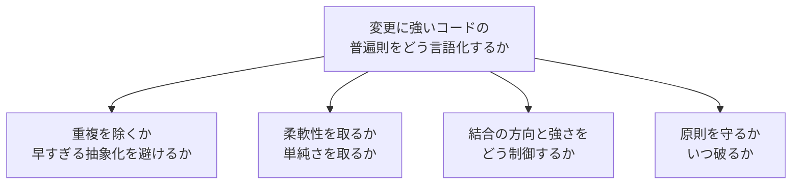
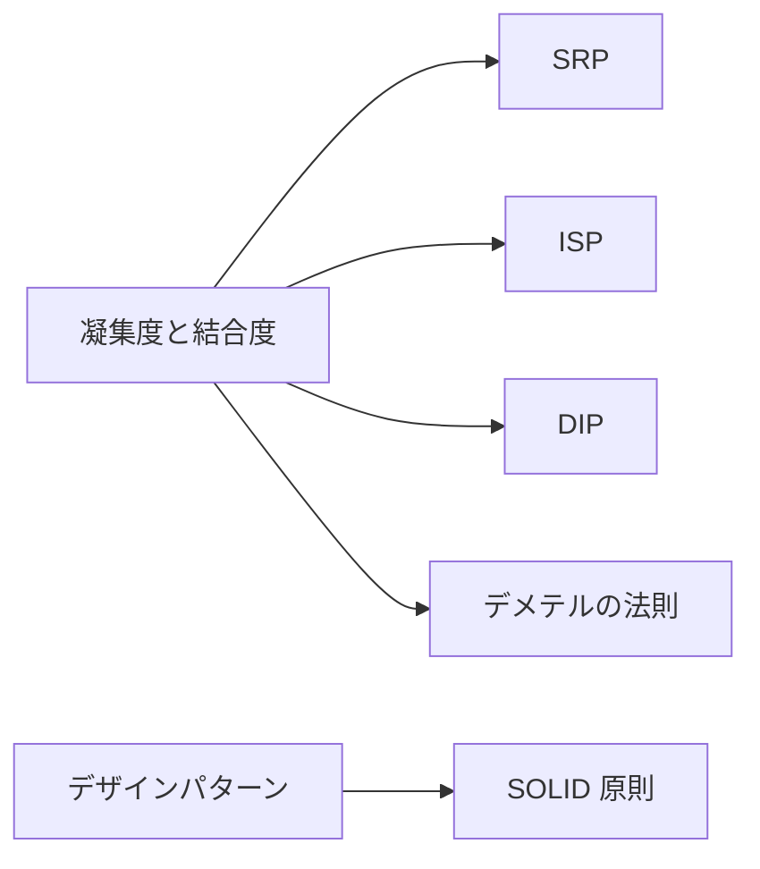
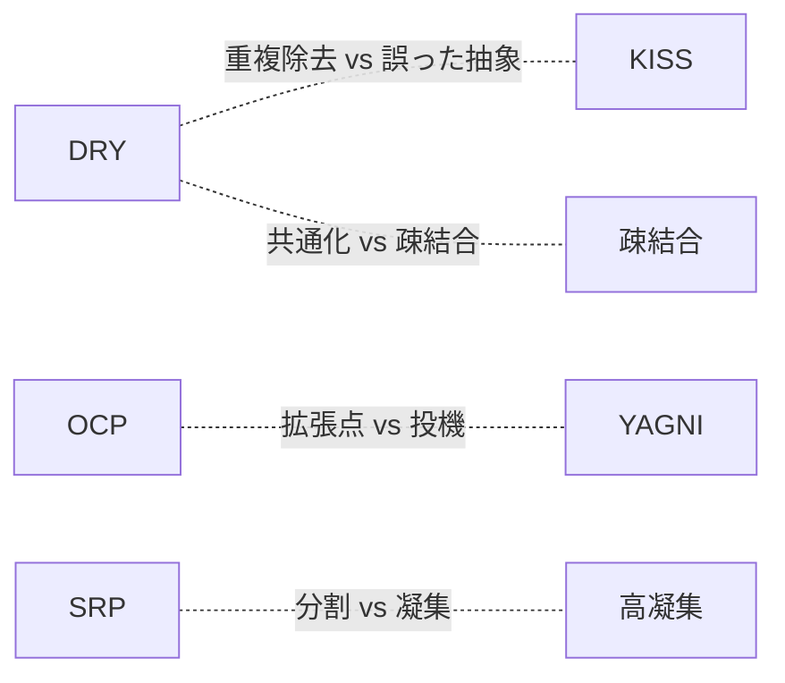
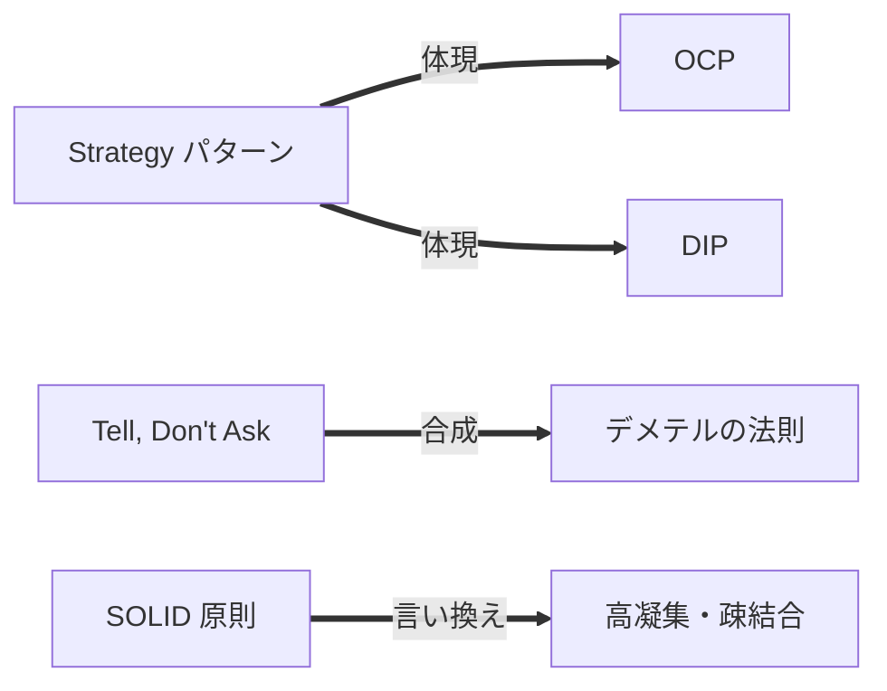

## 導入: 変更に強いコードの普遍則をどう言語化するか

ソフトウェアは完成しない。仕様は変わり、要件は増え、運用の中で前提が覆る。書いたコードの大半は、いずれ別の誰かが読み、直し、機能を足す。設計の良し悪しは、最初に動かす速さではなく、変更に対する耐性で測られる。変更に強いコードをどう書くかという問いに、先人は経験則を残してきた。経験則は頭字語や標語の形を取り、設計原則として流通する。

設計原則は、共通の問題への異なる回答である。問題とは「変更に強いコードの普遍則をどう言語化し、いつ破るか」である。原則は教条ではない。効く場面があり、衝突する相手があり、破るべき限界がある。原則を機械的に適用すると、原則が解こうとした痛みより大きな痛みを生む。本記事は主要な設計原則を族でグループ化し、効く場面・衝突・限界まで論じる。回答は、次の軸で分岐する。

- 重複の除去か、早すぎる抽象化の回避か
- 柔軟性か、単純さか
- 結合の方向と強さをどう制御するか
- 原則をいつ守り、いつ破るか

本記事は主要な設計原則を 4 つの族に分けて比較する。特定の原則を絶対視せず、各原則を族の 1 メンバーとして対等に扱う。SOLID 原則も数ある原則の集合の 1 つとして同じ重みで扱い、万能の解として中心に据えない。各原則を次の 4 段で展開し、末尾で全原則を横断するトレードオフ表にまとめる。

- 問題起点: 何の痛みを解こうとしたか
- 論理: 原則の理屈
- 批判: 限界・誤用・いつ破るか
- 担い手と論争: 提唱・支持・批判の担い手

コード例は Kotlin 2.4.0 を前提とする[^kotlin-version]。各例は原則の差分が見える最小限に絞り、長大なクラス群は避ける。違反例と改善例を対にして、原則が何を変えるかを示す。

設計原則を分岐させる軸を、はじめに俯瞰しておく。



各原則は 4 つの軸の上で異なる位置を占める。本記事は、原則の狙いで 4 つの族に束ねる。責務と依存の構造を扱う SOLID 原則、過剰を戒める簡潔さの原則、モジュール間の関係を測る結合と凝集、再利用可能な設計をカタログ化したパターンとしての原則の 4 つを順に見ていく。

## SOLID 原則

SOLID 原則は、オブジェクト指向設計でクラスの責務と依存の構造を制御する 5 つの原則の頭字語である。Robert C. Martin が複数の論文と著作で各原則を整理した[^solid-martin]。頭字語「SOLID」は Michael Feathers が 2004 年頃に並べ替えて作ったと Wikipedia が Martin の著作を典拠に記すが、Web 上の一次情報単独では確証できず、命名者の断定は留保する[^solid-name]。5 原則は独立しておらず、責務の分割と依存の方向という共通の関心で結びつく。SOLID は体系全体への正面批判も受ける。Dan North は "CUPID" で、原則は遵守か違反かの二値を生む規則だとし、性質（CUPID）への置き換えを提案する[^cupid-north]。CUPID は Composable・Unix philosophy・Predictable・Idiomatic・Domain-based の頭字語である。Kevlin Henney は "SOLID Deconstruction" で、SOLID は原則ではなくパターンの寄せ集めで、各文字は理解と一致しないと論じる[^solid-deconstruction]。Jeff Atwood は "The Ferengi Programmer" で、規則・指針・原則は「批判的に考えることの代わりにはならない」と書き、SOLID を機械的な規則集として崇める姿勢を戒めた[^ferengi-atwood]。Joel Spolsky は SOLID を「極度に官僚的なプログラミング」と評した[^spolsky-solid]。族の各原則を順に見ていく。

### 単一責任の原則（SRP）

#### 問題起点

1 つのクラスが複数の理由で変更されると、変更が干渉する。給与計算のクラスが、計算ロジックと帳票の書式と永続化を同時に持つと、税率の改定と帳票デザインの変更とデータベースの移行が、同じクラスに集中する。変更どうしが衝突し、影響範囲が読めなくなる。

#### 論理

単一責任の原則（Single Responsibility Principle、以下 SRP）は、クラスが変更される理由を 1 つに限る。Robert C. Martin は「責任」を「変更を要求するアクター（人や役割）」と定義し直した[^srp-martin]。1 つのクラスは 1 人のアクターにのみ応答する。会計部門・人事部門・データベース管理者が別々の理由で同じクラスを変更する状態を避ける。

```kotlin
// 違反例: 3 つの理由（計算・整形・永続化）で変更される。
class Employee(val name: String, val hours: Int, val rate: Int) {
    fun calculatePay(): Int = hours * rate
    fun reportHours(): String = "$name worked $hours hours"
    fun save() { /* データベースへ書き込む */ }
}
```

```kotlin
// 改善例: 変更理由ごとにクラスを分ける。
data class Employee(val name: String, val hours: Int, val rate: Int)

class PayCalculator { fun calculate(e: Employee): Int = e.hours * e.rate }
class HourReporter { fun report(e: Employee): String = "${e.name} worked ${e.hours} hours" }
class EmployeeRepository { fun save(e: Employee) { /* データベースへ書き込む */ } }
```

責務を分けると、税率の改定は `PayCalculator` だけを、帳票の変更は `HourReporter` だけを触る。変更の影響が 1 クラスに閉じる。

#### 批判

「責任」の定義が曖昧で、分割の粒度が主観に流れる。批判の要点は次のとおり。

- 「変更する理由」の数え方に客観的な基準がなく、設計者ごとに粒度がぶれる。
- 過度に分割すると、1 つの操作のために多数の小クラスを呼び集める必要が生じ、コードが断片化する。
- 関連の強いロジックを別クラスへ引き離すと、凝集度が下がる。

採否の目安は次のとおり。

- 単一責任の原則を強く効かせる目安は、1 つのクラスが複数の部門・役割から別々の理由で変更される時点である。
- 変更理由が実際には 1 つしかない小さなクラスを、想像上の理由で先回りして分割すると、過剰分割になる。分割は痛みが現れてから行う。

#### 担い手と論争

- 提唱・命名: Robert C. Martin が SRP を提唱し、「変更する理由」「アクター」で定義した[^srp-martin]。
- 支持: クリーンアーキテクチャやドメイン駆動設計の陣営が、責務分割の基礎として支持する。
- 批判・慎重論: Dan North は "CUPID" で、SRP が「人工的な継ぎ目（artificial seams）」を生むと批判する。データの内容と書式が同時に変わる場面で、責務分割がかえって変更を分断するとした[^cupid-north]。Kevlin Henney は "SOLID Deconstruction" で、Martin による DIP の説明が実質 SRP に等しいと、原則間の重複を指摘する[^solid-deconstruction]。Martin 自身も後年に定義を「アクター」へ修正し、粒度の難しさを認めた。

### 開放閉鎖の原則（OCP）

#### 問題起点

機能を追加するたびに既存コードを書き換えると、動いていた部分に手が入り、回帰バグの危険が増す。図形の面積を求める関数が、新しい図形を足すたびに `if` 分岐を書き換える構造だと、追加が既存ロジックの修正を伴う。

#### 論理

開放閉鎖の原則（Open-Closed Principle、以下 OCP）は、モジュールを「拡張に対して開き、修正に対して閉じる」。新しい振る舞いは既存コードの修正ではなく、新しいコードの追加で実現する。起源は Bertrand Meyer が継承による拡張として定式化した（1988）[^ocp-meyer]。後に Robert C. Martin が、抽象（インターフェース）への依存で再解釈した（多態による OCP）[^ocp-martin]。

```kotlin
class Circle(val r: Double)
class Rectangle(val w: Double, val h: Double)

// 違反例: 図形の追加が既存の when 式の修正を強いる。
fun area(shape: Any): Double = when (shape) {
    is Circle -> Math.PI * shape.r * shape.r
    is Rectangle -> shape.w * shape.h
    else -> error("unknown shape")
}
```

```kotlin
// 改善例: 抽象に依存する。新しい図形は新しい型の追加だけで足りる。
interface Shape { fun area(): Double }
class Circle(val r: Double) : Shape { override fun area() = Math.PI * r * r }
class Rectangle(val w: Double, val h: Double) : Shape { override fun area() = w * h }

fun totalArea(shapes: List<Shape>): Double = shapes.sumOf { it.area() }
```

`Triangle` を足すときは `Shape` を実装する新しいクラスを書くだけで済む。`totalArea` は変更しない。

#### 批判

将来の拡張点を見通せないと、抽象が外れる。批判の要点は次のとおり。

- どの軸で変化するかを誤ると、抽象が役に立たず、結局は修正が必要になる。
- 起きない変化に備えた拡張点は、使われないまま複雑さだけを残す。早すぎる抽象化として YAGNI と衝突する。
- 過度な抽象は、間接層を増やしてコードの追跡を難しくする。

採否の目安は次のとおり。

- 開放閉鎖の原則を効かせる目安は、同じ軸での拡張が繰り返し現れた時点である。変化の軸が観測できてから抽象を導入する。
- 変化が一度も起きていない段階で拡張点を作るのは投機である。最初は具体的な分岐で書き、3 度目の追加で抽象へ寄せる判断が現実的である。

#### 担い手と論争

- 起源: Bertrand Meyer が『Object-Oriented Software Construction』（1988）で定式化した[^ocp-meyer]。
- 再解釈・普及: Robert C. Martin が抽象への依存（多態）による解釈で広め、SOLID の一角に組み込んだ[^ocp-martin]。
- 批判・慎重論: 変化の軸を読み違えた抽象は無効になる。投機的な拡張点は YAGNI と衝突する。Kevlin Henney は "SOLID Deconstruction" で、OCP は LSP に包含されて冗長であり、Meyer の「open/closed」は本来言語設計の議論だと指摘する[^solid-deconstruction]。

### リスコフの置換原則（LSP）

#### 問題起点

派生型を基底型として扱ったとき、振る舞いが破綻すると、多態が安全に使えない。長方形を継承した正方形が、幅と高さの独立した変更を許さないと、長方形を期待するコードが正方形を渡されて不正な結果を返す。

#### 論理

リスコフの置換原則（Liskov Substitution Principle、以下 LSP）は、基底型のオブジェクトを派生型のオブジェクトで置き換えても、プログラムの正しさが保たれることを要求する。Barbara Liskov が 1987 年の基調講演で示し、Liskov と Jeannette Wing が 1994 年の論文で形式化した[^lsp-liskov][^lsp-wing]。派生型は基底型の事前条件を強めず、事後条件を弱めてはならない。

```kotlin
// 違反例: Square は Rectangle の契約を破る。幅の変更が高さも変える。
open class Rectangle(open var w: Int, open var h: Int) { fun area() = w * h }
class Square(side: Int) : Rectangle(side, side) {
    override var w: Int = side
        set(value) { field = value; super.h = value } // 高さも書き換わる
}
// Rectangle として w=3, h=4 を期待するコードが、Square では破綻する。
```

```kotlin
// 改善例: 継承で無理に関係づけず、共通の抽象で並べる。
interface Shape { fun area(): Int }
class Rectangle(val w: Int, val h: Int) : Shape { override fun area() = w * h }
class Square(val side: Int) : Shape { override fun area() = side * side }
```

`Square` と `Rectangle` を継承で結ばず、`Shape` の下に並べる。置換可能性を壊す継承を避け、契約を守れる抽象だけで関係づける。

#### 批判

契約は型シグネチャに現れず、検出が難しい。批判の要点は次のとおり。

- 事前条件・事後条件・不変条件はコードの型に現れず、違反がコンパイル時に検出されない。
- 「is-a」の直感（正方形は長方形である）に従うと、振る舞いの契約を破る継承を生む。
- 契約の明文化には設計の規律が要り、実務では暗黙のまま放置されやすい。

採否の目安は次のとおり。

- リスコフの置換原則は、継承や多態を使う設計で常に意識する。基底型を受け取る関数に派生型を渡す箇所で、契約の遵守を確認する。
- 置換可能性を守れない関係は、継承ではなく合成（has-a）で表す。継承は契約を引き継ぐ覚悟がある場合に限る。

#### 担い手と論争

- 提唱: Barbara Liskov が 1987 年の OOPSLA 基調講演で置換可能性の概念を示した[^lsp-liskov]。
- 形式化: Barbara Liskov と Jeannette Wing が 1994 年の論文 "A Behavioral Notion of Subtyping" で形式化した[^lsp-wing]。
- 批判・慎重論: 契約が型に現れず静的検出が難しい。「is-a」の直感が違反を誘発する。LSP は数学的に妥当とされ、原則自体を不要とする正面からの実名批判は SRP・OCP ほど見当たらない。論点は名称と解釈に向く。Liskov が示したのはサブタイプの定義であり、Martin 流の設計規範とは性質が異なるとする見方もある。

### インターフェース分離の原則（ISP）

#### 問題起点

巨大なインターフェースに依存すると、使わないメソッドの変更にも影響を受ける。多機能な複合機のインターフェースに `print`・`scan`・`fax` をまとめると、印刷だけを使うクライアントが `fax` の変更に巻き込まれる。

#### 論理

インターフェース分離の原則（Interface Segregation Principle、以下 ISP）は、クライアントが使わないメソッドへの依存を強制しない。大きなインターフェースを、クライアントごとの小さなインターフェースに分割する[^isp-martin]。各クライアントは必要な操作だけに依存する。

```kotlin
// 違反例: 印刷だけのクライアントも scan と fax に依存させられる。
interface MultiFunctionDevice {
    fun print(doc: String)
    fun scan(doc: String)
    fun fax(doc: String)
}
```

```kotlin
// 改善例: 役割ごとにインターフェースを分ける。
interface Printer { fun print(doc: String) }
interface Scanner { fun scan(doc: String) }
interface Fax { fun fax(doc: String) }

// 複合機は必要な役割だけを実装で束ねる。
class OfficeMachine : Printer, Scanner, Fax {
    override fun print(doc: String) { /* 印刷する */ }
    override fun scan(doc: String) { /* 読み取る */ }
    override fun fax(doc: String) { /* 送信する */ }
}
```

印刷だけを使うクライアントは `Printer` にのみ依存する。`Fax` の変更は印刷クライアントに波及しない。

#### 批判

過度な分割は、インターフェースの数を増やす。批判の要点は次のとおり。

- 分割の粒度を細かくしすぎると、インターフェースが乱立し、合成の手間が増える。
- 1 つのクライアントしか存在しない段階で分割すると、利点が生まれないまま型だけが増える。

採否の目安は次のとおり。

- インターフェース分離の原則を効かせる目安は、複数のクライアントが同じインターフェースの異なる部分集合を使う時点である。
- クライアントが 1 つしかなく、分割で誰も得をしない場合は、まとめたままで足りる。

#### 担い手と論争

- 提唱: Robert C. Martin が Xerox の事案を契機に ISP を定式化した[^isp-martin]。
- 支持: 役割ごとのインターフェース設計（ロールインターフェース）として広く支持される。
- 批判・慎重論: 過度な分割によるインターフェースの乱立への戒めがある。ISP 単独を正面から否定する実名の一次情報は見当たらない。批判は Dan North の "CUPID"[^cupid-north]や Kevlin Henney の "SOLID Deconstruction"[^solid-deconstruction]による SOLID 全体批判の射程に含まれる形が主である。

### 依存性逆転の原則（DIP）

#### 問題起点

上位の方針（ビジネスロジック）が下位の詳細（データベースや外部 API）に直接依存すると、詳細の変更が方針へ波及する。注文処理が特定のデータベースクラスを直接呼ぶと、データベースを差し替えるたびに注文処理を書き換える。

#### 論理

依存性逆転の原則（Dependency Inversion Principle、以下 DIP）は、2 つの規則で依存の方向を制御する[^dip-martin]。

- 上位モジュールも下位モジュールも、抽象に依存する。具体に依存しない。
- 抽象は詳細に依存しない。詳細が抽象に依存する。

上位が定義した抽象（インターフェース）に下位が従う。依存の矢印が、上位から下位への自然な向きから、下位から抽象への逆向きへ反転する。

```kotlin
// 違反例: 上位の OrderService が下位の MySqlDatabase に直接依存する。
class MySqlDatabase { fun save(order: String) { /* MySQL へ保存 */ } }
class OrderService {
    private val db = MySqlDatabase() // 具体への依存
    fun place(order: String) = db.save(order)
}
```

```kotlin
// 改善例: 上位が抽象を定義し、下位がそれを実装する。
interface OrderStore { fun save(order: String) } // 上位が所有する抽象

class OrderService(private val store: OrderStore) { // 抽象に依存
    fun place(order: String) = store.save(order)
}

class MySqlOrderStore : OrderStore { // 詳細が抽象に従う
    override fun save(order: String) { /* MySQL へ保存 */ }
}
```

`OrderService` は `OrderStore` にのみ依存する。データベースを差し替えても、`OrderStore` を実装する新しいクラスを足すだけで、`OrderService` は変更しない。

#### 批判

抽象の所有者を誤ると、逆転が成立しない。批判の要点は次のとおり。

- 抽象を下位（詳細）側に置くと、依存の向きが逆転せず、名ばかりのインターフェースになる。抽象は上位が所有する。
- すべての境界に抽象を挟むと、間接層が増えて追跡が難しくなる。差し替えの必要がない箇所では過剰になる。

採否の目安は次のとおり。

- 依存性逆転の原則を効かせる目安は、詳細が差し替わる可能性が高い境界（永続化・外部サービス・入出力）である。
- 差し替えが起きない内部ロジックに抽象を挟むのは投機である。境界の外側にだけ抽象を置く。

#### 担い手と論争

- 提唱: Robert C. Martin が DIP を定式化し、SOLID の一角に据えた[^dip-martin]。
- 支持: クリーンアーキテクチャ・ヘキサゴナルアーキテクチャが、依存の向きを制御する中核原則として採用する。
- 批判・慎重論: 抽象の所有者の誤りと、不要な境界に過剰な抽象を挟む設計への戒めがある。Kevlin Henney は "SOLID Deconstruction" で、Martin による DIP の説明が実質 SRP に等しいと、原則間の重複を指摘する[^solid-deconstruction]。

## 簡潔さの原則

簡潔さの原則は、コードの過剰を戒める。重複を消し、構造を単純に保ち、まだ要らない機能を作らない。SOLID 原則が責務と依存の構造を整えるのに対し、簡潔さの原則は構造を増やしすぎない方向に働く。3 原則は互いに緊張する。重複の除去（DRY）は抽象を生み、抽象は単純さ（KISS）と将来不要な構造の回避（YAGNI）と衝突しうる。族の各原則を順に見ていく。

### DRY（Don't Repeat Yourself）

#### 問題起点

同じ知識がコードの複数箇所に転記されると、変更時に修正漏れが起きる。税率や割引条件が複数のメソッドにコピーされていると、1 か所を直して他を忘れ、不整合が生じる。

#### 論理

DRY（Don't Repeat Yourself）は、「すべての知識は、システム内で単一かつ明確で信頼できる表現を持つ」とする[^dry-pragmatic]。Andy Hunt と Dave Thomas が『The Pragmatic Programmer』（1999）で定式化した。DRY が消すのはコードの見た目の重複ではなく、知識（意図・ルール）の重複である。

```kotlin
// 違反例: 同じ割引ルールが 2 か所に転記される。
fun priceForMember(base: Int): Int = base - base * 10 / 100
fun priceForCampaign(base: Int): Int = base - base * 10 / 100
```

```kotlin
// 改善例: 割引という知識を 1 か所に集約する。
const val DISCOUNT_RATE = 10
fun applyDiscount(base: Int): Int = base - base * DISCOUNT_RATE / 100
```

割引率の変更は `DISCOUNT_RATE` の 1 か所で済む。知識が単一の表現を持ち、修正漏れが起きない。

#### 批判

見た目の重複と知識の重複を混同すると、誤った抽象を生む。批判の要点は次のとおり。

- 偶然に同じ形をしただけのコードを「重複」とみなして共通化すると、本来は独立して変化すべき 2 つの知識が 1 つの抽象に縛られる。
- 後で片方だけ変えたくなったとき、共通化した抽象に分岐や引数が増え、共通化前より複雑になる。「誤った抽象のコストは、重複のコストより高い」とされる[^wrong-abstraction]。
- DRY を厳格に適用すると、無関係なモジュールが共通コードを介して結合し、変更の波及範囲が広がる。

採否の目安は次のとおり。

- DRY を効かせる目安は、同じ知識（同じ理由で同時に変わるルール）が複数箇所に現れた時点である。
- 形が同じでも、別々の理由で変化するコードは共通化しない。重複を許す判断が、誤った抽象を避ける。3 度繰り返してから抽象化する経験則（Rule of Three）が、早すぎる共通化を防ぐ。

#### 担い手と論争

- 提唱: Andy Hunt と Dave Thomas が『The Pragmatic Programmer』（1999）で定式化した[^dry-pragmatic]。
- 批判・慎重論: Sandi Metz は "The Wrong Abstraction"（2016）で、早すぎる共通化を戒めた[^wrong-abstraction]。「重複は誤った抽象よりはるかに安い（duplication is far cheaper than the wrong abstraction）」と書く。誤った抽象に気づいたら重複を再導入して inline し直すべきだとする。重複と誤った抽象のトレードオフが論点である。

### KISS（Keep It Simple, Stupid）

#### 問題起点

不要に込み入った設計は、理解と変更を妨げる。1 行で書ける処理に汎用フレームワークを持ち込むと、読み手は本質より仕掛けの解読に時間を取られる。

#### 論理

KISS（Keep It Simple, Stupid）は、設計を可能な限り単純に保つことを促す。複雑さは必要になったときに導入し、最初から作り込まない。標語は航空機設計者 Kelly Johnson（Lockheed）に帰されるが、出典は確実でなく、俗にそう語られる[^kiss-origin]。

```kotlin
// 違反例: 単純な合計に過剰な抽象を持ち込む。
interface Reducer<T> { fun reduce(acc: T, x: T): T }
fun <T> fold(list: List<T>, init: T, r: Reducer<T>): T =
    list.fold(init) { acc, x -> r.reduce(acc, x) }
val sum = fold(listOf(1, 2, 3), 0, object : Reducer<Int> {
    override fun reduce(acc: Int, x: Int) = acc + x
})
```

```kotlin
// 改善例: 標準ライブラリで素直に書く。
val sum = listOf(1, 2, 3).sum()
```

合計に汎用の `Reducer` は要らない。標準の `sum()` が意図を直接表す。

#### 批判

「単純」の基準が主観的で、合意が取りにくい。批判の要点は次のとおり。

- 何を単純とみなすかは経験や立場で変わり、客観的な基準がない。慣れた手法を「単純」と感じる偏りが入る。
- 表面的な単純さ（短いコード）を優先すると、暗黙の前提が増え、かえって理解しにくくなる場合がある。
- 本質的に複雑な問題を無理に単純化すると、必要な考慮が抜け落ちる。

採否の目安は次のとおり。

- KISS は、設計の選択肢が複数あるとき、より少ない概念で同じ目的を達する案を選ぶ指針として働く。
- 問題そのものが持つ本質的複雑さ（essential complexity）は削れない。削れるのは、解き方が持ち込む偶有的複雑さ（accidental complexity）である。両者を区別する。

#### 担い手と論争

- 帰属: 標語は Kelly Johnson に帰されるが、出典は確実でなく、俗にそう語られる[^kiss-origin]。Wikipedia は「reportedly coined」と限定し、1960 年の US Navy での言及や 1938 年の異形も挙げて起源を不確かとする。ソフトウェア設計原則としての単一の提唱者・一次論文は確認できない。
- 関連: 過度な複雑さを避ける思想は、Unix 哲学[^unix-philosophy]や Antoine de Saint-Exupéry の「完璧とは、足すものがなくなったときではなく、引くものがなくなったときに達する」とする言葉と通じる。
- 批判・慎重論: 「単純」の主観性と、本質的複雑さを削れない限界が論点である。KISS そのものを名指しで批判した実名の一次情報は見当たらず、批判は「単純の基準が主観的だ」とする一般論にとどまる。

### YAGNI（You Aren't Gonna Need It）

#### 問題起点

「いつか要る」と想像した機能を先回りで作ると、使われないコードが負債になる。将来の拡張に備えた汎用化や設定項目が、結局は使われず、保守対象だけを増やす。

#### 論理

YAGNI（You Aren't Gonna Need It）は、「実際に必要になるまで機能を作るな」とする。エクストリームプログラミング（Extreme Programming、以下 XP）の実践として Ron Jeffries が言語化し、Kent Beck らが XP の中で位置づけた[^yagni-jeffries][^yagni-c2]。推測に基づく実装を避け、現在の要求にだけ応える。

```kotlin
// 違反例: 使う予定のない複数通貨・丸めモードを先回りで実装する。
class Price(
    val amount: Int,
    val currency: String = "JPY",
    val roundingMode: String = "HALF_UP", // まだ使わない
    val taxStrategy: String = "INCLUSIVE", // まだ使わない
)
```

```kotlin
// 改善例: 現在の要求（円・税込み固定）にだけ応える。
@JvmInline
value class Price(val amount: Int)
```

多通貨も丸めモードも、要求が現れた時点で足す。今は使わない柔軟性を持ち込まない。

#### 批判

必要になったときの追加コストが高い領域では、後付けが割に合わない。批判の要点は次のとおり。

- 後から拡張点を入れる改修コストが大きい場所（公開 API・永続化スキーマ・他チームとの契約）では、最初に余地を残す判断も合理的になる。
- YAGNI を機械的に適用すると、変化の軸が明白な箇所でも拡張点を欠き、OCP と衝突する。
- 「必要かどうか」の予測には不確実性があり、明白に必要なものまで先送りすると手戻りを生む。

採否の目安は次のとおり。

- YAGNI を効かせる目安は、要求が推測の段階にとどまり、変化の軸が観測されていない時点である。
- 変更コストが高く、変化がほぼ確実な境界（外部公開する契約など）では、最小限の拡張余地を残す判断を優先する。確実性とコストの両方を見て、守るか破るかを決める。

#### 担い手と論争

- 提唱: フレーズの起源は C3 プロジェクトでの Kent Beck と Chet Hendrickson の会話だと Martin Fowler が記す[^yagni-fowler]。Ron Jeffries が XP の実践として言語化したとされ[^yagni-jeffries]、Kent Beck らが XP の中に位置づけた[^yagni-c2]。
- 支持: Martin Fowler が bliki で Simple Design の一側面として解説・普及した[^yagni-fowler]。アジャイル・XP の陣営が、投機的な汎用化を避ける原則として支持する。
- 批判・慎重論: 変化が明白な境界では OCP と衝突する。後付けコストが高い領域での適用に慎重論がある。YAGNI を名指しで批判した実名の一次情報は見当たらず、批判は「本当に必要かの判断が主観的だ」とする一般論にとどまる。

## 結合と凝集

結合と凝集は、モジュール間とモジュール内の関係の質を測る尺度である。モジュールどうしの依存を弱く（疎結合）、モジュール内の要素のまとまりを強く（高凝集）保つと、変更が局所に閉じる。Larry Constantine と Edward Yourdon が構造化設計（1970 年代）で尺度として導入した[^constantine-yourdon]。族では、結合と凝集の尺度そのものと、結合を抑える具体的な指針であるデメテルの法則を見ていく。

### 凝集度と結合度

#### 問題起点

モジュールの分割が悪いと、変更が広範囲に波及する。関係の薄い処理が 1 つのモジュールに同居し（低凝集）、無関係なモジュールが密に依存し合う（高結合）と、1 つの変更が連鎖して多数のモジュールに及ぶ。

#### 論理

凝集度（cohesion）はモジュール内の要素がどれだけ強く関連するかを、結合度（coupling）はモジュール間がどれだけ密に依存するかを測る。設計の目標は高凝集・疎結合である。凝集度には強さの段階があり、機能的凝集（単一の役割に要素が集まる）が最も強く、偶発的凝集（無関係な要素が偶然同居する）が最も弱い[^constantine-yourdon]。

```kotlin
// 低凝集の例: 無関係な操作が 1 つのクラスに同居する。
class Utils {
    fun parseDate(s: String): Long { /* 日付を解釈 */ return 0 }
    fun sendEmail(to: String) { /* メール送信 */ }
    fun calculateTax(amount: Int): Int = amount * 10 / 100
}
```

```kotlin
// 高凝集の例: 役割ごとにまとめる。各クラスは単一の関心を持つ。
class DateParser { fun parse(s: String): Long { /* 日付を解釈 */ return 0 } }
class Mailer { fun send(to: String) { /* メール送信 */ } }
class TaxCalculator { fun calculate(amount: Int): Int = amount * 10 / 100 }
```

役割ごとに分けると、各クラスの要素が単一の関心に集まる。日付処理の変更は `DateParser` に閉じ、他のクラスへ波及しない。

#### 批判

凝集度・結合度は定量化が難しく、判断が主観に流れる。批判の要点は次のとおり。

- 凝集の段階（機能的・論理的・偶発的など）の分類は、適用に解釈の幅があり、機械的に測れない。
- 疎結合を追い求めて間接層を増やすと、結合は下がるが追跡性が落ちる。疎結合自体がコストを持つ。
- 凝集と結合はしばしばトレードオフになる。凝集を上げる分割が、モジュール間の結合を増やす場合がある。

採否の目安は次のとおり。

- 凝集度と結合度は、モジュール分割の良し悪しを語る共通言語として常に有効である。多くの設計原則（SRP・ISP・DIP）は、高凝集・疎結合を別の角度から言い換えたものである。
- 数値目標として追うより、変更が局所に閉じるかという観点で評価する。結合を下げる手段（抽象の導入）が追跡性を損なうなら、結合の高さを受け入れる判断もある。

#### 担い手と論争

- 提唱: Larry Constantine が凝集度・結合度の概念を生み、Edward Yourdon と『Structured Design』（1979）で体系化した[^constantine-yourdon]。初出は Stevens・Myers・Constantine の論文 "Structured Design"（IBM Systems Journal、1974）である[^structured-design-1974]。
- 支持: 構造化設計からオブジェクト指向まで、モジュール分割を語る基礎概念として定着した。GRASP も凝集と結合を中心に置く[^grasp-larman]。
- 批判・慎重論: 段階分類の主観性と、疎結合のコストが論点である。概念そのものを正面から否定する実名の一次情報は見当たらず、異論は凝集度の段階分類の境界の曖昧さや測定基準の主観性といった運用面に向く。概念自体は現在も広く支持される。

### デメテルの法則（最小知識の原則）

#### 問題起点

オブジェクトが他のオブジェクトの内部構造に深く踏み込むと、内部の変更が呼び出し側に波及する。`a.getB().getC().doSomething()` のように連鎖して内部をたどると、`B` や `C` の構造変更が `a` の呼び出し側を壊す。

#### 論理

デメテルの法則（Law of Demeter、最小知識の原則）は、オブジェクトが直接の隣人としか話さないことを促す。メソッド内で呼んでよいのは、自身・引数・自身が生成したオブジェクト・自身のフィールドのメソッドに限る[^demeter-paper]。Northeastern 大学の Demeter プロジェクト（Ian Holland ら、1987）で生まれた[^demeter-list]。

```kotlin
// 違反例: 内部構造を連鎖してたどる。Wallet の変更が呼び出し側に波及する。
class Wallet(val money: Int)
class Person(val wallet: Wallet)
fun pay(person: Person, cost: Int): Int = person.wallet.money - cost // 連鎖
```

```kotlin
// 改善例: 直接の隣人に処理を委譲する。内部構造を隠す。
class Wallet(private val money: Int) {
    fun withdraw(cost: Int): Int = money - cost
}
class Person(private val wallet: Wallet) {
    fun pay(cost: Int): Int = wallet.withdraw(cost) // 隣人に委譲
}
```

呼び出し側は `Person.pay` だけを知る。`Wallet` の内部構造を `Person` の外へ漏らさない。構造の変更が `Person` の内側に閉じる。

#### 批判

委譲のためのメソッドが増え、ボイラープレートを生む。批判の要点は次のとおり。

- 内部構造を隠すための委譲メソッド（ラッパー）が大量に必要になり、コードが冗長になる。
- 連鎖の禁止を機械的に適用すると、データ変換のためのフルエントインターフェース（`builder.a().b().c()`）まで違反扱いになる。法則は「ドット 1 つ」の規則ではない。
- データ構造（振る舞いを持たない値）の参照には、法則を厳格に適用する意味が薄い。

採否の目安は次のとおり。

- デメテルの法則を効かせる目安は、振る舞いを持つオブジェクトの内部構造に呼び出し側が依存する箇所である。`Tell, Don't Ask`（命令せよ、尋ねるな）と組み合わさり、データを取り出して操作するのではなく、操作を委譲する設計を促す。
- 純粋なデータ構造の走査や、意図的に設計されたフルエントインターフェースには適用しない。法則は結合を下げる手段であり、ドットの数を数える規則ではない。

#### 担い手と論争

- 提唱: Northeastern 大学の Demeter プロジェクト（Ian Holland ら、1987）で生まれた[^demeter-list]。Karl Lieberherr らが論文で定式化した[^demeter-paper]。
- 支持: `Tell, Don't Ask` と結びつき、結合を下げる具体的指針として支持される[^tell-dont-ask]。
- 批判・慎重論: 委譲メソッドの増加と、「ドット 1 つ」への誤解が論点である。Ted Kaminski は "You should break the Law of Demeter"（2018）で、メソッドチェーン `a.b().c()` の問題は公開メソッド `b()` の存在自体にあるとした[^break-demeter]。問題は呼び出し側のチェーンではないと論じる。デメテル対応で wrapper を増やすとロジックが分散して結合が増え、チェーンは良い設計になり得るとした。データ構造への厳格適用に慎重論がある。

## パターンとしての原則

パターンとしての原則は、再利用可能な設計の構造をカタログ化する。原則が「どうあるべきか」を語るのに対し、パターンは「典型的な問題への典型的な解の構造」を名前と図で示す。設計の語彙を共有し、設計の意図を短い名前で伝える。族ではデザインパターン（GoF）を見ていく。

### デザインパターン（GoF）

#### 問題起点

オブジェクト指向設計で繰り返し現れる問題に、その都度ゼロから解を考えると、車輪の再発明になり、設計の意図が伝わりにくい。生成・構造・振る舞いの典型的な問題に、共通の語彙がないと、設計を議論する言葉が揃わない。

#### 論理

デザインパターン（GoF）は、オブジェクト指向設計で繰り返し現れる問題と解の構造を 23 個のパターンとしてカタログ化する。Erich Gamma・Richard Helm・Ralph Johnson・John Vlissides の 4 人（Gang of Four、以下 GoF）が『Design Patterns』（1994）でまとめた[^gof-book]。パターンは生成・構造・振る舞いの 3 群に分かれる。各パターンは名前・問題・解・帰結を持ち、設計の語彙を提供する。

```kotlin
// Strategy パターン: 振る舞いをインターフェースで差し替える。
fun interface SortStrategy { fun sort(list: List<Int>): List<Int> }

val ascending = SortStrategy { it.sorted() }
val descending = SortStrategy { it.sortedDescending() }

class Sorter(private val strategy: SortStrategy) {
    fun run(list: List<Int>): List<Int> = strategy.sort(list)
}
```

`Strategy` は振る舞いをインターフェースに切り出し、実行時に差し替える。OCP（拡張に開く）と DIP（抽象に依存する）を具体的な構造に落とした例である。多くのパターンは、SOLID 原則を構造として体現する。

#### 批判

パターンの濫用と、言語機能による代替が論点になる。批判の要点は次のとおり。

- パターンを使うこと自体が目的化すると、不要なパターンを当てはめて設計を複雑にする。問題が要求しないパターンは負債になる。
- 一部のパターンは、言語機能の不足を補う回避策である。Peter Norvig は、GoF の多くのパターンが、より動的な言語では言語機能に吸収されるか不可視になると指摘した[^norvig-patterns]。Kotlin では、`Strategy` は関数型・ラムダで、`Singleton` は `object` 宣言で、`Iterator` は標準のイテレータで置き換わる。
- パターンの名前が一人歩きし、構造だけを真似て本来の問題文脈を無視すると、誤用になる。

採否の目安は次のとおり。

- デザインパターンは、設計の語彙として有効である。`Observer`・`Strategy`・`Adapter` といった名前は、設計の意図を短く正確に伝える。
- パターンは問題が要求したときに使う。パターンありきで設計を組み立てない。言語が機能で代替する場面では、パターンを名前として保ちつつ、実装は言語機能に委ねる。

#### 担い手と論争

- 提唱: GoF（Gamma・Helm・Johnson・Vlissides）が『Design Patterns』（1994）でカタログ化した[^gof-book]。源流は Christopher Alexander の建築のパターン・ランゲージである[^alexander]。
- 批判・慎重論: Peter Norvig は "Design Patterns in Dynamic Languages"（1996）で、GoF の 23 パターンの多くを言語機能不足の裏返しとした[^norvig-patterns]。23 のうち 16 は Lisp・Dylan では不可視になるか単純化すると示す。Paul Graham は "Revenge of the Nerds" で「プログラムにパターンが見えると、私はそれを問題の兆候とみなす」と書いた[^revenge-graham]。コードの規則性を抽象が弱い兆候とみなす立場である。Mark Dominus は "Design patterns of 1972" で「各デザインパターンはソース言語の欠陥の表れだ」と論じ、パターンを言語を改善すべき箇所の道標とみなした[^dominus-1972]。Jeff Atwood は "Rethinking Design Patterns" で、定型コードを繰り返し書くなら言語が根本的に壊れている兆候だと述べた[^atwood-patterns]。パターンの濫用と名前の一人歩きが論点である。

## 原則の相関

族に分けても、原則どうしは族をまたいで関係する。原則どうしには系譜・対立・合成の関係が重なる。族で束ねた地図の上に、派生の流れ・同じ軸での緊張・組み合わせの線を引くと、各原則の位置が立体的に見える。関係を 3 種に分けて図示し、要点を整理する。

系譜の関係を示す。実線矢印は派生・源流の向き（源流から派生へ）を表す。



緊張・対立の関係を示す。破線は同じ軸の両端で緊張する組を表す。



合成・体現の関係を示す。太線矢印は原則を構造として体現する関係を表す。



系譜の要点は次のとおり。

- 凝集度と結合度は、SOLID 原則の複数（SRP・ISP・DIP）とデメテルの法則の源流である。後発の原則の多くは、高凝集・疎結合という古い尺度を別の角度から具体化したものである。
- デザインパターンは SOLID 原則を構造として体現する。`Strategy` や `Decorator` は、OCP と DIP を具体的なクラス構成に落とす。

緊張・対立の要点は次のとおり。

- DRY と KISS は、重複の除去と単純さの保持で緊張する。共通化（DRY）が抽象を生み、抽象が単純さ（KISS）を損なう場合がある。誤った抽象は重複より高くつく。
- OCP と YAGNI は、拡張点の設置と投機の回避で緊張する。OCP は将来の拡張に開くことを促し、YAGNI は使うか不明な拡張点を作らないことを促す。両者は変化の軸が観測できるかで折り合う。
- DRY と疎結合は緊張する。共通化が無関係なモジュールを共通コードで結合し、結合度を上げる場合がある。
- SRP と高凝集も、過度な分割で緊張する。責務を細かく分けすぎると、関連の強い要素が別クラスへ散り、凝集が下がる。

合成・体現の要点は次のとおり。

- `Strategy` パターンは OCP と DIP を同時に体現する。振る舞いを抽象に切り出し（DIP）、新しい振る舞いを追加で実現する（OCP）。
- `Tell, Don't Ask` はデメテルの法則と合成され、データを取り出さず操作を委譲する設計を促す。
- SOLID 原則は、高凝集・疎結合の言い換えである。5 原則は、古い結合・凝集の尺度をオブジェクト指向の文脈で具体化したものとして読める。

導入で示した 4 軸（重複の除去と抽象・柔軟性と単純さ・結合の制御・守ると破る）が、関係の背骨を成す。各原則は同じ軸の両端で緊張し、軸の上で近い原則は系譜や合成でつながる。4 族で束ねた地図に系譜・緊張・合成の線を引くと、原則の適用は孤立した個別判断ではなく、軸の上での位置取りと組み合わせの判断になる。原則どうしが衝突する場面（DRY と KISS、OCP と YAGNI）では、変化の軸が観測できるか、変更コストが高いかを見て、どちらを優先するかを決める。

## 原則の担い手と歴史

主要な設計原則を、提唱・支持・批判の担い手と起源で一覧する。人名・年・短語に絞り、一次情報のリンクは本文の脚注に委ねる。

| 原則 | 提唱・命名 | 支持・普及 | 批判・慎重論 | 起源（年） | 現在の位置づけ |
| --- | --- | --- | --- | --- | --- |
| SRP | Robert C. Martin | クリーンアーキテクチャ陣営 | Dan North・Kevlin Henney（人工的な継ぎ目・原則間の重複） | 2000 年代 | SOLID の基礎 |
| OCP | Bertrand Meyer（起源）/ Robert C. Martin（再解釈） | オブジェクト指向設計の陣営 | Kevlin Henney（LSP に包含・冗長） | 1988 | 抽象による拡張 |
| LSP | Barbara Liskov | Robert C. Martin（SOLID 化） | 契約の静的検出困難・is-a の誤用（正面批判は乏しい） | 1987 / 1994 | 部分型の規律 |
| ISP | Robert C. Martin | ロールインターフェース | SOLID 全体批判の射程（Dan North・Kevlin Henney） | 2000 年代 | 役割別の依存 |
| DIP | Robert C. Martin | クリーン・ヘキサゴナル | Kevlin Henney（SRP と重複）・抽象の所有者の誤り | 2000 年代 | 依存の方向制御 |
| DRY | Andy Hunt・Dave Thomas | アジャイル全般 | Sandi Metz（誤った抽象） | 1999 | 知識の単一表現 |
| KISS | Kelly Johnson（俗説） | Unix 哲学 | 単純の主観性・本質的複雑さ（実名批判は確認できず） | 出典不確実 | 単純さの標語 |
| YAGNI | Kent Beck・Chet Hendrickson（起源）/ Ron Jeffries | Martin Fowler・XP | OCP と衝突・後付けコスト（実名批判は確認できず） | 1990 年代 | 投機の回避 |
| 凝集度・結合度 | Larry Constantine・Edward Yourdon | GRASP・構造化設計 | 段階分類の主観性（実名批判は確認できず） | 1974 / 1979 | 分割の共通言語 |
| デメテルの法則 | Demeter プロジェクト（Ian Holland ら） | Tell, Don't Ask | Ted Kaminski（チェーンより公開メソッドが問題） | 1987 | 結合を下げる指針 |
| デザインパターン（GoF） | Gamma・Helm・Johnson・Vlissides | 設計の語彙として定着 | Peter Norvig・Paul Graham・Mark Dominus・Jeff Atwood（言語機能で代替） | 1994 | 共通語彙・一部は言語機能へ |

## 結び: 原則は教条ではなく道具である

主要な設計原則は、変更に強いコードという共通の目的への異なる回答である。優劣の序列はなく、原則どうしは衝突する。原則を教条として全面適用すると、原則が解こうとした痛みより大きな痛みを生む。判断の手がかりを 3 点で整理する。

- 重複と抽象は、変化の理由で見分ける。同じ理由で同時に変わる知識だけを共通化する。形が同じでも別々に変わるコードは、重複を許す。
- 柔軟性と単純さは、変化の軸が観測できるかで決める。変化の軸が見えてから抽象を入れる。見えないうちは具体で書き、3 度目の追加で抽象へ寄せる。
- 原則の衝突は、変更コストで裁定する。後付けが高くつく境界（公開 API・永続化スキーマ）では拡張余地を残し、安い内部では YAGNI を優先する。

設計原則は排他ではない。SOLID 原則は高凝集・疎結合の言い換えであり、デザインパターンは SOLID を構造として体現し、`Tell, Don't Ask` はデメテルの法則と組み合わさる。1 つのシステムでも、境界ごとに守る原則と破る原則が変わる。変化が確実な公開境界では OCP を効かせ、推測にとどまる内部では YAGNI を優先する判断が、現実の設計である。

最後に、全原則を横断するトレードオフ表で締める。

| 原則 | 主な狙い | 効く場面 | 主な衝突相手 | いつ破るか |
| --- | --- | --- | --- | --- |
| SRP | 変更理由の分離 | 複数の役割が同じクラスを変更 | 高凝集（過剰分割） | 変更理由が実質 1 つのとき |
| OCP | 修正なしの拡張 | 同じ軸の拡張が繰り返す | YAGNI | 変化の軸が未観測のとき |
| LSP | 安全な置換 | 継承・多態を使う設計 | is-a の直感 | 契約を守れない継承は使わない |
| ISP | 不要な依存の排除 | 複数クライアントが部分集合を使う | 分割の手間 | クライアントが 1 つのとき |
| DIP | 依存の方向制御 | 詳細が差し替わる境界 | 過剰な間接層 | 差し替えのない内部 |
| DRY | 知識の単一表現 | 同じ知識が複数箇所に転記 | KISS・疎結合 | 別々に変わる重複は許す |
| KISS | 単純さの保持 | 設計の選択肢が複数 | DRY・OCP | 本質的複雑さは削れない |
| YAGNI | 投機の回避 | 要求が推測の段階 | OCP | 後付けが高くつく境界 |
| 凝集度・結合度 | 高凝集・疎結合 | モジュール分割の評価 | 疎結合のコスト | 間接層が追跡性を損なうとき |
| デメテルの法則 | 結合を下げる | 内部構造への依存 | 委譲の増加 | データ構造・フルエント API |
| デザインパターン | 設計の語彙 | 繰り返す設計問題 | 濫用・言語機能 | 言語機能が代替する場面 |

表は原則の差を圧縮した近似である。実際の設計では、1 つの原則を全面適用するより、原則どうしの衝突をドメインの境界ごとに裁定する判断が問われる。設計の上達とは、各原則の痛みと衝突と限界を把握し、目の前のコードに照らして選ぶ力を養う過程である。

[^kotlin-version]: 本記事のコード例は Kotlin 2.4.0（2026-06-03 リリース）を前提とする。出典: [Kotlin 2.4.0 Released（JetBrains Blog）](https://blog.jetbrains.com/kotlin/2026/06/kotlin-2-4-0-released/)。
[^solid-martin]: Robert C. Martin, "The Principles of OOD"。<http://www.butunclebob.com/ArticleS.UncleBob.PrinciplesOfOod>
[^solid-name]: "SOLID"（Wikipedia）。頭字語 SOLID の命名を Michael Feathers（2004 年頃）に帰す。<https://en.wikipedia.org/wiki/SOLID>
[^srp-martin]: Robert C. Martin, "The Single Responsibility Principle"（2014）。<https://blog.cleancoder.com/uncle-bob/2014/05/08/SingleReponsibilityPrinciple.html>
[^ocp-meyer]: Bertrand Meyer, 『Object-Oriented Software Construction』（Prentice Hall、初版 1988）。OCP の定式化は初版に由来する。リンク先は第 2 版（1997）の紹介ページ。<https://bertrandmeyer.com/oosc2/>
[^ocp-martin]: Robert C. Martin, "The Open-Closed Principle"（1996）。<https://web.archive.org/web/20150905081105/http://www.objectmentor.com/resources/articles/ocp.pdf>
[^lsp-liskov]: Barbara Liskov, "Data Abstraction and Hierarchy"（OOPSLA '87 基調講演）。<https://dl.acm.org/doi/10.1145/62139.62141>
[^lsp-wing]: Barbara Liskov, Jeannette Wing, "A Behavioral Notion of Subtyping"（ACM TOPLAS、1994）。<https://dl.acm.org/doi/10.1145/197320.197383>
[^isp-martin]: Robert C. Martin, "The Interface Segregation Principle"（1996）。<https://web.archive.org/web/20150905081110/http://www.objectmentor.com/resources/articles/isp.pdf>
[^dip-martin]: Robert C. Martin, "The Dependency Inversion Principle"（1996）。<https://web.archive.org/web/20150905081103/http://www.objectmentor.com/resources/articles/dip.pdf>
[^dry-pragmatic]: Andy Hunt, Dave Thomas, 『The Pragmatic Programmer』（Addison-Wesley、1999）。DRY 原則の定義。<https://pragprog.com/titles/tpp20/the-pragmatic-programmer-20th-anniversary-edition/>
[^wrong-abstraction]: Sandi Metz, "The Wrong Abstraction"（2016）。<https://sandimetz.com/blog/2016/1/20/the-wrong-abstraction>
[^kiss-origin]: "KISS principle"（Wikipedia）。標語の Kelly Johnson への帰属と出典の不確実性を記す。<https://en.wikipedia.org/wiki/KISS_principle>
[^unix-philosophy]: "Basics of the Unix Philosophy"（Eric S. Raymond, "The Art of Unix Programming"）。<http://www.catb.org/~esr/writings/taoup/html/ch01s06.html>
[^yagni-jeffries]: Ron Jeffries, "You're NOT gonna need it!"（1998）。<https://ronjeffries.com/xprog/articles/practices/pracnotneed/>
[^yagni-c2]: "You Arent Gonna Need It"（C2 Wiki）。XP の実践としての位置づけ。<https://wiki.c2.com/?YouArentGonnaNeedIt>
[^constantine-yourdon]: Edward Yourdon, Larry Constantine, 『Structured Design』（Prentice Hall、1979）。凝集度・結合度の体系化。<https://archive.org/details/structureddesign0000your>
[^grasp-larman]: Craig Larman, 『Applying UML and Patterns』。GRASP（General Responsibility Assignment Software Patterns）の出典。<https://www.craiglarman.com/wiki/index.php?title=Books_by_Craig_Larman>
[^demeter-list]: "Law of Demeter"（Northeastern 大学 Demeter プロジェクト）。<https://www2.ccs.neu.edu/research/demeter/demeter-method/LawOfDemeter/general-formulation.html>
[^demeter-paper]: Karl Lieberherr, Ian Holland, "Assuring Good Style for Object-Oriented Programs"（IEEE Software、1989）。<https://dl.acm.org/doi/10.1109/52.35588>
[^tell-dont-ask]: Martin Fowler, "TellDontAsk"。<https://martinfowler.com/bliki/TellDontAsk.html>
[^gof-book]: Gang of Four（Gamma・Helm・Johnson・Vlissides）, 『Design Patterns』（Addison-Wesley、1994）。<https://www.oreilly.com/library/view/design-patterns-elements/0201633612/>
[^norvig-patterns]: Peter Norvig, "Design Patterns in Dynamic Languages"（1996）。<https://norvig.com/design-patterns/>
[^alexander]: Christopher Alexander, 『A Pattern Language』（Oxford University Press、1977）。デザインパターンの源流。<https://global.oup.com/academic/product/a-pattern-language-9780195019193>
[^cupid-north]: Dan North, "CUPID — for joyful coding"（2022）。SOLID を二値的な原則として退け、CUPID の性質への置き換えを提案。<https://dannorth.net/blog/cupid-for-joyful-coding/>
[^solid-deconstruction]: Kevlin Henney, "SOLID Deconstruction"（講演スライド）。SOLID をパターンの寄せ集めとして解体的に論じる。<https://www.slideshare.net/Kevlin/solid-deconstruction>
[^ferengi-atwood]: Jeff Atwood, "The Ferengi Programmer"（Coding Horror、2009）。規則は批判的思考の代わりにならないと論じる。<https://blog.codinghorror.com/the-ferengi-programmer/>
[^spolsky-solid]: "Spolsky vs Uncle Bob"（InfoQ、2009）。Joel Spolsky が SOLID を官僚的と評した論争のまとめ。<https://www.infoq.com/news/2009/02/spolsky-vs-uncle-bob/>
[^yagni-fowler]: Martin Fowler, "Yagni"（2015）。フレーズの起源を Kent Beck と Chet Hendrickson の C3 プロジェクトでの会話とする。<https://martinfowler.com/bliki/Yagni.html>
[^structured-design-1974]: W. P. Stevens, G. J. Myers, L. L. Constantine, "Structured Design"（IBM Systems Journal、1974）。結合度・凝集度の初出論文。<https://ieeexplore.ieee.org/document/5388187>
[^break-demeter]: Ted Kaminski, "You should break the Law of Demeter"（2018）。問題は呼び出し側のチェーンではなく公開メソッドの宣言にあると論じる。<https://www.tedinski.com/2018/12/18/the-law-of-demeter.html>
[^revenge-graham]: Paul Graham, "Revenge of the Nerds"（2002）。コードの規則性を抽象が弱い兆候とみなす。<https://www.paulgraham.com/icad.html>
[^dominus-1972]: Mark Dominus, "Design patterns of 1972"（The Universe of Discourse、2006）。各パターンをソース言語の欠陥の表れとする。<https://blog.plover.com/prog/design-patterns.html>
[^atwood-patterns]: Jeff Atwood, "Rethinking Design Patterns"（Coding Horror、2007）。定型コードの反復を言語の欠陥の兆候とする。<https://blog.codinghorror.com/rethinking-design-patterns/>
