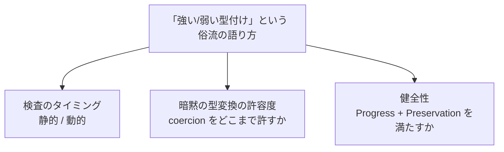

:::message
本記事は、内容の生成に AI を利用しています。
:::

## 導入: 「強い型付け」は何を測っているのか

「Python は強い型付け、JavaScript は弱い型付けです」という説明は、プログラミング言語の入門記事や技術者どうしの会話に繰り返し登場します。語り手が念頭に置くのは、暗黙の型変換の起きやすさや、実行時エラーの起きやすさです。JavaScript の `+` 演算子は数値と文字列を暗黙に変換して連結し、Python の `+` 演算子は数値と文字列の混在を例外で拒否します。型変換の許容度の違いを指して「強い/弱い」と呼ぶ語り方は、実務で広く通用します。

「強い型付け」「弱い型付け」という語り方が指す性質を型理論の一次情報に照らすと、素朴な理解とは異なる姿が見えます。Luca Cardelli の 1997 年の論文 "Type Systems" は、"strong typing" という語を曖昧だとして意図的に避けています[^cardelli-1997]。Benjamin C. Pierce の教科書『Types and Programming Languages』（以下 TAPL）も、本文で "strongly typed" "weakly typed" という語をほとんど使いません[^pierce-tapl]。型理論の一次文献が避ける語を、実務は日常的に使います。型理論と実務の落差自体が、本記事の考察の軸です。

型理論の一次情報を辿り、型安全性・健全性・検査のタイミングという確立した概念を確認します。実務で語られる「強い/弱い」という語り方が、確立した概念のどこに対応し、どこで対応を欠くかを考察します。取り上げる情報源は次のとおりです。

- 型理論の一次情報: Milner の型多相性の理論[^milner-1978]・Harper[^harper-pfpl]・Cardelli の "Type Systems"[^cardelli-1997]・Pierce の TAPL[^pierce-tapl]・Wright and Felleisen の論文[^wright-felleisen-1994]。
- 実務側の観察: MDN・Python 公式言語リファレンス・TypeScript 公式ドキュメント。
- コード例: Python・JavaScript・C・TypeScript・Kotlin・Haskell・Rust で暗黙の型変換と健全性の具体例を確認します。

## 型安全性の形式的骨格: 「行き詰まらない」という保証

### Milner: 型のついた式は go wrong しない

「型付けが正しいプログラムは決して間違った状態にならない」という言明の原典は、Robin Milner の 1978 年の論文 "A Theory of Type Polymorphism in Programming" です[^milner-1978]。論文の要旨は、意味論に基づく健全性定理（Semantic Soundness Theorem）が「型付けが正しいプログラムは "go wrong" しない」ことを示すと述べます。要旨の段階では、主語が programs（プログラム）です。

論文本文の第 3.7 節は、次の見出しを掲げます[^milner-1978]。

> Well-Typed Expressions Do Not Go Wrong

見出しの主語は expressions（式）であり、programs ではありません。第 3.3 節「Discussion of Types」を見ると、次の点が読み取れます。

- Milner は式を主語に据え、program を括弧内の言い換えとして添えます。文言は「型付けが正しい式（またはプログラム）は "go wrong" しないことを示す」というものです。
- 本文は「値には型を持つものと持たないものがある」「"wrong" は型を持たない」と述べます。
- 「関数の値が型を持てば、正しい型の引数を与える限り正しい型の結果を返す」とも述べ、"cannot 'go wrong'" という助動詞つきの表現を繰り返し使います。

世間で流布する次の引用は、要旨の言い回しとしては裏付けがあります。

> well-typed programs cannot go wrong

ただし、論文で最も参照される第 3.7 節の見出しは expressions を主語とし、programs ではありません。引用の際は、参照する箇所（要旨か、第 3.7 節の見出しか）を区別する必要があります。

Milner が論じた型多相性の理論は、Milner を中心とする Edinburgh の研究グループが LCF 証明支援系のメタ言語として設計した ML に実装されました[^milner-1978]。Standard ML と OCaml は、ML から発展した言語族に属します[^hopl-sml-2020]。

### Progress と Preservation: TAPL の定式化

型安全性を「進行（Progress）」と「保存（Preservation）」という 2 つの定理に分解する定式化は、Pierce の TAPL 第 8.3 節「Safety = Progress + Preservation」が採用します[^pierce-tapl]。定式化の骨子は次のとおりです。

- 進行（Theorem 8.3.2, Progress）: 型のついた項は、値であるか、評価関係に従ってさらに 1 ステップ簡約できるかのいずれかです。項が値でも簡約可能でもない状態、すなわち「行き詰まり」には至りません。
- 保存（Theorem 8.3.3, Preservation）: 型のついた項が評価関係に従って 1 ステップ簡約されると、簡約後の項は元の項と同じ型を保ちます。

進行が「今すぐ行き詰まらない」ことを保証し、保存が「1 ステップ進んでも型のつく資格を失わない」ことを保証します。2 つの定理を帰納的に組み合わせると、型のついた項は評価を何ステップ繰り返しても行き詰まりに至らないという結論が導かれます。値でも簡約可能でもない項に、型のつかない項を除いて到達しない、という保証が「型安全性（type safety）」の内容です。数値に真偽値を加えるような操作は、評価規則のどれにも一致せず行き詰まるため、健全な型システムは型検査の段階で拒否します。

TAPL の脚注は、「Safety = Progress + Preservation」というスローガン自体を Robert Harper に帰します。進行・保存という定式化のバリエーションは、Wright and Felleisen の 1994 年の論文 "A Syntactic Approach to Type Soundness" に由来するとしています[^wright-felleisen-1994]。健全性を巡る現在の語彙は、Milner の直感を出発点とします。Harper のスローガンと Wright and Felleisen の定式化を経て、TAPL のような教科書がまとめ上げた成果です。

### Wright and Felleisen の原論文との違い

「Progress + Preservation」という名前つきの 2 定理として分離された提示は、TAPL を含む後続の教科書的整理によるものです。Wright and Felleisen の原論文自体は、進行・保存を個別の名前つき定理として立てていません。原論文は Definition 4.9 から Theorem 4.12 「Syntactic Soundness」までの一続きの流れとして、健全性を単一の議論にまとめています[^wright-felleisen-1994]。

原論文の貢献は、型健全性の証明を、領域理論に基づく表示的意味論ではなく、書き換え関係だけを使う構文的な手法（小ステップ操作的意味論と主部簡約）で行える点にあります。書き換え関係だけを使う証明の手法が、後の教科書で進行と保存という 2 段の定理へ整理され直し、現在標準的な提示形式として定着しました。名前と分離の起源をたどると、定式化の発明者と教科書的パッケージングの担い手は別だと分かります。

単純型付きラムダ計算による形式的な定式化と、進行・保存の証明の骨格は、付録 A に示します。

型システムは、進行・保存という安全性の性質だけでなく、論理学との対応関係も持ちます。対応関係の詳細は付録 B に示します。

## 「型が無い」という理解を問い直す: Harper の uni-typed 論

「動的型付け言語には型が無い」という理解は、実務でよく語られます。Robert Harper の『Practical Foundations for Programming Languages』（以下 PFPL）は、型が無いという理解を型理論の立場から問い直します[^harper-pfpl]。

PFPL の「Untyped Means Uni-Typed」の節は、次のように述べます[^harper-pfpl]。

> so-called dynamically typed languages are, in fact, statically typed.
> （いわゆる動的型付け言語は、実際には静的型付けである）

第 22 章の冒頭は、型無し言語が単一型の言語だと述べます[^harper-pfpl]。「型付き」対「型無し」という対立を、Harper は見かけ上のものだとします。

Harper の主張の骨子は、次のとおりです。

- 動的型付け言語の実行時タグつき値は、単一の型の要素として捉え直せます。単一の型は、数値・文字列・関数・エラーなどすべての値を包含する 1 つの再帰的な型です。
- 単一の型のもとでは、動的型付け言語のすべての式が静的に型付けされます。
- 実行時の「タグ検査」は、単一の型の要素をタグで場合分けする通常の操作に過ぎません。
- 関数でない値を呼び出そうとして起きる実行時エラーは、単一の型が定義しない操作を要求した結果です。

「動的型付け言語には型が無い」という理解は、静的に型付けされた言語との対比として成立しません。「単一の大きな型を持つ静的型付け言語」と「多数の型を区別する静的型付け言語」という、検査の粒度の違いとして捉え直せます。

「単一型（uni-typed）」という発想の芽は、Harper に先立つ一次情報にも見られます。Cardelli の "Type Systems" の巻末用語集は "Untyped language" を定義します[^cardelli-1997]。

> whose type system has a single type that contains all values
> （型システムが、すべての値を含む単一の型だけを持つ言語）

定義は、Harper に 20 年近く先立ち、同じ直感をすでに含んでいます。1997 年の用語集の言及から、2013 年以降の PFPL の議論へ、単一型という発想が受け継がれてきたと読めます。

## 「strongly typed」という語をめぐる、一次情報自身の距離の取り方

### Cardelli: 曖昧な語として意図的に避ける

Cardelli の "Type Systems" の序論は、用語法について次のように述べます[^cardelli-1997]。

> we avoid the words type and typing when referring to run time concepts
> （実行時の概念を指すときは type と typing という語を避ける）

続けて、次のように補足します。

> avoid common but ambiguous terms such as strong typing
> （strong typing のような、一般的だが曖昧な語も避ける）

Cardelli は "strongly typed" という語自体を意図的に避けます。代わりに、検査のタイミングを表す "checking" 系の語彙（dynamic checking・static checking）を使います。

Cardelli は "strong typing" という語こそ避けますが、"strongly checked" という技術用語は明確に定義します。用語集は "Strongly checked language" という項目を立て、次のように定義します[^cardelli-1997]。

> no forbidden errors can occur at run time
> （実行時に禁止されたエラーが一切起きない）

本文は、次の性質を持つ言語を「強く検査される（strongly checked）」と呼びます。

- 捕捉されない実行時エラー（untrapped error）が一切起きません。
- 禁止された実行時エラーとして指定した捕捉エラー（trapped error）が一切起きません。
- 禁止対象に指定していない捕捉エラーは起き得ますが、対処はプログラマの責任です。

「強く検査される」という性質の担い手は、型システムに限りません。Cardelli は LISP を例に挙げます。静的な型検査を持たず、型システムを持たない言語であっても、実行時に配列境界や除算などを十分に検査し、禁止エラーをすべて防げば「強く検査される」と述べます[^cardelli-1997]。

Cardelli の主張は、Common Lisp の処理系である SBCL で確認できます。

```lisp:type-error.lisp
(defun add (a b) (+ a b))
(add 1 "a")
```

SBCL 2.6.5-85913ede1 で実行すると、次の `TYPE-ERROR` を送出して停止します[^sbcl-version]。

> The value "a" is not of type NUMBER

Lisp は静的な型検査を持ちませんが、実行時の `+` は数値以外の引数を拒否します。文字列を渡すと `TYPE-ERROR` で停止し、禁止エラーを防ぎます。コード例は、型システムが無くても実行時検査で「強く検査される」という Cardelli の主張を裏付けます。

「型システムを持たない言語ほど型付けが弱い」という直感は、Cardelli の技術的な定義のもとでは成立しません。動的検査だけの言語も、静的検査を持つ言語と同等に「強く検査される」場合があります。

対して "Weakly checked language" の定義は、次の一節を含みます[^cardelli-1997]。

> no clear guarantee of absence of execution errors
> （静的検査を持つが、実行時エラーが起きない保証は無い）

「弱く検査される」という性質は、静的検査を持つ言語のうち、一部の不安全な操作が検査をすり抜ける言語を指します。Cardelli は C を代表例に挙げ、ポインタ演算やキャストのような不安全な機能の多さを指摘します。用語集の本文は、次のようにも書き添えます[^cardelli-1997]。

> euphemistically called weakly checked (or weakly typed, in the literature)

「文献では weakly typed とも婉曲に呼ばれる」という一節から、Cardelli 自身が実務の慣用語を認識しつつ、自分の技術用語としては typed ではなく checked を選んだ経緯が読み取れます。

「Cardelli は strongly typed に複数の意味があると指摘した」という説明が広く流布していますが、原文に該当する記述は確認できませんでした。原文が実際に行っているのは、"strong typing" という曖昧な語を避け、"strongly checked" "weakly checked" という、実行時エラーの有無に基づく明確な技術的定義へ置き換えることです。

### TAPL: dynamically checked という言い換え

Pierce の TAPL も、本文中で "strongly typed" "weakly typed" という語をほぼ使いません[^pierce-tapl]。第 1 章は、"dynamically typed" を誤称（misnomer）と位置づけ、呼ぶべき語は "dynamically checked" だと注記します。動的型付け言語も、実行時のタグに対する検査という意味では型検査をしています。TAPL の立場では、"typed" より "checked" のほうが検査の実態を正確に表します。

「Pierce が "strongly/weakly typed" を非厳密だと批判した」という説明も広く流布していますが、本文レベルで該当する記述は確認できませんでした。TAPL が確認できる範囲で行っているのは、"strongly/weakly typed" をほぼ使わないという用語選択と、"dynamically checked" という言い換えの明記です。

Cardelli と Pierce という、型理論の代表的な一次情報 2 つが、独立に同じ方向へ向かいます。「typing」という語を実行時の議論から遠ざけ、「checking」という語で検査のタイミング（静的・動的）を語る方向です。「strong/weak typing」という語は、型理論の技術用語というより、実務者コミュニティの慣用語だと確認できます。

## 実務で語られる「強い/弱い」の実体: 暗黙の型変換という運用的基準

型理論の一次情報が距離を置く一方で、実務者は「強い/弱い」という語を一貫した基準で使い続けます。基準の実体は、多くの場合「演算子が暗黙の型変換（coercion）をどこまで許すか」という運用的な性質です。Cardelli and Wegner の 1985 年の論文は、多相性をオーバーロードと coercion（型変換）に分類します[^cardelli-wegner-1985]。coercion は「構文上の値の型を、演算に必要な型へ変換する意味論的操作」と定義されます。演算子の記述に現れる「同じ `+` が複数の型の組み合わせを受け入れる」という現象は、オーバーロードと coercion の境界が曖昧な典型例として、同論文が取り上げます。

実装を比較すると、暗黙の型変換の許容度は言語ごとに大きく異なります。

### JavaScript: 加算演算子の暗黙の文字列変換

MDN の Addition (+) のページは、`+` 演算子の一方が文字列であれば、もう一方のオペランドも文字列へ変換して連結すると説明します[^mdn-addition]。

```js:addition.js
console.log("2" + 2) // 出力: 22
```

Node.js 26.4.0 で実行すると `"22"` を出力します[^node-version]。数値の `2` が暗黙に文字列 `"2"` へ変換され、連結される結果です。

### Python: 加算演算子は暗黙変換をしない

Python の公式言語リファレンス第 6.7 節「Binary arithmetic operations」は、`+` 演算子の被演算子の型に関する規則を定めます[^python-langref]。文字列と数値の混在は、規則の対象外として扱われます。

```python:coercion.py
try:
    print("5" + 3)
except TypeError as error:
    print(error)
# 出力: can only concatenate str (not "int") to str
```

Python 3.14.6 で実行すると、`can only concatenate str (not "int") to str` という `TypeError` を送出します[^python-version]。JavaScript の `+` と対照的に、Python の `+` は文字列と数値の暗黙変換をしません。

### C: 数値の暗黙変換と縮小変換

C は静的に型を検査する言語ですが、数値どうしの暗黙変換に寛容です。

```c:coercion.c
#include <stdio.h>

int main(void) {
    double price = 3.9;
    int quantity = price; // 暗黙の縮小変換。既定のコンパイルオプションでは警告も出ない
    char grade = 'A';
    int score = grade + 1; // 算術演算での整数昇格
    printf("quantity = %d\n", quantity);
    printf("score = %d\n", score);
    return 0;
}
// 出力: quantity = 3
// 出力: score = 66
```

Apple clang 17.0.0 で追加のオプションなしにコンパイルすると、警告を一切出さずにコンパイルが成功します[^clang-version]。`double` から `int` への縮小変換は、既定では警告も出ません。`-Wconversion` オプションを付けて初めて `implicit conversion turns floating-point number into integer` という警告が出ます。警告が出ても、コンパイルは成功します。Cardelli の用語で言えば、C は静的に検査されますが、縮小変換という不安全な操作の一部を検査がすり抜ける「弱く検査される」言語の典型例です[^cardelli-1997]。

### Kotlin: 暗黙の数値変換を許さない設計

Kotlin は、Java と異なり、数値型どうしの暗黙変換を許しません。

```kotlin:Coercion.kt
fun main() {
    val i: Int = 1
    val d: Double = i // コンパイルエラー
    println(d)
}
```

kotlinc-jvm 2.4.0 でコンパイルすると、`error: initializer type mismatch: expected 'Double', actual 'Int'.` というエラーで失敗します[^kotlin-version]。`Int` から `Double` への変換には、明示的な変換関数の呼び出しが必要です。

```kotlin:Coercion2.kt
fun main() {
    val i: Int = 1
    val d: Double = i.toDouble() // 明示的な変換
    println(d)
}
// 出力: 1.0
```

`i.toDouble()` を呼び出すと、コンパイルに成功し `1.0` を出力します[^kotlin-version]。数値どうしの変換であっても暗黙には行わないという設計判断が、C との対比で際立ちます。

### Haskell: 数値リテラルの多相性はあるが、暗黙変換はしない

Haskell も、Kotlin と同様に数値どうしの暗黙変換を許しません。

```haskell:TypeMismatch.hs
main :: IO ()
main = do
  let i = 1 :: Int
  let d = 2.0 :: Double
  print (i + d)
```

GHC 9.14.1 でコンパイルすると、`Couldn't match expected type ‘Int’ with actual type ‘Double’` という型エラーで失敗します[^haskell-version]。`Int` と `Double` は別々の具体的な型です。`(+)` 演算子は `Num a => a -> a -> a` という型を持ち、両方の引数と戻り値は同じ型変数 `a` に統一されます。`Int` の値と `Double` の値を混在させる呼び出しは、型検査を通りません。

Haskell の数値リテラルは、型注釈が無ければ確定した型を持ちません。`1` は `Num a => a` という型を、`2.0` は `Fractional a => a` という型を持ちます。文脈から具体的な型が決まるまで、リテラルは特定の型に縛られません。型注釈の無い `1 + 2.0` という式は、リテラルの型と GHC のデフォルト規則により両辺が `Double` へ解決され、コンパイルが通ります[^haskell-version]。リテラルの多相的な型は、具体的な型が確定する前だけの性質です。型注釈で `Int`・`Double` という具体的な型へ固定した値どうしの演算とは、別の話です。`Int` の値を `Double` の値と演算するには、`fromIntegral i + d` のように明示的な変換関数を呼ぶ必要があります。

Haskell の関数型・タプル型・`Either` 型は、付録 B の表が示す含意・連言・選言にそのまま対応します。型クラスという複雑さ、あるいは一般再帰がもたらす停止しない計算（`⊥`）などの詳細を踏まえずとも、Haskell は Curry-Howard 対応を実践的に体験できる言語の1つです。

### 暗黙の型変換という軸の位置づけ

5 言語を並べると、暗黙の型変換の許容度は次のように分かれます。

- JavaScript: 文字列と数値という異種の型どうしですら暗黙に変換します。
- C: 数値どうしの縮小変換を暗黙に許します。
- Python: 文字列と数値の混在を拒否します。
- Kotlin: 数値どうしの変換すら拒否します。
- Haskell: リテラルには多相的な型がありますが、型注釈で固定した数値どうしの変換は拒否します。

実務で語られる「強い/弱い」は、暗黙の型変換の許容度という軸に対応する場合が多いと確認できます。

暗黙の型変換の許容度という軸は、前章までに確認した型安全性の軸（進行・保存が保証する「行き詰まらない」という性質）とは別の軸です。Python の `+` 演算子が例外を送出する挙動は、Progress 定理が禁じる「行き詰まり」ではありません。型のつかない項として拒否されるか、実行時例外という定義済みの経路で捕捉されるかのいずれかであり、TAPL の意味での「行き詰まり」には至りません。暗黙の型変換の許容度は、個々の演算子の操作的意味論という、より狭い運用レベルの性質です。

## 静的/動的というもう一つの軸との関係

「strong/weak typing は static/dynamic typing とは独立した（直交する）軸である」という整理は、実務者の間で広く使われます。Chris Wellons は、ブログ記事で次のように述べます[^wellons-2014]。

> Strong typing is often mixed up with static typing despite being an orthogonal concept.

「強い型付けは、独立した概念であるにもかかわらず、静的型付けとよく混同される」という整理です。

「直交する」という整理は、直前の例からも直感的に裏付けられます。C は静的検査でありながら暗黙の型変換に寛容（弱い型付け寄り）で、Python は動的検査でありながら暗黙の型変換に厳格（強い型付け寄り）です。静的/動的という軸と、暗黙の型変換の許容度という軸は、独立に変化する組み合わせを取り得ます。

ただし、Wellons の整理は査読を経ないブログ記事です。本記事が辿った Cardelli・Pierce・Harper・Milner・Wright and Felleisen という査読済みの一次文献には、「直交する」と明示的に述べた記述を確認できませんでした。「直交する」という整理は、実務者コミュニティで広く共有される準一次情報に基づく整理であり、型理論の一次文献が定理として確立した事実ではありません。実務の整理として有用ですが、学術的に確立した命題として引用する際は注意が必要です。

## 健全性（soundness）というより精密な代替軸

暗黙の型変換の許容度とも、静的/動的の区別とも異なる、第 3 の軸があります。前章までに確認した型安全性の形式的骨格（進行と保存）を、型システムが実際に満たすかどうかという軸、すなわち健全性（soundness）です。

### TypeScript: 意図的な unsound 設計

TypeScript は、健全性を意図的に手放す設計を採用します。公式ドキュメントの Type Compatibility ページ「A Note on Soundness」は、次のように述べます[^ts-handbook-soundness]。

> TypeScript's type system allows certain operations that can't be known at compile-time to be safe.
> （TypeScript の型システムは、コンパイル時には安全だと確定できない一部の操作を許す）

続けて、次のように述べます。

> When a type system has this property, it is said to not be 'sound'.
> （そのような性質を持つ型システムは 'sound' でないと言われる）

配列の共変性は、不健全性が現れる典型例です。

```typescript:unsoundness.ts
const numbers: number[] = [1, 2, 3]
const items: (number | string)[] = numbers // 配列の共変性によりコンパイルが通る
items.push("not a number")
console.log(numbers[3].toFixed(2)) // numbers[3] の実体は文字列
```

TypeScript 6.0.3 で `--strict` を付けてコンパイルしても、エラーなく成功します[^ts-version]。`numbers` は `number[]` と宣言されていますが、`items` へ代入し文字列を `push` した結果、`numbers[3]` の実体は文字列になります。コンパイル後の JavaScript を Node.js 26.4.0 で実行すると、`TypeError: numbers[3].toFixed is not a function` という実行時エラーで停止します[^node-version]。`numbers` は `number[]` という型を持つと型検査器が判定したにもかかわらず、実行時には数値でない要素を含みます。TAPL の Preservation 定理が保証する「型は評価によって保たれる」という性質を、TypeScript の型システムは満たしません。

TypeScript の不健全性は、実装の不備ではなく設計判断です。既存の JavaScript 資産との互換性と、実用上の利便性を優先し、一部の不健全な操作を意図的に許容しています。TypeScript の型システムは、進行・保存という定理を証明できる健全な型システムとして設計されていません。「健全でない」という性質は、Cardelli の用語で言えば「弱く検査される」性質に近い側面を持ちますが、健全性という軸は「行き詰まりに至らないことを型システムが証明できるか」という、より形式的で精密な基準です。

### Rust: 明示的な unsafe 境界による健全性の分離

Rust の安全な部分（safe Rust）は、健全性を保つよう設計されています。型システムの保証を破る操作は、`unsafe` ブロックの中でだけ許されます。TypeScript の不健全性は、配列の共変性のように、通常の「安全に見える」コードの中に構造的に潜んでいます。Rust の不健全性は、`unsafe` という構文上の境界の内側に局所化されています。

```rust:transmute.rs
fn main() {
    let bits: u32 = 1065353216; // IEEE 754 単精度で 1.0 を表すビットパターン
    let value: f32 = unsafe { std::mem::transmute(bits) };
    println!("{}", value);
}
```

rustc 1.96.0 でコンパイル・実行すると、`1` を出力します[^rust-version]。`std::mem::transmute` は、値のビット列をそのまま別の型として再解釈する関数です。ビットパターン `1065353216`（16 進数で `0x3F800000`）は、IEEE 754 単精度の浮動小数点数として符号ビット 0・バイアス付き指数部 127・仮数部 0 を表します。表す値は 1.0 です。

`unsafe` ブロックを外して `std::mem::transmute` を呼び出すと、コンパイルエラーで失敗します[^rust-version]。エラーメッセージは ``call to unsafe function `std::intrinsics::transmute` is unsafe and requires unsafe function or block`` です。`transmute` を使わず `let value: f32 = bits;` と直接代入した場合も、`error[E0308]: mismatched types` という型エラーで拒否されます[^rust-version]。型システムの保証を破る操作には、`unsafe` という明示的なキーワードを書く必要があるという設計です。

数値どうしの変換も、Rust は明示的なキャスト（`as`）や変換メソッド（`.into()` 等）を要求し、Kotlin や Haskell と同じく暗黙変換に厳格な軸の位置を占めます。

### Gradual Typing: 静的検査と動的検査を橋渡しする形式的枠組み

静的検査の一部と動的検査の一部が同じプログラム内に混在する状況を、形式的に扱う枠組みが Gradual Typing（漸進的型付け）です。起源とされる論文は、Jeremy Siek と Walid Taha の "Gradual Typing for Functional Languages" です[^siek-taha-2006]。Gradual Typing は、静的に検査する型と動的に検査する「不明（unknown）」型を同じ型システムの中に共存させ、境界をまたぐ値にキャストを挿入して両者を橋渡しします。静的部分は通常どおり健全性を保ちますが、動的部分との境界では、実行時のキャスト失敗という形で不健全性が顕在化します。TypeScript のような「一部だけ静的に検査する言語」を、恣意的な例外の集まりとしてではなく、統一的な形式的枠組みで説明する土台を、Gradual Typing の理論は提供します。

健全性という軸は、暗黙の型変換の許容度や、静的/動的の区別よりも精密です。健全性は、Progress・Preservation という形式的な定理に直接接続しており、「型システムが約束する保証を、実際に守れているか」という一点を測ります。TypeScript の事例は、静的型付けでありながら不健全という組み合わせを示し、健全性が静的/動的の区別とも独立に変化する軸であることを裏付けます。

## 考察: 実務者が「強い/弱い」で測ろうとしているもの

前章までの考察を踏まえると、「強い型付け」「弱い型付け」という語り方は、少なくとも独立に変化し得る 3 つの軸を暗黙に混ぜています。

- 検査のタイミング: 静的検査か、動的検査か。Cardelli の用語では static checking / dynamic checking です[^cardelli-1997]。
- 暗黙の型変換の許容度: 個々の演算子が、型の異なる被演算子どうしをどこまで暗黙に変換するか。Cardelli and Wegner の用語では coercion です[^cardelli-wegner-1985]。
- 健全性: 型システムが約束する保証（進行・保存）を、実際に満たすか。TAPL の用語では soundness です[^pierce-tapl]。

3 つの軸の関係を図示します。



3 つの軸それぞれの上で、Python・JavaScript・C・Kotlin・Haskell・TypeScript・Rust は異なる位置を占めます。

| 言語 | 検査のタイミング | 暗黙の型変換の許容度 | 健全性 |
| --- | --- | --- | --- |
| Python | 動的検査 | 低い（`"5" + 3` は例外） | 動的検査の範囲では健全 |
| JavaScript | 動的検査 | 高い（`"2" + 2` は連結） | 動的検査の範囲では健全 |
| C | 静的検査 | 高い（数値の縮小変換を許容） | 不健全（弱く検査される） |
| Kotlin | 静的検査 | 低い（数値変換も明示が必須） | 健全 |
| Haskell | 静的検査 | 低い（型注釈済みの値どうしの変換も拒否） | 健全（`unsafeCoerce` 等、構文境界を伴わない拡張を除く） |
| TypeScript | 静的検査 | 言語仕様により様々 | 意図的に不健全 |
| Rust | 静的検査 | 低い（キャスト・変換メソッドが必須） | safe Rust は健全（`unsafe` に局所化） |

Python と JavaScript は、検査のタイミングが同じ（動的検査）でありながら、暗黙の型変換の許容度で対照的な位置を占めます。C と Kotlin は、検査のタイミングが同じ（静的検査）でありながら、暗黙の型変換の許容度でも健全性でも対照的な位置を占めます。「Python は強い型付け、JavaScript は弱い型付け」という語りは、暗黙の型変換の許容度という軸だけを見れば妥当な観察です。「動的型付け言語は型付けが弱い」という、しばしば伴う含意は、静的/動的という別の軸を暗黙の型変換の軸と混同した結果です。Haskell は暗黙の型変換の許容度という軸で Kotlin と並ぶ厳格な位置を占め、Rust は健全性という軸で TypeScript とは異なる、`unsafe` による局所化という位置を占めます。

「型が無い」という語りも、Harper の議論に照らせば、型付けの強弱とは別の問題だと分かります[^harper-pfpl]。動的型付け言語が「型が無い」のではなく、単一の型のもとで検査のタイミングを実行時に遅らせているだけです。健全性という軸も、暗黙の型変換の許容度とは独立です。TypeScript は暗黙の型変換に関する規則を多く持ちながら、健全性の欠如という、また別の性質を意図的に選び取っています。

実務で「強い/弱い」を語る場面では、測ろうとしている性質を軸ごとに名指すほうが精密です。

- 暗黙の型変換の挙動を語るときは「`+` 演算子は文字列へ暗黙変換する」のように演算子の意味論を直接記述します。
- 検査のタイミングを語るときは「静的に検査される」「動的に検査される」と表現します。
- 型システムの保証の強さを語るときは「健全である」「意図的に不健全である」と表現します。

「強い/弱い」という 1 つの形容詞に、性質の異なる複数の軸を折りたたむと、軸ごとに違う答えを持つ問いへ、単一の答えを与えてしまいます。

## まとめ

「強い型付け」「弱い型付け」という語り方は、型理論の一次情報が積極的に使う語ではありません。Cardelli は "strong typing" という語を曖昧だとして避け、"strongly checked" "weakly checked" という、実行時エラーの有無に基づく技術的な定義へ置き換えました[^cardelli-1997]。TAPL も本文中で同種の語をほぼ使わず、"dynamically checked" という言い換えを採用しています[^pierce-tapl]。型理論の一次文献が確立してきたのは、Milner に始まり Wright and Felleisen を経て TAPL が定式化した、進行・保存という形式的な型安全性の骨格です[^milner-1978][^wright-felleisen-1994][^pierce-tapl]。Harper は、動的型付け言語が「型を持たない」という理解を、単一型という概念で問い直しました[^harper-pfpl]。

実務が「強い/弱い」という語で測ろうとしている性質は、多くの場合、暗黙の型変換の許容度という運用的な基準です。基準は、静的/動的という検査のタイミングの軸とも、健全性という型システムの保証の軸とも独立に変化します。3 つの軸を 1 つの形容詞へ折りたたむ「強い/弱い」という語り方は、実務の直感的な要約としては機能しますが、型理論の一次情報が確立した概念とは一対一に対応しません。言語の型システムを精密に語るときは、検査のタイミング・暗黙の型変換の許容度・健全性という 3 つの軸を、それぞれの名前で語り分ける必要があります。

## 付録

### 付録 A: 単純型付きラムダ計算による形式化と証明の骨格

型安全性を、具体的な計算体系の上で確認します。対象は、TAPL 第 9 章が提示する単純型付きラムダ計算（Simply Typed Lambda Calculus、以下 STLC）です[^pierce-tapl]。STLC は、真偽値の型 Bool と関数の型だけを持つ計算体系です。

#### 構文

STLC の型は、次の文法で定義します。

$$
\tau ::= \mathrm{Bool} \mid \tau_1 \to \tau_2
$$

$\mathrm{Bool}$ は真偽値の型です。$\tau_1 \to \tau_2$ は、引数の型 $\tau_1$ から結果の型 $\tau_2$ への関数の型です。

STLC の項は、次の文法で定義します。

<!-- textlint-disable ja-technical-writing/sentence-length -->

$$
t ::= x \mid \lambda x:\tau.\ t \mid t_1\ t_2 \mid \mathrm{true} \mid \mathrm{false} \mid \text{if } t_1 \text{ then } t_2 \text{ else } t_3
$$

<!-- textlint-enable ja-technical-writing/sentence-length -->

$x$ は変数です。$\lambda x:\tau.\ t$ は、引数 $x$ の型を $\tau$ と明示したラムダ抽象です。$t_1\ t_2$ は関数適用です。$\mathrm{true}$ と $\mathrm{false}$ は真偽値のリテラルです。値（value）は、$\mathrm{true}$・$\mathrm{false}$・ラムダ抽象のいずれかです。

#### 型付け規則

型判断 $\Gamma \vdash t : \tau$ は、型コンテキスト $\Gamma$ のもとで項 $t$ が型 $\tau$ を持つことを表します。型コンテキストは、変数から型への写像です。型付け規則は、TAPL の Figure 9-1（関数関連の規則）と Figure 8-1（真偽値関連の規則）に基づきます[^pierce-tapl]。次のとおりです。

$$
\dfrac{x:\tau \in \Gamma}{\Gamma \vdash x : \tau}
$$

型コンテキスト $\Gamma$ に $x:\tau$ が登録されていれば、T-Var は変数 $x$ の型を $\tau$ とします。

$$
\dfrac{\Gamma, x:\tau_1 \vdash t_2 : \tau_2}{\Gamma \vdash \lambda x:\tau_1.\ t_2 : \tau_1 \to \tau_2}
$$

引数 $x$ を型コンテキストへ追加して本体 $t_2$ を型付けできれば、T-Abs はラムダ抽象全体を関数型 $\tau_1 \to \tau_2$ として型付けします。

$$
\dfrac{\Gamma \vdash t_1 : \tau_1 \to \tau_2 \quad \Gamma \vdash t_2 : \tau_1}{\Gamma \vdash t_1\ t_2 : \tau_2}
$$

関数部分 $t_1$ が関数型 $\tau_1 \to \tau_2$ を持ち、引数部分 $t_2$ が引数の型 $\tau_1$ を持てば、T-App は適用結果 $t_1\ t_2$ を結果の型 $\tau_2$ として型付けします。

$$
\dfrac{}{\Gamma \vdash \mathrm{true} : \mathrm{Bool}}
$$

$$
\dfrac{}{\Gamma \vdash \mathrm{false} : \mathrm{Bool}}
$$

T-True と T-False は、真偽値リテラル true と false それぞれに型 Bool を与える公理です。

<!-- textlint-disable ja-technical-writing/sentence-length -->

$$
\dfrac{\Gamma \vdash t_1 : \mathrm{Bool} \quad \Gamma \vdash t_2 : \tau \quad \Gamma \vdash t_3 : \tau}{\Gamma \vdash \text{if } t_1 \text{ then } t_2 \text{ else } t_3 : \tau}
$$

<!-- textlint-enable ja-technical-writing/sentence-length -->

条件部 $t_1$ が型 Bool を持ち、then 節 $t_2$ と else 節 $t_3$ が同じ型 $\tau$ を持てば、T-If は if 式全体を型 $\tau$ として型付けします。

#### 簡約規則

簡約関係 $t \to t'$ は、call-by-value の小ステップ操作的意味論です。E-AppAbs・E-App1・E-App2 は TAPL の Figure 9-1 に、E-IfTrue・E-IfFalse・E-If は第 3 章の Figure 3-1 に由来します[^pierce-tapl]。

$$
(\lambda x:\tau.\ t)\ v \to [x \mapsto v]t
$$

E-AppAbs は、値 $v$ を引数とする関数適用を、本体 $t$ 中の変数 $x$ を $v$ で置換した項へ簡約します。

$$
\dfrac{t_1 \to t_1'}{t_1\ t_2 \to t_1'\ t_2}
$$

$$
\dfrac{t_2 \to t_2'}{v_1\ t_2 \to v_1\ t_2'}
$$

E-App1 は関数部分を左から先に簡約し、E-App2 は関数部分が値 $v_1$ になった後で引数部分を簡約します。

$$
\text{if true then } t_2 \text{ else } t_3 \to t_2
$$

$$
\text{if false then } t_2 \text{ else } t_3 \to t_3
$$

E-IfTrue と E-IfFalse は、条件部が真偽値に確定した if 式を、対応する枝へ簡約します。

<!-- textlint-disable ja-technical-writing/sentence-length -->

$$
\dfrac{t_1 \to t_1'}{\text{if } t_1 \text{ then } t_2 \text{ else } t_3 \to \text{if } t_1' \text{ then } t_2 \text{ else } t_3}
$$

<!-- textlint-enable ja-technical-writing/sentence-length -->

E-If は、条件部が値でなければ条件部を先に 1 ステップ簡約します。

#### 定理: Progress と Preservation の形式的な記述

進行（Progress）は、次のとおり定式化します。$\emptyset \vdash t : \tau$ ならば、項 $t$ は値であるか、ある項 $t'$ が存在して $t \to t'$ となるかのいずれかです。

保存（Preservation）は、次のとおり定式化します。$\Gamma \vdash t : \tau$ かつ $t \to t'$ ならば、$\Gamma \vdash t' : \tau$ です。

「Progress と Preservation: TAPL の定式化」の節で言葉として説明した「行き詰まらない」という性質は、STLC の型判断と簡約関係を使うと上記の 2 つの式で書き下せます。

#### 証明の骨格

Progress（TAPL Theorem 9.3.5）の証明は、型付け導出に関する帰納法で進めます。型付け規則ごとに場合分けし、各規則について部分項が値かどうかで場合分けします。部分項がすべて値であれば、正準形補題（canonical forms lemma、TAPL Lemma 9.3.4）により、いずれかの簡約規則が適用できます。部分項の一部が値でなければ、帰納法の仮定により、値でない部分項自体を簡約できます。

正準形補題は、次の 2 つの主張から成ります。$\emptyset \vdash v : \mathrm{Bool}$ ならば、値 $v$ は $\mathrm{true}$ か $\mathrm{false}$ のいずれかです。$\emptyset \vdash v : \tau_1 \to \tau_2$ ならば、値 $v$ はラムダ抽象です。T-App のケースでは、関数部分 $t_1$ が値であり関数型を持つ場合、正準形補題により $t_1$ はラムダ抽象だと分かり、E-AppAbs が適用できます。

Preservation（TAPL Theorem 9.3.9）の証明も、型付け導出に関する帰納法で進め、最後に適用された型付け規則で場合分けします。T-App のケースで E-AppAbs による簡約が起きる場合は、置換補題（substitution lemma、TAPL Lemma 9.3.8）を使います。置換補題は、次のとおりです。$\Gamma, x:\tau_1 \vdash t_2 : \tau_2$ かつ $\Gamma \vdash v : \tau_1$ ならば $\Gamma \vdash [x \mapsto v]t_2 : \tau_2$ です。関数の本体 $t_2$ に引数 $v$ を代入した項の型付けを、置換補題は保証します。

TAPL の脚注が指摘するとおり、進行・保存という定式化のバリエーションは Wright and Felleisen の 1994 年の論文に由来します[^wright-felleisen-1994]。TAPL 第 9 章は、Wright and Felleisen の構文的な証明手法を STLC の上で再構成し、正準形補題と置換補題を通じて進行・保存を証明します[^pierce-tapl]。

### 付録 B: Curry-Howard 対応

型システムは、独立に発見された論理学との対応関係を持ちます。対応関係は、型を命題とみなし、型 $\tau$ を持つ項を命題 $\tau$ の証明とみなす関係です。

Haskell B. Curry は、1934 年ごろ、コンビネータ論理と含意論理の対応を示しました[^curry-1934]。William A. Howard は、1969 年に私的な草稿として "The Formulae-as-Types Notion of Construction" を回覧し、型システム全体と直観主義論理の証明との対応を定式化しました[^howard-1980]。Howard の論文は、1980 年に論文集 "To H.B. Curry: Essays on Combinatory Logic, Lambda Calculus and Formalism" に正式に収録されました[^howard-1980]。Curry と Howard が独立に到達した対応関係は、両者の名を取って Curry-Howard 対応と呼ばれます。

型と論理の対応関係は、次の表のとおりです。

| プログラミング言語の型 | 論理学の命題 |
| --- | --- |
| 関数型 $A \to B$ | 含意 $A \Rightarrow B$ |
| 直積型 $A \times B$ | 連言 $A \land B$ |
| 直和型 $A + B$ | 選言 $A \lor B$ |
| Unit 型 | 自明に真な命題 |
| Empty 型（Void） | 偽なる命題 |

型付けされた項の簡約（評価）は、論理学における証明の正規化（cut-elimination）に対応します。関数適用は、含意の除去規則（モーダスポネンス）に対応します。

現代的で読みやすい解説として、Philip Wadler の論文 "Propositions as Types" があります[^wadler-2015]。

STLC の型安全性（進行・保存）は、「プログラムが実行時に行き詰まらない」という工学的な性質です。Curry-Howard 対応が示すのは、「型システムが命題論理の断片である」という、型理論のもう一段深い数学的な位置づけです。「強い型付け」「弱い型付け」という実務の語り口は、暗黙の型変換の許容度や検査のタイミングを語りますが、型理論が論理学と持つ対応関係には触れません。Curry-Howard 対応は、型理論の本質的な数学的内容の一例です。

Coq・Agda のような証明支援系や、Idris のような依存型を持つ汎用プログラミング言語は、Curry-Howard 対応を文字どおり実現する環境です。依存型のもとでは、型が証明したい命題を表現します。命題に対応するプログラムを書くことは、証明を構成することと一致します。STLC のような単純な型システムでは、関数型は含意にしか対応せず、値に依存する述語や量化子を表現できません。依存型システムは、構成的（直観主義）論理における命題を、より広く型として表現します。

[^milner-1978]: Robin Milner, "A Theory of Type Polymorphism in Programming"。掲載誌は *Journal of Computer and System Sciences* Vol. 17 No. 3、pp. 348–375（1978 年）。第 3.7 節の見出しは "Well-Typed Expressions Do Not Go Wrong"。<https://doi.org/10.1016/0022-0000(78)90014-4>
[^hopl-sml-2020]: David MacQueen, Robert Harper, John Reppy, "The History of Standard ML"。掲載誌は *Proc. ACM Program. Lang.* Vol. 4, No. HOPL, Article 86（2020 年 6 月）。ML が Robin Milner と Edinburgh の研究グループによる LCF 証明支援系のメタ言語から発展した経緯と、Standard ML・OCaml を含む言語族への展開を記す。<https://doi.org/10.1145/3386336>
[^wright-felleisen-1994]: Andrew K. Wright, Matthias Felleisen, "A Syntactic Approach to Type Soundness"。掲載誌は *Information and Computation* Vol. 115 No. 1、pp. 38–94（1994 年）。<https://doi.org/10.1006/inco.1994.1093>
[^pierce-tapl]: Benjamin C. Pierce, 『Types and Programming Languages』（MIT Press、2002 年、ISBN 0-262-16209-1）。第 8.3 節 "Safety = Progress + Preservation"（Theorem 8.3.2・Theorem 8.3.3）と第 1 章の "dynamically checked" の注記を参照。単純型付きラムダ計算（第 9 章）は、T-Var・T-Abs・T-App と E-AppAbs・E-App1・E-App2 を Figure 9-1 に、T-True・T-False・T-If を Figure 8-1 にまとめます。第 9.3 節は、正準形補題（Lemma 9.3.4）・進行（Theorem 9.3.5）・置換補題（Lemma 9.3.8）・保存（Theorem 9.3.9）を証明します。<https://www.cis.upenn.edu/~bcpierce/tapl/>
[^harper-pfpl]: Robert Harper, 『Practical Foundations for Programming Languages』（第 2 版）。版元は Cambridge University Press、2016 年（ISBN 978-1-107-15030-0）。初版は 2013 年（ISBN 978-1-107-02957-6）。第 21.4 節 "Untyped Means Uni-Typed"（p.186）と第 22 章冒頭（p.189）を参照。<https://www.cs.cmu.edu/~rwh/pfpl/>
[^cardelli-1997]: Luca Cardelli, "Type Systems"。掲載元は *The Computer Science and Engineering Handbook*（ed. Allen B. Tucker、CRC Press、1997 年）。Chapter 103、pp. 2208–2236。広く流通する PDF は第 2 版（2004）の Chapter 97 として収録されるが、本文・用語集の内容は同一。<http://lucacardelli.name/Papers/TypeSystems.pdf>
[^cardelli-wegner-1985]: Luca Cardelli, Peter Wegner の論文 "On Understanding Types, Data Abstraction, and Polymorphism" です。掲載誌は *ACM Computing Surveys* Vol. 17 No. 4、pp. 471–523（December 1985）。<https://doi.org/10.1145/6041.6042>
[^sbcl-version]: 記事中の Lisp コード例は SBCL（Steel Bank Common Lisp）2.6.5-85913ede1 で実行し、出力を確認しました。
[^mdn-addition]: "Addition (+)"（MDN Web Docs）。<https://developer.mozilla.org/en-US/docs/Web/JavaScript/Reference/Operators/Addition>
[^python-langref]: "6.7. Binary arithmetic operations"（The Python Language Reference）。<https://docs.python.org/3/reference/expressions.html>
[^python-version]: 記事中の Python コード例は Python 3.14.6 で実行し、出力を確認しました。
[^node-version]: 記事中の JavaScript / TypeScript のコード例は Node.js 26.4.0 で実行し、出力を確認しました。
[^clang-version]: 記事中の C コード例は Apple clang version 17.0.0（clang-1700.6.4.2）でコンパイルし、出力を確認しました。
[^kotlin-version]: 記事中の Kotlin コード例は kotlinc-jvm 2.4.0 でコンパイルし、出力を確認しました。
[^ts-version]: 記事中の TypeScript コード例は TypeScript 6.0.3 で `--strict` を付けてコンパイルし、確認しました。
[^haskell-version]: 記事中の Haskell コード例は GHC 9.14.1（`runghc`）で実行し、出力とエラーメッセージを確認しました。
[^rust-version]: 記事中の Rust コード例は rustc 1.96.0 でコンパイル・実行し、出力とエラーメッセージを確認しました。
[^wellons-2014]: Chris Wellons, "Three Dimensions of Type Systems"（nullprogram.com、2014-04-25）。<https://nullprogram.com/blog/2014/04/25/>
[^ts-handbook-soundness]: "Type Compatibility"（TypeScript Handbook）。"A Note on Soundness" セクション。<https://www.typescriptlang.org/docs/handbook/type-compatibility.html>
[^siek-taha-2006]: Jeremy G. Siek, Walid Taha, "Gradual Typing for Functional Languages"（Scheme and Functional Programming Workshop, 2006）。University of Chicago Technical Report TR-2006-06, pp. 81–92。<http://scheme2006.cs.uchicago.edu/13-siek.pdf>
[^curry-1934]: Haskell B. Curry, "Functionality in Combinatory Logic"。掲載誌は *Proceedings of the National Academy of Sciences* Vol. 20 No. 11、pp. 584–590（1934 年）。<https://doi.org/10.1073/pnas.20.11.584>
[^howard-1980]: William A. Howard, "The Formulae-as-Types Notion of Construction"。1969 年に私的な草稿として回覧されました。正式な収録は 1980 年の論文集です。論文集名は "To H.B. Curry: Essays on Combinatory Logic, Lambda Calculus and Formalism"。編者は J.P. Seldin と J.R. Hindley、出版社は Academic Press。掲載ページは情報源により pp. 479–490 と pp. 479–491 の表記が併存します。
[^wadler-2015]: Philip Wadler, "Propositions as Types"。掲載誌は *Communications of the ACM* Vol. 58 No. 12、pp. 75–84（2015 年 12 月）。<https://doi.org/10.1145/2699407>
