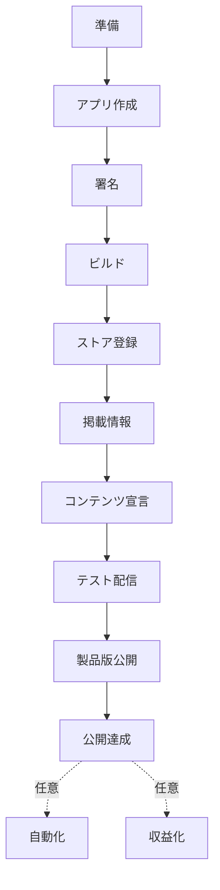

本書は、Android アプリをゼロから作成し、Google Play で公開し、さらに自動リリースと収益化までを扱う手順書です。Jetpack Compose[^compose] で最小のアプリを作り、署名し、ストアに登録し、テスト配信から製品版公開まで進めます。続いて、GitHub Actions による自動リリースと、広告・課金による収益化を扱います。

## 対象読者と前提

対象読者は、Android アプリを初めて Google Play で公開する開発者です。Kotlin の基本文法を前提とします。Android Studio・Gradle・Jetpack Compose は未経験でもかまいません。本書で繰り返し登場する用語は「前提知識と用語」章にまとめます。意味の分からない語が出たら参照してください。

## 本書のゴール

本書のゴールは、読者のアプリを Google Play の製品版として公開できる状態に到達することです。公開に必須の手順は「製品版をリリースする」章までにまとめます。自動化と収益化は、公開後に取り組む任意の発展です。

## 本書の歩き方

公開までに必須の段階と、公開後の任意の段階を次の図に示します。

「製品版をリリースする」章まで終えると、アプリは公開されます。自動化と収益化の各章は、公開後に必要となった段階で参照してください。

## 公開までの待ち時間

公開の手順には、完了までに日数のかかる待ちが 3 つあります。待ちを見込んで計画してください。

| 待ちが発生する手順 | 目安の期間 | 該当する章 |
| --- | --- | --- |
| デベロッパーアカウントの本人確認 | 数日 | 開発環境とアカウントの準備 |
| クローズドテスト（新規の個人アカウント） | 14 日間以上 | テストとテスター運用 |
| 製品版の審査 | 数時間〜7 日 | 製品版をリリースする |

2023 年 11 月 13 日より後に作成した個人アカウントは、製品版を申請する前に、12 人以上のテスターで 14 日間のクローズドテストを完了する必要があります[^closed-test]。クローズドテストは早い段階で開始できます。14 日間の待ちの間に、掲載情報とコンテンツ宣言を並行して進められます。

## 最初に決めておくこと

次の 3 項目は、後から変更できないか、変更に制約があります。作業の前に決めてください。

:::message alert
- アプリケーション ID（`applicationId`、アプリを一意に識別する文字列）は、公開後に変更できません。
- アカウント種別（個人／組織）は、金融・健康・VPN・政府のアプリで組織が必須です。
- アプリのダウンロード価格は、一度無料で公開すると有料へ変更できません。
:::

各項目の詳細は、「サンプルアプリを作る」章・「開発環境とアカウントの準備」章・「収益化モデルの全体像」章で説明します。

## バージョンと最新性について

本書のバージョン・要件・画面名は、2026 年 6 月時点の調査に基づきます。Google Play の要件とツールのバージョンは更新されます。重要な箇所には公式ドキュメントへのリンクを示すので、作業の前にリンク先で最新の情報を確認してください。

## 本章のまとめ

- 公開に必須の手順は、準備から製品版公開までです。自動化と収益化は任意の発展です。
- 本人確認・クローズドテスト・審査の 3 つの待ちを見込みます。
- `applicationId`・アカウント種別・無料／有料は、後から変更できないため先に決めます。

[^compose]: Jetpack Compose は、Kotlin のコードで画面（UI）を組み立てる Android の UI ツールキットです。
[^closed-test]: 新規の個人デベロッパーアカウントのテスト要件。詳細は [App testing requirements for new personal developer accounts](https://support.google.com/googleplay/android-developer/answer/14151465) を参照してください。
