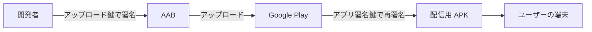

本章では、リリースに必要なアプリ署名を準備します。Google Play では「Play アプリ署名（Play App Signing）」が前提になります。署名に関する用語（キーストア、アップロード鍵、アプリ署名鍵）は「前提知識と用語」章にまとめてあります。意味が分からない場合は同章を参照してください。

## Play アプリ署名のしくみ

開発者は手元の「アップロード鍵」で AAB に署名してアップロードします。Google は AAB を検証し、Google が保管する「アプリ署名鍵」で配信用 APK に再署名します[^app-signing]。



アップロード鍵とアプリ署名鍵を分ける利点は、アップロード鍵を紛失・漏洩しても復旧できる点にあります。アップロード鍵は Play Console からリセットでき、アプリ署名鍵には影響しません。結果として、同じアプリの更新を継続して配信できます。

[^app-signing]: Play アプリ署名の詳細は [アプリに署名する](https://developer.android.com/studio/publish/app-signing) を参照してください。

## アップロード鍵を作成する

`keytool`[^keytool] でアップロード鍵のキーストアを作成します。次のコマンドはプロジェクトのルートディレクトリで実行します。実行すると、氏名・組織名・所在地などの識別情報と、キーストアおよび鍵のパスワードを対話で入力するよう求められます。

```bash
keytool -genkeypair -v \
  -keystore upload-keystore.jks \
  -alias upload \
  -keyalg RSA -keysize 2048 \
  -validity 10000
```

`-alias upload` は、キーストア内の鍵を識別する名前（エイリアス）です[^alias]。生成された `upload-keystore.jks` は、コマンドを実行したプロジェクトのルートディレクトリに作成されます。後述の `keystore.properties` では、同ファイルを `storeFile=../upload-keystore.jks` として参照します。

鍵の有効期間は 25 年以上にします。Google Play で公開する鍵は、2033 年 10 月 22 日より後まで有効である必要があります[^validity]。`-validity 10000` は約 27 年に相当し、要件を満たします。

[^keytool]: `keytool` は JDK に同梱される鍵とキーストアの管理コマンドです。詳細は [keytool](https://docs.oracle.com/javase/jp/21/docs/specs/man/keytool.html) を参照してください。
[^alias]: エイリアスは、1 つのキーストアに複数の鍵を保管した場合に、対象の鍵を指定するための名前です。
[^validity]: 鍵の有効期間の要件は [アプリのリリースを準備する](https://developer.android.com/studio/publish/preparing) を参照してください。

## 認証情報をファイルに分離する

パスワードやエイリアスをリポジトリに含めないよう、`keystore.properties` に分離します。

```properties:keystore.properties
storeFile=../upload-keystore.jks
storePassword=ストアのパスワード
keyAlias=upload
keyPassword=鍵のパスワード
```

`storeFile` の `../upload-keystore.jks` は、app モジュールから見た相対パスで、プロジェクトのルートディレクトリに作成したキーストアを指します。`keyAlias` には、鍵の作成時に指定したエイリアス（`upload`）を設定します。

:::message alert
`keystore.properties` とキーストア（`.jks`）は秘密情報です。`.gitignore`[^gitignore] に追加し、リポジトリへコミットしないでください。漏洩すると、アプリの署名を偽装される恐れがあります。
:::

```gitignore:.gitignore
# 署名関連の秘密情報
keystore.properties
*.jks
*.keystore
```

[^gitignore]: `.gitignore` は、Git の追跡対象から除外するファイルのパターンを記述する設定ファイルです。

## Gradle に署名設定を追加する

`app/build.gradle.kts` に署名設定を追加します。`keystore.properties` があれば読み込み、なければ環境変数[^env]を使います。環境変数は「GitHub Actions で自動リリース」章の CI で利用します。

ファイル先頭（`plugins` ブロックより前）に読み込み処理を追加します。

```kotlin:app/build.gradle.kts
import java.util.Properties
import java.io.FileInputStream

// keystore.properties があれば読み込み、なければ環境変数にフォールバックする
val keystorePropertiesFile = rootProject.file("keystore.properties")
val keystoreProperties = Properties().apply {
    if (keystorePropertiesFile.exists()) {
        FileInputStream(keystorePropertiesFile).use { load(it) }
    }
}

fun signingValue(propertyKey: String, envKey: String): String =
    keystoreProperties.getProperty(propertyKey) ?: System.getenv(envKey).orEmpty()
```

[^env]: 環境変数は、OS やプロセスが保持する名前付きの値です。CI では秘密情報をリポジトリに置かず、環境変数として渡します。

`android { }` ブロック内に `signingConfigs` を追加し、`release` ビルドへ適用します。`buildTypes` の `release` は「サンプルアプリを作る」章で定義済みのため、新たに追加せず、同章のブロックを次の内容へ置き換えます。あわせて R8 によるコード縮小を有効化します。R8 の役割は「前提知識と用語」章を参照してください。

```kotlin:app/build.gradle.kts
android {
    signingConfigs {
        create("release") {
            // storeFile に空文字を渡すと file("") が設定時に失敗するため、署名値があるときだけ設定する
            val storeFilePath = signingValue("storeFile", "KEYSTORE_FILE")
            if (storeFilePath.isNotEmpty()) {
                storeFile = file(storeFilePath)
                storePassword = signingValue("storePassword", "KEYSTORE_PASSWORD")
                keyAlias = signingValue("keyAlias", "KEY_ALIAS")
                keyPassword = signingValue("keyPassword", "KEY_PASSWORD")
            }
        }
    }

    buildTypes {
        getByName("release") {
            isMinifyEnabled = true
            isShrinkResources = true
            signingConfig = signingConfigs.getByName("release")
            proguardFiles(
                getDefaultProguardFile("proguard-android-optimize.txt"),
                "proguard-rules.pro",
            )
        }
    }
}
```

署名値がどちらの経路でも得られない場合は、署名値を設定しないまま `signingConfigs` を組み立てます。`debug` ビルドや `assembleDebug` は署名設定を必要としないため、鍵を用意する前でも実行できます。署名が必要な `release` ビルド（`bundleRelease`）は、`keystore.properties` または環境変数を用意してから実行します。

アップロード鍵を紛失した場合は、Play Console から新しいアップロード鍵へのリセットを申請できます[^reset]。リセットはアプリ署名鍵に影響しないため、同じアプリの更新を継続できます。

[^reset]: アップロード鍵のリセットは [アップロード鍵をリセットする](https://support.google.com/googleplay/android-developer/answer/7384423) を参照してください。

## 確認

- `upload-keystore.jks` を作成し、安全な場所に保管している。
- `keystore.properties` と `*.jks` を `.gitignore` に追加し、コミット対象から外している。
- `app/build.gradle.kts` に `signingConfigs` を追加している。
