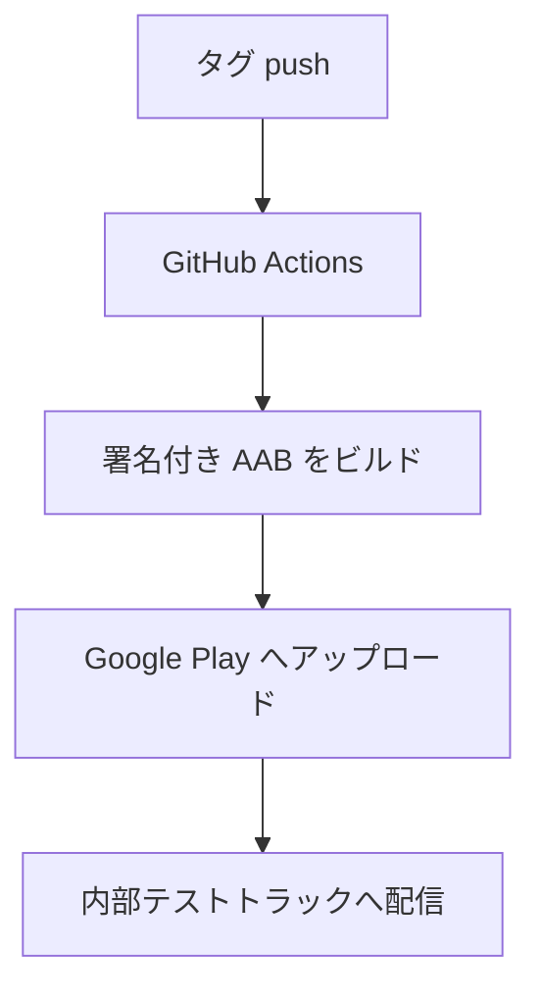

本章では、手動で行ってきたリリースを GitHub Actions[^actions] で自動化します。タグの push をきっかけに、署名付き AAB をビルドして内部テストトラックへ配信するパイプラインを構築します。CI（継続的インテグレーション）と AAB の用語は「前提知識と用語」章を参照してください。

[^actions]: GitHub Actions は、GitHub のリポジトリで動く CI 機能です。詳細は [GitHub Actions のドキュメント](https://docs.github.com/actions) を参照してください。



:::message
CI からの自動アップロードは、登録済みのアプリに対してのみ動作します。最初の 1 本は「Play Console にアプリを登録する」章の手順で手動アップロードし、アプリを登録しておく必要があります。
:::

自動配信の設定は、2 つの管理画面を使います。手順は次のとおりです。

1. Google Cloud Console でサービスアカウントを作成します。
2. Play Console で、作成したサービスアカウントへ配信の権限を与えます。
3. 発行した JSON 鍵を GitHub Secrets に登録します。

GitHub Secrets への登録まで終えると、CI から配信できます。

## サービスアカウントを作成する

CI から Google Play へ配信するには、Google Cloud のサービスアカウント[^service-account]を使います。手順は次のとおりです。

[^service-account]: サービスアカウントは、人ではなくプログラムやサービスが Google API へアクセスするためのアカウントです。詳細は [サービス アカウントの概要](https://cloud.google.com/iam/docs/service-account-overview) を参照してください。

1. [Google Cloud Console](https://console.cloud.google.com/) でプロジェクトを作成します。
2. 「Google Play Android Developer API」を有効化します。
3. サービスアカウントを作成します。
4. サービスアカウントの「鍵」から JSON 形式の鍵を発行し、ダウンロードします。

発行した JSON 鍵が CI の認証情報になります。

:::message
以前は「Play Console と Google Cloud プロジェクトのリンク」が必要でしたが、現在は不要です。Google Cloud で API を有効化し、サービスアカウントを Play Console に招待すれば動作します。古い記事の手順とは異なる点に注意してください。
:::

## Play Console で権限を付与する

Play Console の「ユーザーと権限」で、サービスアカウントのメールアドレス（末尾が `iam.gserviceaccount.com`）を招待し、必要な権限を付与します[^permissions]。

[^permissions]: API アクセス用の権限設定は [API アクセス用のサービス アカウントを設定する](https://developers.google.com/android-publisher/getting_started) を参照してください。

| 目的 | 付与する権限 |
| --- | --- |
| テストトラックへの配信 | テストトラックへのアプリのリリース |
| 製品版への配信 | 本番環境へのリリース（Play アプリ署名の使用を含む） |
| ストア情報の編集 | ストアの表示の管理 |
| アプリ情報の閲覧 | アプリ情報の表示（読み取り専用） |

:::message
内部テストの配信だけなら、「テストトラックへのアプリのリリース」と「アプリ情報の表示」で足ります。サービスアカウントには必要最小限の権限だけを与えます。
:::

## GitHub Secrets を登録する

リポジトリの Settings → Secrets and variables → Actions で、次のシークレット[^secrets]を登録します。

[^secrets]: GitHub Secrets は、ワークフローへ秘密情報を渡す仕組みです。値は暗号化され、ログには表示されません。詳細は [GitHub Actions でのシークレットの使用](https://docs.github.com/actions/security-guides/using-secrets-in-github-actions) を参照してください。

| Secret 名 | 内容 |
| --- | --- |
| `KEYSTORE_BASE64` | キーストアを base64 化した文字列 |
| `KEYSTORE_PASSWORD` | キーストアのパスワード |
| `KEY_ALIAS` | 署名鍵のエイリアス |
| `KEY_PASSWORD` | エイリアス鍵のパスワード |
| `SERVICE_ACCOUNT_JSON` | サービスアカウント JSON 鍵の中身 |

キーストアはバイナリのため、base64 で 1 行の文字列に変換してから登録します。

```bash
# macOS: 変換結果をクリップボードへコピー
base64 -i upload-keystore.jks | pbcopy

# Linux: 改行なしで出力
base64 -w0 upload-keystore.jks
```

CI 内ではキーストアを復元し、署名値を環境変数で `signingConfigs` へ渡します。「アプリに署名する」章の `signingValue` 関数が、環境変数 `KEYSTORE_FILE`・`KEYSTORE_PASSWORD`・`KEY_ALIAS`・`KEY_PASSWORD` を読み取ります。

## ワークフローを定義する

タグ push をきっかけに内部テストトラックへ配信するワークフローです。AAB のアップロードには GitHub Action の `r0adkll/upload-google-play` を使います。

```yaml:.github/workflows/release-internal.yml
name: Release to Play (internal)

on:
  push:
    tags:
      - "v*"

permissions:
  contents: read

jobs:
  deploy:
    runs-on: ubuntu-latest
    steps:
      - name: Checkout
        uses: actions/checkout@v6

      - name: Set up JDK
        uses: actions/setup-java@v5
        with:
          distribution: temurin
          java-version: "17"
          cache: gradle

      - name: Decode keystore
        env:
          KEYSTORE_BASE64: ${{ secrets.KEYSTORE_BASE64 }}
        run: printf '%s' "$KEYSTORE_BASE64" | base64 --decode > "${{ github.workspace }}/upload-keystore.jks"

      - name: Build signed AAB
        env:
          KEYSTORE_FILE: ${{ github.workspace }}/upload-keystore.jks
          KEYSTORE_PASSWORD: ${{ secrets.KEYSTORE_PASSWORD }}
          KEY_ALIAS: ${{ secrets.KEY_ALIAS }}
          KEY_PASSWORD: ${{ secrets.KEY_PASSWORD }}
        run: ./gradlew bundleRelease

      - name: Upload to Google Play (internal track)
        uses: r0adkll/upload-google-play@v1.1.5
        with:
          serviceAccountJsonPlainText: ${{ secrets.SERVICE_ACCOUNT_JSON }}
          packageName: com.example.mycomposeapp
          releaseFiles: app/build/outputs/bundle/release/app-release.aab
          tracks: internal
          status: completed
```

`v1.0.0` のようなタグを push すると、ワークフローが署名付き AAB をビルドし、内部テストトラックへ配信します。`packageName` は実際の `applicationId` に置き換えます。

:::message
`r0adkll/upload-google-play`[^r0adkll] の README にある例は古く、非推奨の `track`（単数）と `secrets.` の付け忘れを含みます。現行では `tracks`（複数）を使い、シークレット参照は `${{ secrets.XXX }}` の形にします。
:::

[^r0adkll]: AAB をアップロードする GitHub Action です。詳細は [r0adkll/upload-google-play](https://github.com/r0adkll/upload-google-play) を参照してください。

`status` の値で反映の仕方を選びます。

- `completed`: 即時に反映されます。
- `inProgress`: 段階的に公開する場合に、`userFraction` と併用します。

`r0adkll/upload-google-play` 以外の配信手段（Gradle Play Publisher・fastlane）は「CI の別解」章で扱います。

## 確認

- Google Cloud でサービスアカウントを作成し、JSON 鍵を発行している。
- Play Console でサービスアカウントに必要な権限を付与している。
- GitHub Secrets にキーストアとサービスアカウント JSON を登録している。
- タグ push でワークフローが実行され、内部テストトラックへ配信される。
