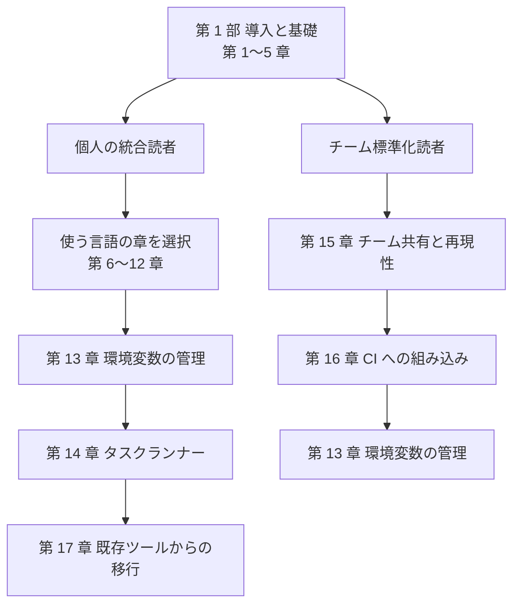

本書は、複数言語のランタイム・パッケージマネージャ・CLI ツールを mise[^mise] だけで一元管理し、開発環境を再現可能にする手順書です。nvm・pyenv・rbenv といった言語別のバージョン管理ツールを mise に統合し、バージョン管理から環境変数・タスク・CI・チーム共有・移行までを扱います。対象は macOS で、既定のシェルである zsh を前提に進め、bash・fish も補足します。

## 対象読者と前提

本書は、次の 2 層の読者を対象とします。

- 言語別のバージョン管理ツールを使用中で、mise を初めて使う開発者。nvm・pyenv・rbenv など複数のツールを 1 つに統合する動機を持つ読者です。
- チームの開発環境を標準化したいリーダー・運用者。メンバー間で同じバージョンとタスクを共有し、環境差をなくしたい読者です。

前提は次のとおりです。

- OS は macOS です。
- シェルは既定の zsh で説明し、bash・fish の手順も補足します。
- コマンドラインの基本操作を前提とします。
- 特定の言語の習熟は前提としません。

Node.js・Python・Go・Java などのうち、読者が使う言語の章だけを選んで読めます。

## 本書のゴール

本書のゴールは、読者が複数言語のランタイム・パッケージマネージャ・CLI ツールを mise だけで一元管理し、環境変数・タスク・CI・チーム共有・移行まで運用できる状態に到達することです。第 1 部で mise の基礎を固め、第 2 部以降で言語・ツール別の実践と自動化・運用を扱います。

## 本書の歩き方

本書は 4 部構成です。第 1 部は全読者共通の土台です。第 2 部以降は、読者の目的に応じて必要な章を選びます。

| 部 | 範囲 | 内容 |
| --- | --- | --- |
| 第 1 部 | 第 1〜5 章 | 導入と基礎 |
| 第 2 部 | 第 6〜12 章 | 言語・ツール別の実践 |
| 第 3 部 | 第 13〜16 章 | 環境変数・タスク・自動化 |
| 第 4 部 | 第 17〜20 章 | 移行・運用・トラブルシュート |

対象読者の 2 層に対応する 2 つの読みの流れを次の図に示します。第 1 部はどちらの流れでも先に読みます。

個人の統合読者は、第 1 部のあとに自分が使う言語の章を選び、環境変数・タスク・移行へ進みます。チーム標準化読者は、第 1 部のあとにチーム共有・CI・環境変数へ進みます。各部の章は独立しているため、必要な順序で読み返せます。

## 扱わない範囲

本書は macOS を前提とします。次の範囲は扱いません。

- Windows ネイティブと WSL（Windows Subsystem for Linux）のセットアップ。
- Nix・Docker の devcontainer との詳細な比較。
- asdf からの移行の網羅的な解説。第 17 章で要点のみ触れます。

## バージョンと最新性について

本書のコマンド・バージョン・画面は、2026 年 6 月時点の調査に基づきます。検証に使った mise のバージョンは 2026.6.10 です。

:::message
mise は活発に更新されます。将来はコマンドや出力が変わる可能性もあります。重要な箇所には公式ドキュメント[^docs]へのリンクを示すので、作業の前にリンク先で最新の情報を確認してください。
:::

## 本章のまとめ

- 本書は、複数言語のランタイム・CLI ツールを mise だけで一元管理し、環境変数・タスク・CI・チーム共有・移行まで運用する方法を扱います。
- 対象読者は、言語別のツールを mise に統合したい開発者と、チームの開発環境を標準化したい運用者の 2 層です。
- 前提は macOS と zsh で、bash・fish も補足します。特定の言語の習熟は前提としません。
- 第 1 部は全読者共通の土台です。第 2 部以降は目的に応じて章を選びます。
- コマンドとバージョンは 2026 年 6 月時点の調査に基づきます。作業の前に公式ドキュメントで最新を確認してください。

[^mise]: mise は、複数言語のランタイムや CLI ツールのバージョンを管理する開発環境マネージャです。旧称は rtx です。詳細は第 2 章で説明します。
[^docs]: mise 公式ドキュメント。<https://mise.jdx.dev> を参照してください。
